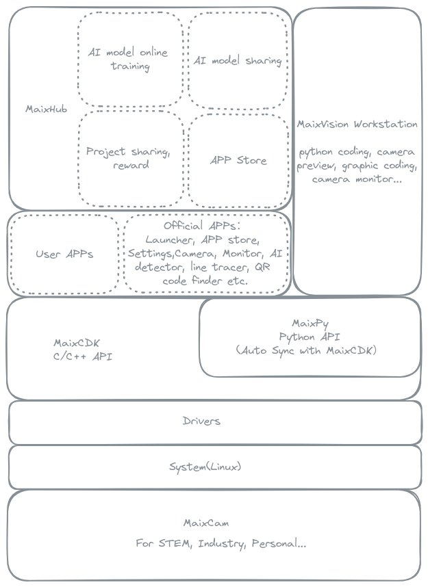

MaixPy
======

English | [中文](./README_ZH.md)

> New MaixPy (v4) is on the way~ And new hardware platform is coming soon~<br>
> The code will open source here when it's ready, please stay tuned.<br>
> If you have any suggestions, tell us in [MaixHub](https://maixhub.com/discussion/100073), or [Telegram/MaixPy](https://t.me/maixpy) or QQ group: 862340358.
>
> Maix-I K210 series please visit [MaixPy-v1](https://github.com/sipeed/maixpy-v1).


**Let's Sipeed up, Maximize AI's power!**

**MaixPy (v4) provide a super easy way to develop AI vision projects with Python script**.

With MaixPy you can easily use camera, screen and AI in a short code:

```python
from maix import camera, display, image, nn

classifier = nn.Classifier(model="/root/models/mobilenetv2.mud")
input_size = classifier.input_size()

cam = camera.Camera(input_size.width, input_size.height, classifier.input_img_fmt())
dis = display.Display()

while 1:
    img = cam.read()
    res = classifier.classify_image(img)
    max_idx, max_prob = res[0]
    msg = f"{max_prob:5.2f}: {classifier.labels[max_idx]}"
    img.draw_text(10, 10, msg, image.COLOR_RED)
    dis.show(img)
```
> This program read image from camera, and classify what it is by mobilenetv2 model, then show the result on screen.

Simply use serial port:

```python
from maix import uart

ports = uart.list_ports()
print("uart ports:", ports)

serial = uart.UART(ports[0], 115200)

serial.write_str("hello world")
print("received:", serial.read(timeout = 2000))
```

And we provide several cool hardware platforms:

| Platform | Picture | Description | Price | Buy |
| -------- | ------- | ----------- | ----- | --- |
|  MaixCam |  | - 1Tops@INT8 NPU, support BF16, support YOLOv5 YOLOv8 etc.<br>- 1GHz RISC-V(Linux) + 700MHz RISCV-V(RTOS) + 25~300MHz 8051(LowPower)<br>- 256MB DDR3<br>- USB2.0/100M Eth/WiFi6/BLE5.4/H.264/H.265/IIC/PWM/SPI/UART...<br>- 5M Camera/2K encoder/Max 1080p screen| ￥50 ~ ￥399 | To be on sale |

> **Maix-I K210** series is outdated, Not support MaixPy v4, use it please visit **[MaixPy-v1](https://github.com/sipeed/maixpy-v1)**


## Features

| Feature | Description | Picture/Video |
| ------- | ----------- | ------------- |
| Python support | Support Python and common libs like numpy, opencv. | - |
| Simple API | Provide simple API to access hardware, like camera, screen, NPU, etc.<br>And Simple API to create vision apps. | - |
| Efficient AI vision | Many AI vision features with hardware acceleration.| - |
| C++ Version | MaixCDK is a C++ version SDK, have the same API with MaixPy, it's easy to convert from one to another | - |
| Open source | Software and hardware are open source. | - |
| Many APPs | Provide many official APPs, like `AI recognition`, `Video streaming`, `Monitor` etc.  | - |
| Easy to start | Use APPs even you don't know how to program. | - |
| As module | Use this as serial module, control it by command. | - |
| MaixVision workstation | A PC software to programming and more.| - |
| APP Store | Share your APPs to community, and install APP in one click. | - |
| Compatible API with MaixPy-v1 | MaixPy-v4 have a MaixPy-v1 compatible API, so you can quickly migrate your MaixPy-v1 project to MaixPy-v4. | - |
| AI classification | Classify objects use AI | - |
| AI object detection | Detect objects use AI | - |
| AI face recognition | Recognize faces use AI | - |
| AI Monitor | Security monitor, streaming video and detect objects. Even broadcast to live platforms like bilibili.com | - |
| AI object tracking | Track objects use AI | - |
| Find color | Find color | - |
| Route tracking | Track route | - |
| Face Tracking | Track face| - |
| OCR | Recognize text and numbers | - |
| QR code | Recognize QR code | - |
| Desktop monitor | Monitor PC info, like CPU, memory, network, etc. | - |
| Wether station | Monitor wether info, like temperature, humidity, etc. | - |


## Maix Ecosystem

MaixPy not only a Python SDK, but have a whole ecosystem, including hardware, software, tools, docs, etc.
See the picture below:




## Who are using MaixPy?

* **AI programmer** who want to develop your AI model to embedded devices.
> MaixPy provide easy-to-use API to access NPU, and docs to help you develop your AI model.
* **STEM** teacher who want to teach AI to students.
> MaixPy provide easy-to-use API, PC tools, online AI train service ... Let you focus on teaching AI, not the hardware and complicated software usage.
* **Maker** who want to make some cool projects but don't want to learn complicated hardware and software.
> MaixPy provide Python API, so all you need is learn Python, and MaixPy's API is so easy to use, you can make your project even in a few minutes.
* **Engineer** who want to make some projects but want a prototype as soon as possible.
> MaixPy is easy to build projects, and provide corresponding C++ sdk, so you can directly use MaixPy to deploy or transfer Python code to C++ in a few minutes.
* **Students** who want to learn AI, embedded development.
> We provide many docs and tutorials to help you find learning route, and grow up step by step. From simple Python programming to `Vision`, `AI`, `Audio`, `Linux`, `RTOS` etc.
* **Enterprise** who want to develop AI vision products but have no time or engineers to develop complicated embedded system.
> Use MaixPy even graphic programming to develop your products with no more employees and time. For example, add a AI QA system to your production line, or add a AI security monitor to your office as your demand.
* **Contestants** who want to win the competition.
> MaixPy integrate many functions and easy to use, fasten your work to win the competition in limited time.

## Quick start

Please visit [Quick Start doc](https://wiki.sipeed.com/maixpy/en/quick_start.html) to get started.

Full Documentation: [wiki.sipeed.com/maixpy](https://wiki.sipeed.com/maixpy)

## What difference between MaixPy v1, MaixPy3 and MaixPy v4?

* MaixPy v1 use MicroPython programming language, only support Sipeed Maix-I K210 series hardware, have limited third-party packages.
* MaixPy3 is designed for Sipeed Maix-II-Dock v831, not a long-term support version.
* MaixPy v4 use Python programming language, so there's much package we can use directly. MaixPy v4 support new hardware platforms of Sipeed, it's a long-term support version, the future's hardware platforms will support this version. MaixPy v4 have a MaixPy-v1 compatible API, so you can quickly migrate your MaixPy v1 project to MaixPy v4.

(MaixPy v4 Will not support Maix-I K210 series, if you are using Maix-I K210 series, it's recommended to upgrade hardware platform to use this to get more features and better performance.)

## Why upgrade from Maix-I K210 or Maix-II v831 ?

K210 and v831 are outdated, K210 have many limitations in memory, performance, NPU operators missing etc.<br>
No matter you are using them or new comer, it's recommended to upgrade to MaixCam and MaixPy v4.<br>

Here's the comparison between them:

| Feature | Maix-I K210 | Maix-II v831 | MaixCam |
| ------- | ----------- | ------------ | ------- |
| CPU | 400MHz RISC-V x2 | 800MHz ARM7 | **1GHz RISC-V(Linux)<br>700MHz RISC-V(RTOS)<br>25~300MHz 8051(Low Power)** |
| Memory | 6MB SRAM | 64MB DDR2 | **256MB DDR3** |
| NPU | 0.25Tops@INT8<br>official says 1T but... | 0.25Tops@INT8 | **1Tops@INT8** |
| Encoder | ✖ | 1080p@30fps | **2K@30fps** |
| Screen | 2.4" 320x240 | 1.3" 240x240 | **2.28" 552x368** / 5" 1280x720 / 7" 1280x800 / 10“ 1280x800|
| Camera | 30W | 200W | **500W** |
| WiFi   | 2.4G | 2.4G | **WiFi6** 2.4G/5G |
| USB    | ✖    | **USB2.0** | **USB2.0** |
| Eth    | ✖    | 100M   | 100M |
| SD Interface | SPI | **SDIO** | **SDIO** |
| BLE    | ✖    | ✖      | **BLE5.4** |
| OS     | RTOS | Tina Linux | **Linux + RTOS** |
| Language | C / C++ / MicroPython | C / C++ / **Python3** | C / **C++ / Python3** |
| Software | MaixPy | MaixPy3 | **MaixCDK + MaixPy v4 + opencv + numpy + ...**|
| PC software | MaixPy IDE | MaixPy3 IDE | **MaixVision** Workstation |
| Docs   | ⭐️⭐️⭐️⭐️ |  ⭐️⭐️⭐️   |  🌟🌟🌟🌟🌟 |
| Online AI train | ⭐️⭐️⭐️ |  ⭐️⭐️⭐️⭐️ |  🌟🌟🌟🌟🌟 |
| Official APPs   | ⭐️⭐️   |  ⭐️⭐️⭐️   |  🌟🌟🌟🌟🌟 |
| AI classify(224x224) | MobileNetv1 50fps<br>MobileNetv2 ✖<br>Resnet ✖ | MobileNet ✖<br>Resnet18 20fps<br>Resnet50 ✖| MobileNetv2 **130fps**<br>Resnet18 **62fps**<br>Resnet50 **28fps** |
| AI detect   | YOLOv2(224x224) 15fps |  YOLOv2(224x224) 15fps |  **YOLOv5s(224x224) 100fps<br>YOLOv5s(320x256) 70fps<br>YOLOv5s(640x640) 15fps<br>YOLOv8n(640x640) 23fps**|
| Ease of use     | ⭐️⭐️⭐️⭐️ |  ⭐️⭐️⭐️   |  🌟🌟🌟🌟🌟 |

## License

All files in this repository are under the terms of the [Apache License 2.0 Sipeed Ltd.](./LICENSE) except the third-party libraries or have their own license.


## Community

* Project sharing: [maixhub.com/share](https://maixhub.com/share)
* Discussion: [maixhub.com/discussion](https://maixhub.com/discussion)
* QQ group: 862340358
* Telegram: [t.me/maixpy](https://t.me/maixpy)


