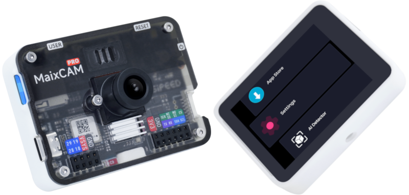

<style>
    #head_links table {
        width: 100%;
        display: table;
    }

    @media screen and (max-width: 900px){
      #head_links th, #head_links td {
          /* padding: 8px; */
          font-size: 0.9em;
          padding: 0.1em 0.05em;
      }
    }
</style>

<div id="head_links">

| Resource Summary           | Link                                                                                      |
| :-------------------------:| :-------------------------------------------------------------------------------------:|
|  Tutorial Documentation 📖 | [wiki.sipeed.com/maixpy/en/](https://wiki.sipeed.com/maixpy/en/)                                   |
| Examples and Source Code  | [github.com/sipeed/MaixPy](https://github.com/sipeed/MaixPy)                               |
|  MaixCAM Hardware 📷 | [wiki.sipeed.com/maixcam](https://wiki.sipeed.com/maixcam) / [wiki.sipeed.com/maixcam-pro](https://wiki.sipeed.com/maixcam-pro)                                 |
|  API Documentation 📚 | [wiki.sipeed.com/maixpy/api/](https://wiki.sipeed.com/maixpy/api/index.html)               |
| MaixHub App Store 📦      | [maixhub.com/app](https://maixhub.com/app)                                                 |
| MaixHub Sharing Square 🎲 | [maixhub.com/share](https://maixhub.com/share)                                             |
| Open Source Projects 📡             | GitHub Search：[MaixCAM](https://github.com/search?q=maixcam&type=repositoriese) / [MaixCAM2](https://github.com/search?q=maixcam2&type=repositoriese) / [MaixPy](https://github.com/search?q=maixpy&type=repositoriese)  |

</div>
<div style="font-size: 1.2em;padding:1em; text-align:center; color: white">
  <div style="padding: 1em 0 0 0">
    <a target="_blank" style="color: white; font-size: 0.9em; border-radius: 0.3em; padding: 0.5em; background-color: #c33d45" href="https://item.taobao.com/item.htm?id=784724795837">Taobao(MaixCAM)</a>
    <a target="_blank" style="color: white; font-size: 0.9em; border-radius: 0.3em; padding: 0.5em; background-color: #c33d45" href="https://item.taobao.com/item.htm?id=846226367137">Taobao(MaixCAM-Pro)</a>
    <a target="_blank" style="color: white; font-size: 0.9em; border-radius: 0.3em; padding: 0.5em; background-color: #c33d45" href="https://www.aliexpress.com/store/911876460">AliExpress</a>
  </div>
</div>
<br>

> For an introduction to MaixPy, please see the [MaixPy official website homepage](../../README.md)
> Please give the [MaixPy project](https://github.com/sipeed/MaixPy) a Star ⭐️ to encourage us to develop more features if you like MaixPy.

<iframe style="width:100%;min-height:30em" src="https://www.youtube.com/embed/qV1lw0UVUYI?si=g3xUX5v3iT9r7RxJ" title="YouTube video player" frameborder="0" allow="accelerometer; autoplay; clipboard-write; encrypted-media; gyroscope; picture-in-picture; web-share" referrerpolicy="strict-origin-when-cross-origin" allowfullscreen></iframe>

## Before Start

* Please **carefully** follow the steps outlined in this document. Do not skip any sections, and compare your actions accordingly.
* **Pay close attention** to the table of contents on the left. Be sure to read through the basic sections thoroughly and patiently.
* **Before asking questions**, first search the documentation in the left-hand table of contents and review the [FAQ](./faq.md).
* This document is the `MaixPy v4 Tutorial`. Be mindful not to confuse it with the [MaixPy-v1](https://wiki.sipeed.com/soft/maixpy/zh/index.html) (K210 series), and ensure you are referring to the correct documentation.

## Get a MaixCAM Device



* **MaixCAM**: Purchase the <a href="https://wiki.sipeed.com/maixcam" target="_blank">MaixCAM</a> development board from the [Sipeed Taobao](https://item.taobao.com/item.htm?id=784724795837) or [Sipeed AliExpress](https://www.aliexpress.com/store/911876460) store.
* **MaixCAM-Pro**: Purchase the <a href="https://wiki.sipeed.com/maixcam" target="_blank">MaixCAM</a> development board from the [Sipeed Taobao](https://item.taobao.com/item.htm?id=846226367137) or [Sipeed AliExpress](https://www.aliexpress.com/store/911876460) store.

**It is recommended to purchase the bundle with a `TF card`, `camera`, `2.3-inch touchscreen`, `case`, `Type-C data cable`, `Type-C one-to-two mini board`, and `4P serial port socket+cable`**, which will be convenient for later use and development. **The following tutorials assume that you already have these accessories** (including the screen).

**It is highly recommended to purchase a package that includes a screen, as it greatly enhances the development experience.** If you do not need a screen for actual deployment in a production environment, you can start with a screen-included kit for initial development, and then either remove the screen or purchase a screenless version for mass production later on.

* **Power Supply**: A stable power supply is crucial. MaixCAM requires a steady `5V 500mA` power supply. Insufficient power can result in failure to boot or crashes during operation. This is especially true for some computer USB ports, which may provide unstable power.

* **TF Card Reader**: Used for flashing the system, essential.

* **USB to serial port module**: If you want to debug serial communication with PC, it is recommended to prepare one. You can buy any one from Taobao or buy them together at Sipeed store, such as this [dual serial port to USB module](https://item.taobao.com/item.htm?spm=a1z10.5-c-s.w4002-24984936573.13.73cc59d6AkB9bS&id=610365562537).

>! Note that currently only the MaixCAM development board is supported. Other development boards with the same chip are not supported, including Sipeed's development boards with the same chip. Please be careful not to purchase the wrong board, which could result in unnecessary waste of time and money.

## For no screen devies

If you use screenless version, please refer to the [Quick Start (Screenless Version)](./README_no_screen.md) document.


## Getting Started

### Prepare the TF Image Card and Insert it into the Device

If the package you purchased includes a TF card, it already contains the factory image. If the TF card was not installed in the device at the factory, you will first need to carefully open the case (be careful not to tear the ribbon cables inside) and then insert the TF card. Additionally, since the firmware from the factory may be outdated, it is highly recommended to follow the instructions on [Upgrading and Flashing the System](./basic/os.md) to upgrade the system to the latest version.

If you did not purchase a TF card, you need to flash the system onto a self-provided TF card. Please refer to [Upgrading and Flashing the System](./basic/os.md) for the flashing method, and then install it on the board.

### Power On

Use a `Type-C` data cable to connect the `MaixCAM` device and power it on. Wait for the device to boot up and enter the function selection interface.


If the screen does not display:
* Please confirm that you purchased the bundled TF card. If you confirm that you have a TF card and it is inserted into the device, you can try <a href="./basic/os" target="_blank">updating to the latest system</a>.
* If you did not purchase the TF card bundle, you need to follow the instructions in <a href="./basic/os" target="_blank">updating to the latest system</a> to flash the latest system onto the TF card.
* Also, ensure that the screen and camera cables are not loose. The screen cable can easily come off when opening the case, so be careful.

### Connect to the Network

For the first run, you need to connect to the network, as you will need it later to activate the device and use the IDE.
If you don't have a router, you can use your phone to open a hotspot.

Click `Settings` on the device and select `WiFi`. There are two ways to connect to the `WiFi` hotspot:

* Scan the WiFi sharing code:
  * Use your phone to share the `WiFi` hotspot QR code, or go to [maixhub.com/wifi](https://maixhub.com/wifi) to generate a QR code.
  * Click the `Scan QR code` button, the camera screen will appear, scan the QR code generated previously to connect.
* Search for hotspots:
  * Click the `Scan` button to start scanning the surrounding `WiFi`, you can click multiple times to refresh the list.
  * Find your WiFi hotspot.
  * Enter the password and click the `Connect` button to connect.
Then wait for the `IP` address to be obtained, which may take `10` to `30` seconds. If the interface does not refresh, you can exit the `WiFi` function and re-enter to view it, or you can also see the `IP` information in `Settings` -> `Device Information`.

### Update the Runtime Libraries

**This step is very important!!!** If this step is not done properly, other applications and functions may not work (e.g., they may crash).

* First, ensure that you have completed the previous step of connecting to WiFi and have obtained an IP address to access the internet.
* On the device, click `Settings`, and select `Install Runtime Libraries`.
* After the installation is complete, you will see that it has been updated to the latest version. Then exit.

If it shows `Request failed` or `请求失败` (Request failed), please first check if the network is connected. You need to be able to connect to the internet. If it still doesn't work, please take a photo and contact customer service for assistance.

### Use Built-in Applications

Many applications are built-in, such as Find Blobs, AI Detector, Line Follower, etc. For example, Find Blobs:

<video playsinline controls autoplay loop muted preload  class="pl-6 pb-4 self-end" src="/static/video/self_learn_tracker.mp4" type="video/mp4" style="width:100%">
Classifier Result video
</video>

Please explore other applications on your own. More applications will be updated in the future. For usage documentation and application updates, please see the [MaixHub App Store](https://maixhub.com/app).

**Note: The applications only include a part of the functionality that MaixPy can achieve. Using MaixPy, you can create even more features.**

## Use as a Serial Module

> If you want to use the device as the main controller (or if you don't understand what a serial module is), you can skip this step.

The built-in applications can be used directly as serial modules, such as `Find Blobs`, `Find Faces`, `Find QR Codes`, etc.
Note that the serial port can only directly connect to other microcontrollers. **If you want to communicate with a computer via a serial port, you must provide a USB-to-serial module yourself.**

Usage:
* Hardware connection: You can connect the device to the `Type-C one-to-two mini board`(For MaixCAM-Pro is 6Pin interface), which allows you to connect the device via serial to your main controller, such as `Arduino`, `Raspberry Pi`, `STM32`, etc.
* Open the application you want to use, such as QR code recognition. When the device scans a QR code, it will send the result to your main controller via serial.
> The serial baud rate is `115200`, the data format is `8N1`, and the protocol follows the [Maix Serial Communication Protocol Standard](https://github.com/sipeed/MaixCDK/blob/master/docs/doc/convention/protocol.md). You can find the corresponding application introduction on the [MaixHub APP](https://maixhub.com/app) to view the protocol.
> If APP no serial output, you can also do it by yourself, follow function examples and [UART usage doc](./peripheral/uart.md) to add function and serial output.

## Preparing to Connect Computer and Device

To enable communication between the computer (PC) and the device (MaixCAM), we need to ensure they are on the same local area network. There are two methods to achieve this:

* **Method 1 (Highly Recommended)**: Wireless Connection. Connect the device to the same router or Wi-Fi hotspot that the computer is connected to via Wi-Fi. Go to the device's `Settings -> WiFi Settings` and connect to your Wi-Fi. (If you experience **screen lag or high latency** with Wi-Fi, you can try Method 2 for a wired connection.)

Here is the translation:

* **Method Two**: Wired Connection. The device connects to the computer via a USB cable, and the device will emulate as a USB network adapter. This way, the device and the computer will be on the same local network through the USB connection. It is recommended to start with WiFi because although a wired connection offers stable transmission, it may encounter issues such as faulty cables, poor connection, or driver problems. If you encounter any issues, you can refer to the common problems in the [FAQ](./faq.md).

.. details::Method Two: Driver Installation on Different Computer Systems:
    :open: true
    By default, there are two types of USB virtual network adapter drivers (NCM and RNDIS drivers) to meet the needs of different systems. You can also disable the unused virtual network adapter on the device under `Settings` -> `USB Settings`:
    * **Windows**: All Windows systems will automatically install the RNDIS driver, while only Windows 11 will automatically install the NCM driver. As long as **one of the drivers works**, it is sufficient.
      * Open Task Manager -> Performance, and you should see a virtual Ethernet with an IP address such as `10.131.167.100`, which is the computer's IP address. The device's IP address is the same but with the last digit changed to `1`, i.e., `10.131.167.1`. If you are using Windows 11, you will see two virtual network adapters; you can use either IP address.
      * Additionally, you can open `Device Manager` (search for `Device Manager` in the search bar). The RNDIS and NCM drivers should be correctly installed, as shown below:
         
    * **Linux**: No additional setup is required. Simply plug in the USB cable. Use `ifconfig` or `ip addr` to see the `usb0` and `usb1` network interfaces, and either IP address can be used. **Note**: The IP address you see, such as `10.131.167.100`, is the computer's IP address, and the device's IP address is the same but with the last digit changed to `1`, i.e., `10.131.167.1`.
    * **MacOS**: Check for the `usb` network adapter under `System Settings` -> `Network`. **Note**: The IP address you see, such as `10.131.167.100`, is the computer's IP address, and the device's IP address is the same but with the last digit changed to `1`, i.e., `10.131.167.1`.

## Preparing the Development Environment

* First, ensure that the computer and the device are on the same local network as per the previous step.
* Download and install [MaixVision](https://wiki.sipeed.com/maixvision).
* Connect the device and the computer using a Type-C cable. Open MaixVision, click the `“Connect”` button in the lower left corner, and it will automatically search for the device. Wait for a moment until the device appears, then click the connection button next to the device to connect.

 If **no device is detected**, you can also manually enter the device's IP address in the **device**'s `Settings -> Device Info`. You can also find solutions in the [FAQ](./faq.md).

 **After a successful connection, the function selection interface on the device will disappear, and the screen will turn black, releasing all hardware resources. If there is still an image displayed, you can disconnect and reconnect.**

 Here is a video example of using MaixVision:

 <video style="width:100%" controls muted preload src="/static/video/maixvision.mp4"></video>

 ## Run Examples

 Click `Example Code` on the left side of MaixVision, select an example, and click the `Run` button in the bottom left to send the code to the device for execution.

 For example:
 * `hello_maix.py`: Click the `Run` button, and you will see messages printed from the device in the MaixVision terminal, as well as an image in the upper right corner.
 * `camera_display.py`: This example will open the camera and display the camera view on the screen.
 ```python
 from maix import camera, display, app
 
 disp = display.Display()          # Construct a display object and initialize the screen
 cam = camera.Camera(640, 480)     # Construct a camera object, manually set the resolution to 640x480, and initialize the camera
 while not app.need_exit():        # Keep looping until the program exits (you can exit by pressing the function key on the device or clicking the stop button in MaixVision)
     img = cam.read()              # Read the camera view and save it to the variable img, you can print(img) to print the details of img
     disp.show(img)                # Display img on the screen
 ```
 * `yolov5.py` will detect objects in the camera view, draw bounding boxes around them, and display them on the screen. It supports detection of 80 object types. For more details, please see [YOLOv5 Object Detection](./vision/yolov5.md).

 You can try other examples on your own.

> If you encounter image display stuttering when using the camera examples, it may be due to poor network connectivity, or the quality of the USB cable or the host's USB being too poor. You can try changing the connection method or replacing the cable, host USB port, or computer.

 ## Install Applications on the Device

 The above examples run code on the device, but the code will stop running when `MaixVision` is disconnected. If you want the code to appear in the boot menu, you can package it as an application and install it on the device.

 Click the `Install App` button in the bottom left corner of `MaixVision`, fill in the application information, and the application will be installed on the device. Then you will be able to see the application on the device.
 You can also choose to package the application and share your application to the [MaixHub App Store](https://maixhub.com/app).

>  The default examples do not explicitly write an exit function, so you can exit the application by pressing the function key on the device. (For MaixCAM, it is the user key.)

 If you want the program to start automatically on boot, you can set it in `Settings -> Boot Startup`.

 More MaixVision usage refer to [MaixVision documentation](./basic/maixvision.md)。

 ## Next Steps

 If you like what you've seen so far, **please be sure to give the MaixPy open-source project a star on [GitHub](https://github.com/sipeed/MaixPy) (you need to log in to GitHub first). Your star and recognition is the motivation for us to continue maintaining and adding new features!**

 Up to this point, you've experienced the usage and development workflow. Next, you can learn about `MaixPy` syntax and related features. Please follow the left sidebar to learn. If you have any questions about using the API, you can look it up in the [API documentation](/api/).

 It's best to learn with a specific purpose in mind, such as working on an interesting small project. This way, the learning effect will be better. You can share your projects and experiences on the [MaixHub Share Plaza](https://maixhub.com/share) and receive cash rewards!


## Frequently Asked Questions (FAQ)

If you encounter any problems, please check the [FAQ](./faq.md) first. If you cannot find a solution there, you can ask in the forums or groups below, or submit a source code issue on [MaixPy issue](https://github.com/sipeed/MaixPy/issues).

 ## Share and Discuss

 * **[MaixHub Project and Experience Sharing](https://maixhub.com/share)**: Share your projects and experiences, and receive cash rewards. The basic requirements for receiving official rewards are:
   * **Reproducible**: A relatively complete process for reproducing the project.
   * **Showcase**: No detailed project reproduction process, but an attractive project demonstration.
   * **Bug-solving experience**: Sharing the process and specific solution for resolving a particular issue.
 * [MaixPy Official Forum](https://maixhub.com/discussion/maixpy) (for asking questions and discussion)
 * Telegram: [MaixPy](https://t.me/maixpy)
 * MaixPy Source Code Issues: [MaixPy issue](https://github.com/sipeed/MaixPy/issues)
 * For business cooperation or bulk purchases, please contact support@sipeed.com.
