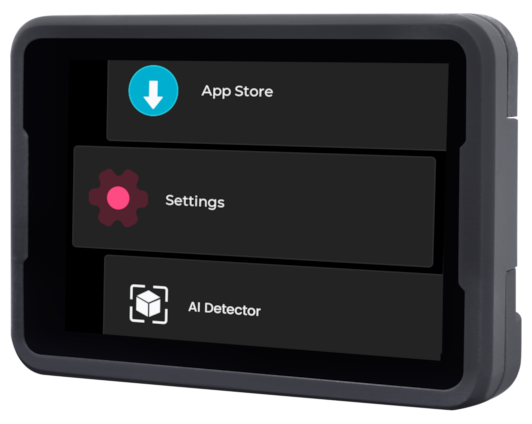

<style>
    #head_links table {
        width: 100%;
        display: table;
    }
    .biliiframe {
      width: 100%;
      min-height: 30em;
      border-radius: 0.5em;
      border: 1em solid white;
    }

    @media screen and (max-width: 900px){
      #head_links th, #head_links td {
          /* padding: 8px; */
          font-size: 0.9em;
          padding: 0.1em 0.05em;
      }
    }
</style>

## From Power-On to Your First Program

### Getting Started Video

<iframe src="//player.bilibili.com/player.html?isOutside=true&aid=113485669204279&bvid=BV1ncmRYmEDv&cid=26768769718&p=1" scrolling="no" border="0" frameborder="no" framespacing="0" allowfullscreen="true" class="biliiframe"></iframe>

### Prepare the TF Image Card and Insert it into the Device

If the package you purchased includes a TF card, it already contains the factory image. If the TF card was not installed in the device at the factory, you will first need to carefully open the case (be careful not to tear the ribbon cables inside) and then insert the TF card. Additionally, since the firmware from the factory may be outdated, it is highly recommended to follow the instructions on [Upgrading and Flashing the System](./basic/os.md) to upgrade the system to the latest version.

If you did not purchase a TF card, you need to flash the system onto a self-provided TF card. Please refer to [Upgrading and Flashing the System](./basic/os.md) for the flashing method, and then install it on the board.

### Power On

Power MaixCAM with a `Type-C` cable. Wait for it to start and show the function-selection screen.



If the screen does not display:
* Please confirm that you purchased the bundled TF card. If you confirm that you have a TF card and it is inserted into the device, you can try [updating to the latest system](./basic/os.md).
* If you did not purchase the TF card bundle, you need to follow the instructions in [updating to the latest system](./basic/os.md) to flash the latest system onto the TF card.
* Also, ensure that the screen and camera cables are not loose. The screen cable can easily come off when opening the case, so be careful.

### Connect to the Network

The first setup needs internet access to activate the device, install the runtime, and connect development tools. You can use a phone hotspot if no router is available.

Click `Settings` on the device and select `WiFi`. There are two ways to connect to the `WiFi` hotspot:

* Scan the WiFi sharing code:
  * Use your phone to share the `WiFi` hotspot QR code, or go to [maixhub.com/wifi](https://maixhub.com/wifi) to generate a QR code.
  * Click the `Scan QR code` button, the camera screen will appear, scan the QR code generated previously to connect.
* Search for hotspots:
  * Click the `Scan` button to start scanning the surrounding `WiFi`, you can click multiple times to refresh the list.
  * Find your WiFi hotspot.
  * Enter the password and click the `Connect` button to connect.
Then wait for the `IP` address to be obtained, which may take `10` to `30` seconds. If the interface does not refresh, you can exit the `WiFi` function and re-enter to view it, or you can also see the `IP` information in `Settings` -> `Device Information`.

### Install the Latest Runtime

The runtime provides basic features required by apps. Without the latest version, an app may fail to open or may close unexpectedly.

* Make sure the device is connected to WiFi, has an IP address, and can access the internet.
* On the device, click `Settings`, and select `Install Runtime Libraries`.
* After the installation is complete, you will see that it has been updated to the latest version. Then exit.

If `Request failed` appears, check whether the device can access the internet. If the network works but installation still fails, take a photo of the error and contact support.

### Use Built-in Applications

The device includes apps such as Find Blobs, AI Detector, and Line Follower. The following video shows self-learning detection:

<video playsinline controls autoplay loop muted preload  class="pl-6 pb-4 self-end" src="/static/video/self_learn_tracker.mp4" type="video/mp4" style="width:100%">
Classifier Result video
</video>

Open other apps from the function-selection screen. Their descriptions and updates are available in the [MaixHub App Store](https://maixhub.com/app).

**Note: The applications only include a part of the functionality that MaixPy can achieve. Using MaixPy, you can create even more features.**

### Logging into the Terminal

If you need to log into the terminal, the default username for `MaixCAM` is `root`, and the password is `root`.

## Use as a Serial Module

> This section is optional. Read it only when you need to send detection results over UART to another controller such as Arduino or STM32.

The built-in applications can be used directly as serial modules, such as `Find Blobs`, `Find Faces`, `Find QR Codes`, etc.
Note that the serial port can only directly connect to other microcontrollers. **If you want to communicate with a computer via a serial port, you must provide a USB-to-serial module yourself.**

Usage:
* Hardware connection: You can connect the device to the `Type-C one-to-two mini board`(For MaixCAM-Pro is 6Pin interface), which allows you to connect the device via serial to your main controller, such as `Arduino`, `Raspberry Pi`, `STM32`, etc.
* Open the application you want to use, such as QR code recognition. When the device scans a QR code, it will send the result to your main controller via serial.
> The serial baud rate is `115200`, the data format is `8N1`, and the protocol follows the [Maix Serial Communication Protocol Standard](https://github.com/sipeed/MaixCDK/blob/master/docs/doc/convention/protocol.md). You can find the corresponding application introduction on the [MaixHub APP](https://maixhub.com/app) to view the protocol.
> If an app does not send its result over UART, start from the matching MaixPy example and add output by following the [UART guide](./peripheral/uart.md).

## Preparing to Connect Computer and Device

MaixVision connects to the device over a network. Choose either WiFi or USB; you only need one of them:

* **Method 1 (Highly Recommended)**: Wireless Connection. Connect the device to the same router or Wi-Fi hotspot that the computer is connected to via Wi-Fi. Go to the device's `Settings -> WiFi Settings` and connect to your Wi-Fi. (If you experience **screen lag or high latency** with Wi-Fi, you can try Method 2 for a wired connection.)

* **Method 2**: Wired Connection. The device connects to the computer via a USB cable and appears as a USB network adapter. Wired transfer is stable, but a faulty cable, loose connection, or missing driver can prevent detection. See the [FAQ](./faq.md) if that happens.

.. details::Method Two: Driver Installation on Different Computer Systems:
    :open: true
    By default, there are two types of USB virtual network adapter drivers (NCM and RNDIS drivers) to meet the needs of different systems. You can also disable the unused virtual network adapter on the device under `Settings` -> `USB Settings`:
    * **Windows**: All Windows systems will automatically install the RNDIS driver, while only Windows 11 will automatically install the NCM driver. As long as **one of the drivers works**, it is sufficient. If the RNDIS driver is not installed automatically, see the [RNDIS driver installation guide](https://wiki.sipeed.com/hardware/zh/maixsense/maixsense-a075v/install_drivers.html).
      * Open Task Manager -> Performance, and you should see a virtual Ethernet with an IP address such as `10.131.167.100`, which is the computer's IP address. The device's IP address is the same but with the last digit changed to `1`, i.e., `10.131.167.1`. If you are using Windows 11, you will see two virtual network adapters; you can use either IP address.
      * Additionally, you can open `Device Manager` (search for `Device Manager` in the search bar). The RNDIS and NCM drivers should be correctly installed, as shown below:
         
    * **Linux**: No additional setup is required. Simply plug in the USB cable. Use `ifconfig` or `ip addr` to see the `usb0` and `usb1` network interfaces, and either IP address can be used. **Note**: The IP address you see, such as `10.131.167.100`, is the computer's IP address, and the device's IP address is the same but with the last digit changed to `1`, i.e., `10.131.167.1`.
    * **MacOS**: Check for the `usb` network adapter under `System Settings` -> `Network`. **Note**: The IP address you see, such as `10.131.167.100`, is the computer's IP address, and the device's IP address is the same but with the last digit changed to `1`, i.e., `10.131.167.1`.

## Preparing the Development Environment

* Make sure the computer and device are connected through WiFi or USB.
* Download and install [MaixVision](https://wiki.sipeed.com/maixvision).
* Open MaixVision and click `Connect` in the lower-left corner. When the device appears, click its connect button.

 If **no device is detected**, you can also manually enter the device's IP address in the **device**'s `Settings -> Device Info`. You can also find solutions in the [FAQ](./faq.md).

 **After a successful connection, the function selection interface on the device will disappear, and the screen will turn black, releasing all hardware resources. If there is still an image displayed, you can disconnect and reconnect.**

 Here is a video example of using MaixVision:

 <video style="width:100%" controls muted preload src="/static/video/maixvision.mp4"></video>

 ## Run Examples

 Click `Example Code` on the left side of MaixVision, select an example, and click the `Run` button in the bottom left to send the code to the device for execution.

 For example:
 * `hello_maix.py`: Click the `Run` button, and you will see messages printed from the device in the MaixVision terminal, as well as an image in the upper right corner.
 * `camera_display.py`: This example will open the camera and display the camera view on the screen.
 ```python
 from maix import camera, display, app
 
 disp = display.Display()          # Construct a display object and initialize the screen
 cam = camera.Camera(640, 480)     # Construct a camera object, manually set the resolution to 640x480, and initialize the camera
 while not app.need_exit():        # Keep looping until the program exits (you can exit by pressing the function key on the device or clicking the stop button in MaixVision)
     img = cam.read()              # Read the camera view and save it to the variable img, you can print(img) to print the details of img
     disp.show(img)                # Display img on the screen
 ```
 * `yolov5.py` will detect objects in the camera view, draw bounding boxes around them, and display them on the screen. It supports detection of 80 object types. For more details, please see [YOLOv5 Object Detection](./vision/yolov5.md).

 After these examples work, choose other examples that match what you want to build.

> If you encounter image display stuttering when using the camera examples, it may be due to poor network connectivity, or the quality of the USB cable or the host's USB being too poor. You can try changing the connection method or replacing the cable, host USB port, or computer.

 ## Install Applications on the Device

 The above examples run code on the device, but the code will stop running when `MaixVision` is disconnected. If you want the code to appear in the boot menu, you can package it as an application and install it on the device.

 Click the `Install App` button in the bottom left corner of `MaixVision`, fill in the application information, and the application will be installed on the device. Then you will be able to see the application on the device.
 You can also choose to package the application and share your application to the [MaixHub App Store](https://maixhub.com/app).

>  The default examples do not explicitly write an exit function, so you can exit the application by pressing the function key on the device. (For MaixCAM, it is the user key.)

 If you want the program to start automatically on boot, you can set it in `Settings -> Boot Startup`.

 More MaixVision usage refer to [MaixVision documentation](./basic/maixvision.md)。
