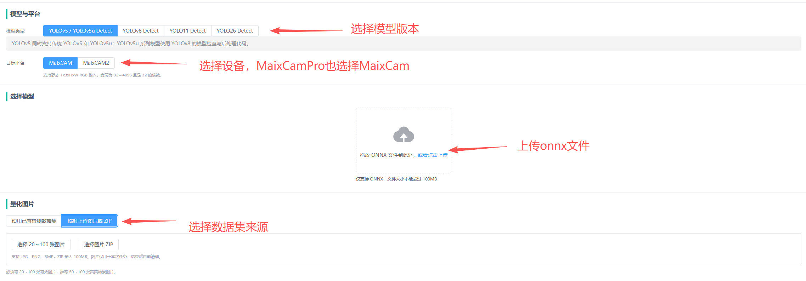
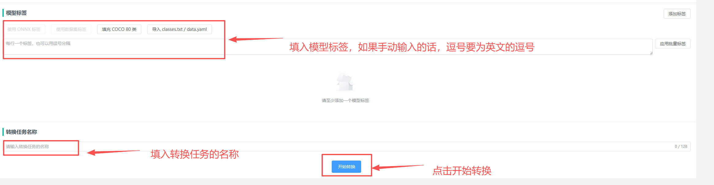
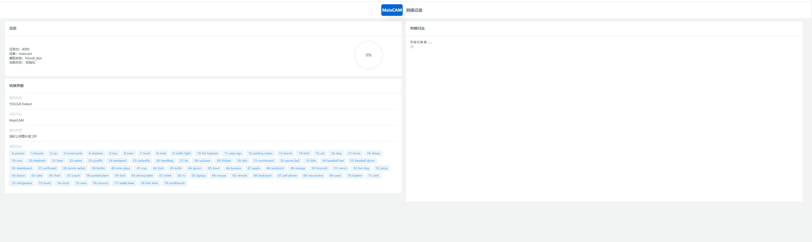
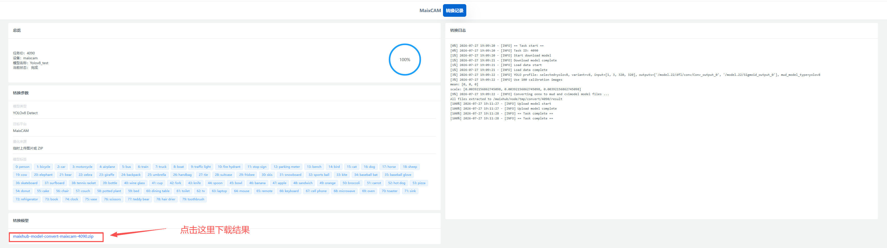
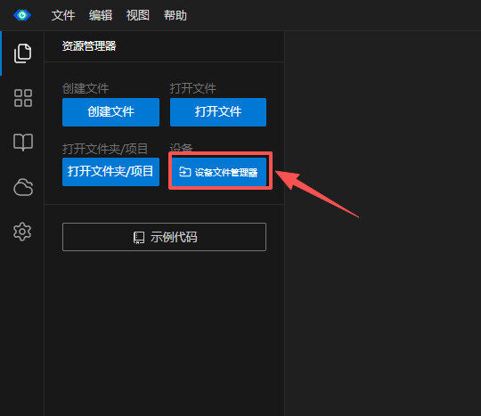
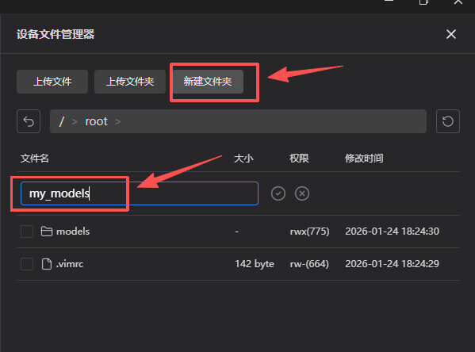
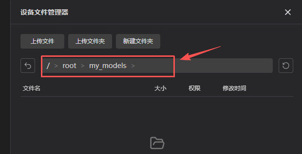
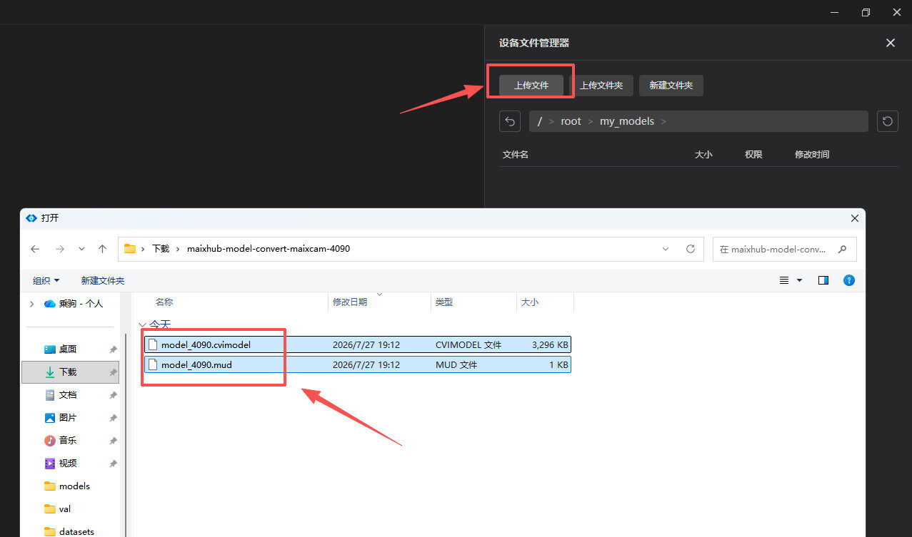

## Introduction

The MaixCAM model conversion tool is a Web model-conversion service hosted by Sipeed. You do not need to install Docker, Pulsar2, or TPU-MLIR locally. Prepare the ONNX model file and calibration image dataset, create a conversion job on the page, wait for the platform to finish, and download the result.

The online platform is suitable for quickly converting common YOLO Detect models and generating model files that can be deployed directly on MaixCAM, MaixCAM Pro, or MaixCAM2. If you need private intranet deployment, a self-managed conversion environment, or cannot upload model files to the online service, see [Self-hosted Graphical Model Conversion Platform](./web_converter.md).

## Current Support

The platform currently supports the following devices and models:

| Item | Supported |
| --- | --- |
| Target devices | MaixCAM, MaixCAM Pro, MaixCAM2 |
| Model types | YOLO26, YOLO11, YOLOv8, YOLOv5/YOLOv5u |
| Tasks | Object detection (Detect) |
| Input models | `.onnx` |
| Calibration dataset | A `.zip` file containing 20-100 `.jpg`, `.png`, or `.bmp` images, no larger than 100MB |

> Classification, segmentation, pose estimation, and OBB tasks are not currently supported. For other models or custom conversion parameters, use the manual conversion methods described in the previous guides, or self-host the conversion platform and modify it as needed.

## Open the Online Platform

Open the online model conversion platform in a browser:

[MaixHub Converter tool](https://maixhub.com/toolbox)

## Export a PT Model to ONNX

The online platform only accepts `.onnx` models. If your training result is a `.pt` weight file, export it to ONNX on your computer before uploading it to the platform.

For YOLO26, YOLO11, YOLOv8, or YOLOv5u models trained with Ultralytics, use `ultralytics==8.4.104` for both training and ONNX export. Pinning this version avoids model-structure or output-node differences from other Ultralytics releases, which may cause conversion failures later.

Install the specified export tools first:

```shell
pip install ultralytics==8.4.104 ultralytics-thop onnx onnxslim onnxruntime
```

Then choose the input resolution for the target device. The previous model-conversion guides recommend `320x224` for MaixCAM, and `640x480` or `320x240` for MaixCAM2. These resolutions are described as "width x height", while the Ultralytics `imgsz` argument is written as "height,width".

For MaixCAM, export an ONNX model with `320x224` input:

```shell
yolo export model=best.pt format=onnx imgsz=224,320 opset=17 simplify=True
```

For MaixCAM2, export an ONNX model with `640x480` input:

```shell
yolo export model=best.pt format=onnx imgsz=480,640 opset=17 simplify=True
```

To improve runtime speed on MaixCAM2 with a smaller input, you can also export `320x240`:

```shell
yolo export model=best.pt format=onnx imgsz=240,320 opset=17 simplify=True
```

Replace `model` with the path to your `.pt` file, and set `imgsz` to the input resolution you will use on the device. After export, `best.onnx` is usually generated in the same directory.

If the model was trained with the legacy YOLOv5 repository, run this command from the YOLOv5 project directory:

```shell
python export.py --weights best.pt --include onnx --img 224 320    # MaixCAM, 320x224
python export.py --weights best.pt --include onnx --img 480 640    # MaixCAM2, 640x480
python export.py --weights best.pt --include onnx --img 240 320    # MaixCAM2, 320x240
```

After exporting, use Netron or another ONNX viewer to confirm that the model has a fixed input shape and that it matches the width and height entered on the platform.

> Note the difference between YOLOv5u and YOLOv5: YOLOv5u refers to the YOLOv5u models in the newer Ultralytics `ultralytics` repository and is exported with the `yolo export ...` command. YOLOv5 refers to the YOLOv5 models from the original `ultralytics/yolov5` repository and is usually exported with that repository's `export.py` script.

## Prepare the Model and Calibration Dataset

The platform only accepts `.onnx` model files. It uses the ONNX model's own static input shape for later processing and conversion, and does not resize the model after upload. Decide the final deployment input resolution when exporting the ONNX model.

The calibration dataset must be packaged as a `.zip` file containing images only; annotation files are not required. The archive must contain 20-100 images, supported image formats are `.jpg`, `.png`, and `.bmp`, and the uploaded ZIP file must be no larger than 100MB.

Images may be stored directly in the archive:

```text
dataset.zip
  000001.jpg
  000002.jpg
  000003.jpg
```

Calibration images should resemble the model's actual deployment environment. For example, if the model will process camera images, prefer images captured by a similar camera under realistic conditions. Prepare 20-50 images for a quick workflow check, then increase the number toward 100 for final conversion as needed.

## Create a Conversion Job

Open the Web page and complete the form from top to bottom:



The platform usually detects the labels stored in the model automatically. If it does not, enter the labels manually.



Click **Start Conversion** after completing the form. The page displays upload progress, the current job status, and live conversion logs. Conversion time depends on the model size, calibration image count, and the server job queue.

Wait for the conversion to complete.



## Download the Conversion Result

After a successful conversion, the **Download Result** button becomes available. Click it to download a ZIP archive containing the generated model files.



A MaixCAM2 result normally contains:

```text
model_name.mud
model_name_npu.axmodel
model_name_vnpu.axmodel
```

A MaixCAM or MaixCAM Pro result normally contains:

```text
model_name.mud
model_name.cvimodel
```

## Transfer the Model Files to MaixCAM / MaixCAM Pro / MaixCAM2

1. Open MaixVision and connect to the device.

2. Open the device file manager.



3. Create a `my_models` folder under the `root` directory to store the converted model.



4. Click the `my_models` folder to enter it.



5. Upload the converted files to `my_models`. For MaixCAM / MaixCAM Pro, upload the `.mud` and `.cvimodel` files. For MaixCAM2, upload the `.mud` and `.axmodel` files.



6. Write the inference code.

The following example uses YOLOv8.

Assume the `.mud` file you just obtained is `model_4090.mud`.

```python
from maix import app, camera, display, image, nn

detector = nn.YOLOv8(model="/root/my_models/model_4090.mud", dual_buff=True)
cam = camera.Camera(detector.input_width(), detector.input_height(), detector.input_format())
disp = display.Display()

while not app.need_exit():
    img = cam.read()
    objs = detector.detect(img, conf_th=0.5, iou_th=0.45)
    for obj in objs:
        img.draw_rect(obj.x, obj.y, obj.w, obj.h, color=image.COLOR_RED)
        msg = f"{detector.labels[obj.class_id]}: {obj.score:.2f}"
        img.draw_string(obj.x, obj.y, msg, color=image.COLOR_RED)
    disp.show(img)
```

For YOLO26 or YOLO11, replace `nn.YOLOv8` with the corresponding MaixPy model interface. For YOLOv5u models from the newer Ultralytics `ultralytics` repository, use `nn.YOLOv8` directly in the inference code; do not use `nn.YOLOv5`. The `nn.YOLOv5` interface is for YOLOv5 models trained with the original `ultralytics/yolov5` repository.

## Notes

- Confirm the source and license of the model before uploading it. Do not upload models you are not allowed to use.
- The online platform only accepts ONNX models. If you have a `.pt` weight file, export it to ONNX first.
- The calibration dataset must contain 20-100 `.jpg`, `.png`, or `.bmp` images, and the ZIP file must be no larger than 100MB.
- If the model or dataset contains sensitive information, use the [self-hosted graphical model conversion platform](./web_converter.md) on your own server.
- Conversion jobs may wait in a queue. Runtime depends on model size, calibration image count, and server load.
- Download the result promptly after conversion succeeds to avoid job expiration or cleanup.
- The online platform mainly targets common YOLO Detect conversion. Use self-hosting if you need to modify Docker images, toolchain parameters, or result-generation logic.

## FAQ

### Not Enough Calibration Images

The **Image Count** value must be between 20 and 100 and cannot exceed the number of valid images in the uploaded ZIP archive. If the archive contains only 50 images, do not set the value to 100.

### Incorrect Classes in a Custom Model

The platform tries to read class names from ONNX metadata. If the deployed model reports incorrect class names or counts, check whether `labels` in the generated `.mud` file matches the trained model.

### Conversion Job Failed

Check the live log on the page first and confirm that the model format, YOLO version, input resolution, and calibration image count are correct. If the log reports unsupported operators, abnormal output nodes, or quantization failure, go back to the training, ONNX export, or manual conversion flow for diagnosis.
