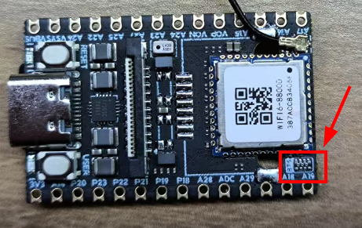

##  Bluetooth Instructions

​	Bluetooth is a common short-range wireless communication technology mainly used to establish low-power, point-to-point or local network connections between two or more devices. It operates in the 2.4GHz frequency band and was originally designed to replace wired data cables for small data transmissions between devices. In modern life, Bluetooth has become a widely used technology in our daily activities. For example, when driving, we can connect a phone to the car’s Bluetooth system to make hands-free calls or play music; Bluetooth headsets free us from the constraints of wired earphones when listening to music or making calls; in smart homes, Bluetooth enables interaction with smart locks, lighting, temperature and humidity sensors, and more, creating a convenient and efficient living environment.

## Getting Started

​	MaixCAM and MaixCAM-Pro come with a built-in AIC8800D Wi-Fi/Bluetooth dual-mode chip. However, due to limited IO resources, the main controller is not connected to Bluetooth by default. To enable Bluetooth, you need to solder a 0-ohm resistor between the following pins and the Bluetooth path: `GPIOA18`, `GPIOA19`, `GPIOA28`, and `GPIOA29`.

The position for soldering the 0-ohm resistors on MaixCAM is shown below:



The position for soldering the 0-ohm resistors on MaixCAM Pro is shown below:


> Note: The following section demonstrates basic Bluetooth usage via the command line. For more advanced development needs, we encourage you to explore further on your own!

## Enabling Bluetooth

```shell
hciattach -n /dev/ttyS1 any 1500000 &
hciconfig hci0 up
```


## Connecting a Bluetooth Mouse

Here, we use the `bluetoothctl` tool to configure Bluetooth:

```shell
bluetoothctl			# Start bluetoothctl

##  Enter the following commands in the bluetoothctl terminal ##
power on              # Turn on Bluetooth
agent on              # Enable agent
default-agent         # Set as default agent
scan on               # Start scanning for devices

# After finding the target Bluetooth MAC address during scan
pair {device MAC address}        # Pair with the device
trust {device MAC address}       # Trust the device
connect {device MAC address}     # Connect to the device

# Exit after successful connection
exit
```

Verify mouse data:

```shell
# Run hcidump to observe all HCI messages printed in the terminal
hcidump

# Run btmon to observe captured HCI events
btmon
```


## Other reference

* [使用MaixCAM的蓝牙功能 · 硬件篇](https://maixhub.com/share/58)
* [使用MaixCAM的蓝牙功能 · 软件篇](https://maixhub.com/share/62)


