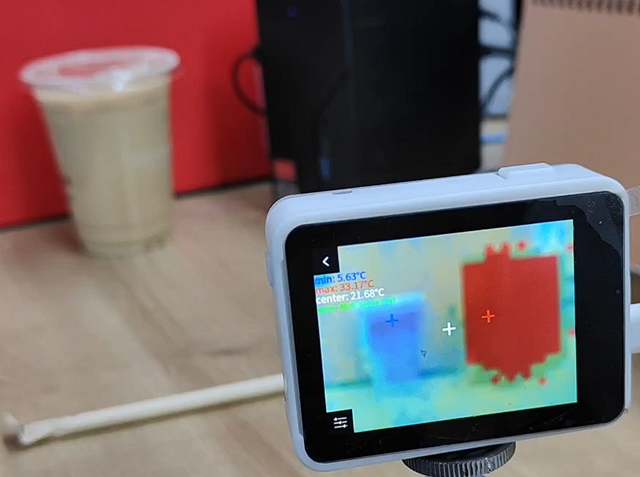

## Demo

Single thermal imaging effect:

Thermal imaging and visible light fusion effect (left: cold drink, right: a working mini PC):

This APP has been integrated into the MaixCAM Release image. Install the supported module and launch the `Thermal Camera` APP to use it.

[APP Installation Link](https://maixhub.com/app/87)

[Source Code Link](https://github.com/sipeed/MaixCDK/tree/main/projects/app_thermal_camera)

## Supported List

* PMOD_Thermal32

[Purchase Inquiry Link](https://wiki.sipeed.com/en/store.html)

### PMOD_Thermal32

PMOD_Thermal32 is an industry-standard, fully calibrated 32*24 pixel thermal infrared array sensor. Module parameters:

| Parameter Name | Value |
|----------------|-------|
| Resolution     | 32x24 |
| Temperature Range | -40～450℃ |
| Frame Rate     | 1~30fps |
| Interface      | I2C   |

After installing the PMOD_Thermal32 module, you can use the API provided by MaixPy to obtain the temperature data matrix, pseudo-color images, and the minimum, maximum, and center temperature values and their corresponding coordinates from the latest frame data. For details, see [Module API Documentation](../../../api/maix/ext_dev/mlx90640.md).

You can also refer to our demo APP to write your application code.
