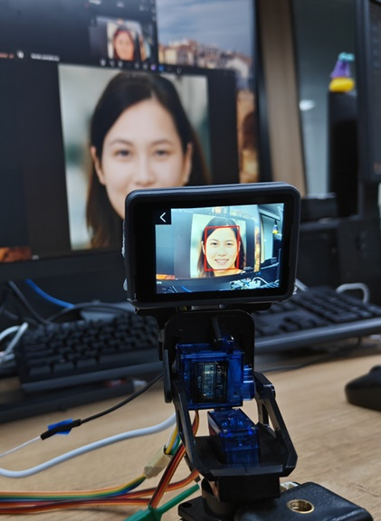

Before reading this article, make sure you know how to develop with MaixCAM. For details, please read [Quick Start](../README.md).

[Source Code](https://github.com/sipeed/MaixPy/blob/main/projects/app_face_tracking)

[Download APP](https://maixhub.com/app/31)

## Description

Face recognition and tracking is accomplished using a gimbal consisting of two servos and MaixCAM.




## Usage of this example program

* Assemble your Gimbal and MaixCAM.

* Modify the parameters in `main.py`.

  Modify the MaixCAM pins used for each servo. The specified pins must have PWM capability.The `servos.Servos` constructor then configures the pin for PWM functionality.

  ```python
  ROLL_PWM_PIN_NAME = "A17"
  PITCH_PWM_PIN_NAME = "A16"
  ```

  Modify the initial positions of the two servos.

   ```python
   init_pitch = 80         # init position, value: [0, 100], means minimum angle to maxmum angle of servo
   init_roll = 50          # 50 means middle
   ```

  You need to modify the min-max PWM duty cycle for the active range of each of the two servos. NOTE: Certain Gimbal configurations may have unintended consequences when servos exceed their physically limited maximum range of motion. Ensure that there is no obstruction within the range of motion of the servos corresponding to the following setpoints.

  ```python
  PITCH_DUTY_MIN  = 3.5   # The minimum duty cycle corresponding to the range of motion of the y-axis servo.
  PITCH_DUTY_MAX  = 9.5   # Maximum duty cycle corresponding to the y-axis servo motion range.
  ROLL_DUTY_MIN   = 2.5   # Minimum duty cycle for x-axis servos.
  ROLL_DUTY_MAX   = 12.5  # Maxmum duty cycle for x-axis servos.
  ```

  You need to select the direction of motion of the servos.

  ```python
  pitch_reverse = False                   # reverse out value direction
  roll_reverse = True                     # reverse out value direction
  ```

* Just execute the code at the end.

  If you installed the application from MaixHub, click face_tracking in the launcher to execute the program.

  If you got the source code from Github, you can import the project folder in [MaixVision](https://wiki.sipeed.com/maixvision) and execute the whole project. Please refer to [MaixVision Description](https://wiki.sipeed.com/maixpy/doc/zh/basic/maixvision.html) for more information about MaixVision.

  Of course, you can also copy the whole project folder to our MaixCAM in your favorite way and execute it with python.

* If you want to exit the program, just press the button in the upper left corner.

  

### FAQs

* The face tracking is not ideal.

  Different Gimbal use different PID parameters, you can adjust the PID value to make the effect better.

  ```python
  pitch_pid = [0.3, 0.0001, 0.0018, 0]    # [P I D I_max]
  roll_pid  = [0.3, 0.0001, 0.0018, 0]    # [P I D I_max]
  ```

* After completing the tracking, the gimbal jerks small left and right for a period of time against a motionless face.

  You can usually make this effect as small as possible by adjusting the PID; however, there is no way to avoid the jitter caused by the physical structure of the gimbal. You can try to adjust the deadband to minimize the jitter.

  ```python
  target_ignore_limit = 0.08
  # when target error < target_err_range*target_ignore_limit , set target error to 0
  ```

* The display shows or the terminal prints `PIN: XXX does not exist`.

  This is because the pin does not exist in the pinout of the MaixCAM board. Please select a pin with PWM function on MaixCAM.

* The display shows or the terminal prints `Pin XXX doesn't have PWM function`.

  This is because the pin does not have a PWM function, you need to select a pin with a PWM function.


## How to track other objects

* In `main.py` there exists a class `Target` which is used to customize the target to be tracked.

* In `__init__`, initialize the objects you need to use, such as the camera.

* In `__get_target()`, you need to calculate the center point of the tracked object, and if the tracked object does not exist in the frame, return -1,-1 to make sure that the program does not do anything for a while if the target is not found. You also need to call `self.__exit_listener(img)` and `self.disp.show(img)` before returning to the point to make sure that the program can interact with you properly.
