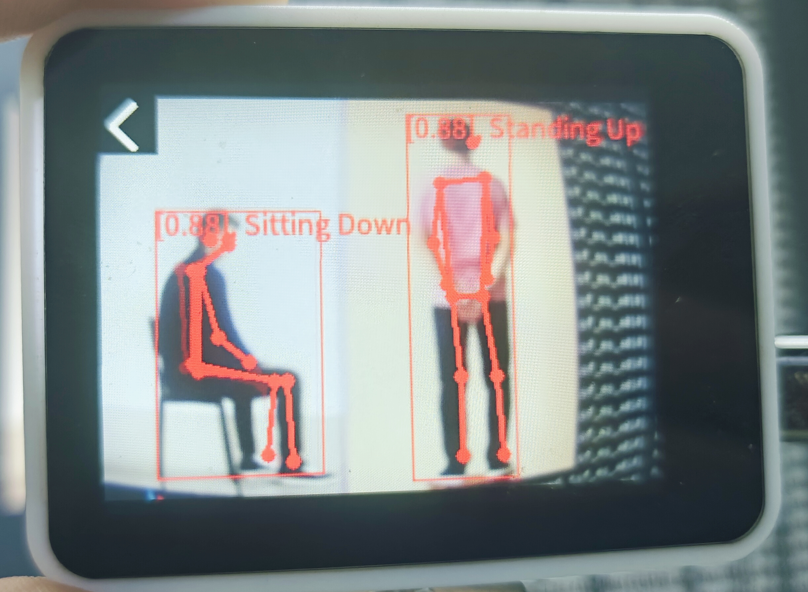

## Introduction

The `MaixCAM MaixPy Pose Estimation` can estimate `17` human keypoints.


The connections between specific keypoints can simulate the human body, such as:

```markdown
3-1-0-2-4 form the head (Head)
5-6-12-11-5 form the torso (Torso)
5-7-9 or 6-8-10 form the upper limbs (Upper Limbs)
11-13-15 or 12-14-16 form the lower limbs (Lower Limbs)

"Thigh": "大腿",
"Shin": "小腿",
"Upper Arm": "大臂",
"Forearm": "小臂",
```

Each limb can be represented as a vector, and the angle between different limbs can be calculated.

For example, the angle between the thigh and shin can be used to determine whether the shin is straight or bent. Since a human cannot stand upright with a bent shin, similar logic can be applied to classify the posture of the human body.

Current classifications include:

1. "Lying Down": "躺下",
2. "Standing Up": "直立",
3. "Sitting Down": "坐下",
4. "Reclining": "斜躺",
5. "To Left 1": "向左1",
6. "To Right 1": "向右1",
7. "Both Hands Raised Horizontally": "双手平举",
8. "Left Hand Raised": "举左手",
9. "Right Hand Raised": "举右手",
10. "Both Hands Raised Up": "举双手",
11. "Both Hands Forming a Heart": "双手比心",
12. "Big 'T' Shape": "大字型",


Example Image


## Usage

The app `Human Pose Classifier` packaged in `projects/app_human_pose_classifier/` can be directly run.

The file `nn_yolo11_pose_cls.py` under `examples/vision/ai_vision/` is a standalone implementation and can be run directly on MaixVision by just clicking the run button.

It is recommended to refer to `PoseEstimation.py` for customization.