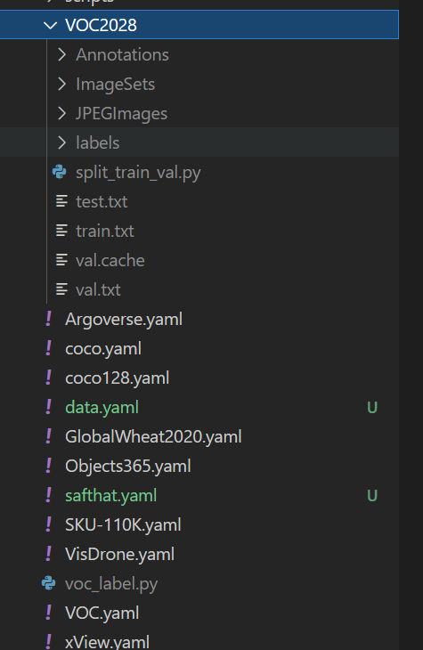
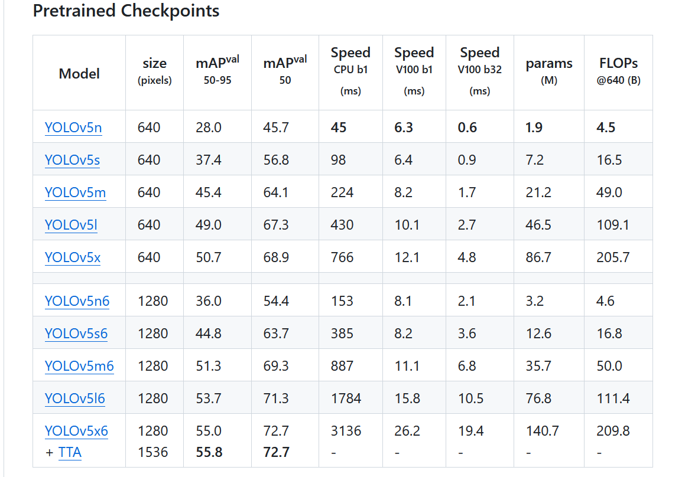
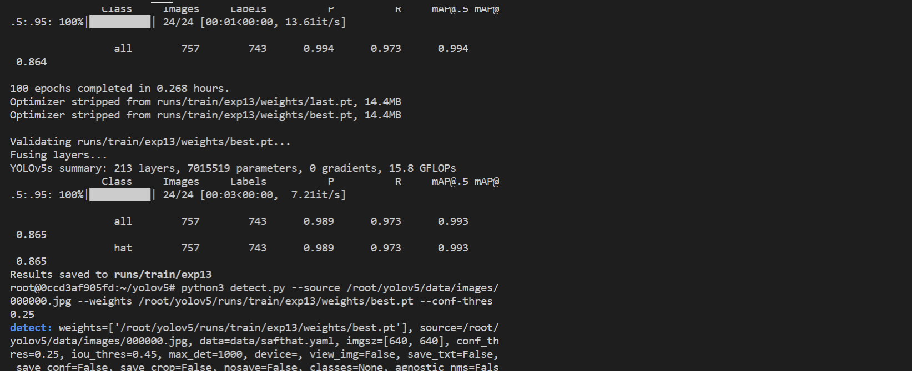
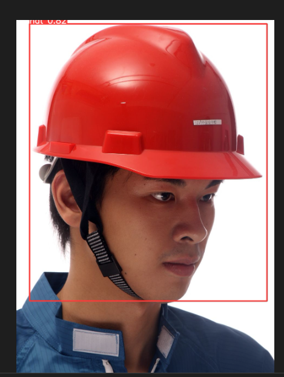
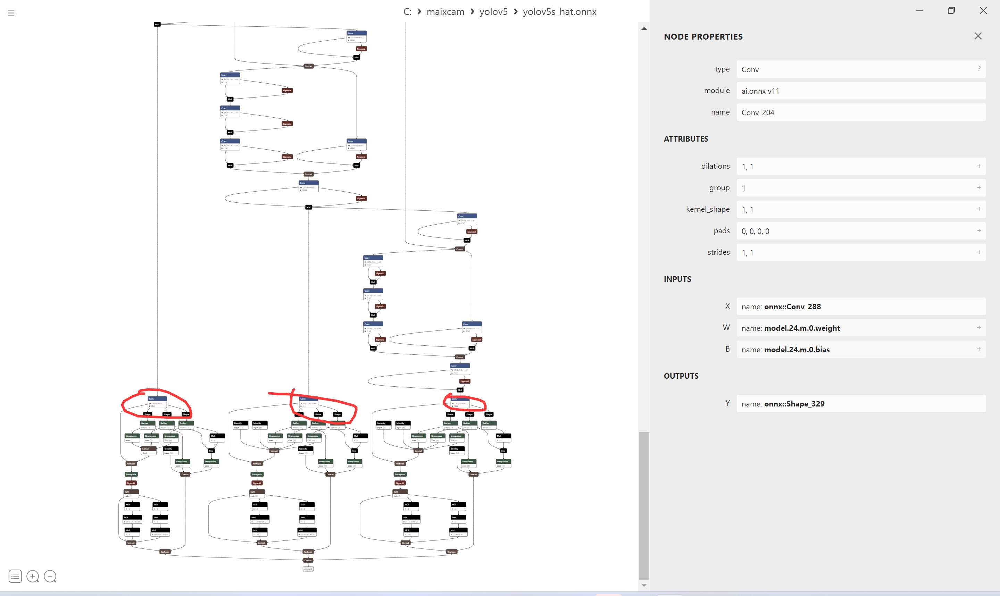
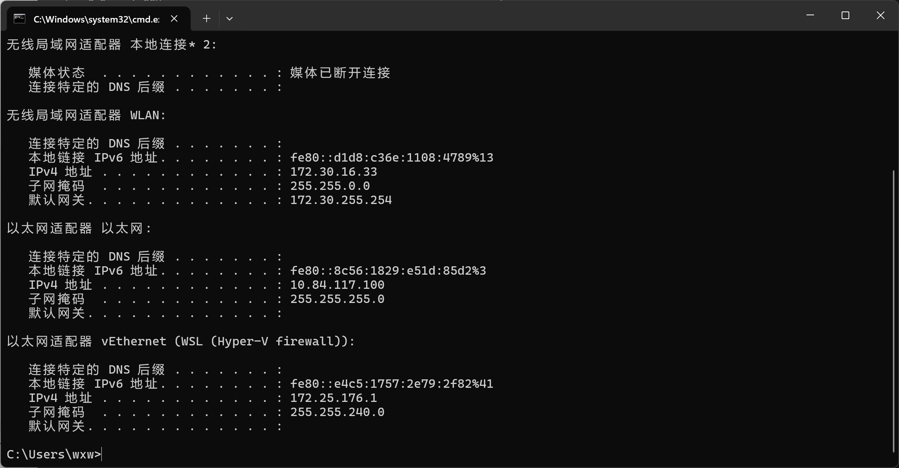

> This post is contributed by the community user dragonforward

> This blog will show you how to deploy your own YOLOv5s model (the author demonstrates a hard hat model) step by step from scratch. The training part refers to the author's previous work, and those who have already trained their models can skip this part, although there are some differences.

**Obtain Custom-Trained YOLOv5s ONNX Model**
--------------------------------------------

### **Prepare Custom Dataset (The author uses the VOC dataset)**

*   `Dataset Directory Structure` is as follows:
    
```
└─VOC2028:        Custom dataset
    ├─Annotations    Stores the dataset label files in XML format
    ├─ImageSets        Dataset split files
    │  └─Main
    ├─JPEGImages    Stores the dataset images
```

*   `Split the Dataset`
    

Execute `python3 split_train_val.py` in the `split_train_val.py` file path, and you will get the following directory structure:

```
└─VOC2028:        Custom dataset
    ├─Annotations    Stores the dataset label files in XML format
    ├─ImageSets        Dataset split files
    │  └─Main test.txt
          └─test.txt
          └─train.txt
          └─val.txt
    ├─JPEGImages    Stores the dataset images
    ├─split_train_val.py    Python file for splitting the dataset
```

`split_train_val.py file code`:

```python
# -*- coding: utf-8 -*-
"""
Author: dragonforward
Description: Split into training, validation, and test sets in the ratio of 8:1:1, 8 for training, 1 for validation, and 1 for testing.
"""
import os
import random
import argparse

parser = argparse.ArgumentParser()
# Address of the XML files, modify according to your data. XML files are usually stored in Annotations
parser.add_argument('--xml_path', default='Annotations/', type=str, help='input xml label path')
# Dataset split, choose the address under your data's ImageSets/Main
parser.add_argument('--txt_path', default='ImageSets/Main/', type=str, help='output txt label path')
opt = parser.parse_args()

train_percent = 0.8  # Proportion of the training set
val_percent = 0.1    # Proportion of the validation set
test_persent = 0.1   # Proportion of the test set

xmlfilepath = opt.xml_path
txtsavepath = opt.txt_path
total_xml = os.listdir(xmlfilepath)

if not os.path.exists(txtsavepath):
    os.makedirs(txtsavepath)

num = len(total_xml)  
list = list(range(num))

t_train = int(num * train_percent)  
t_val = int(num * val_percent)

train = random.sample(list, t_train)
num1 = len(train)
for i in range(num1):
    list.remove(train[i])


val_test = [i for i in list if not i in train]
val = random.sample(val_test, t_val)
num2 = len(val)
for i in range(num2):
    list.remove(val[i])


file_train = open(txtsavepath + '/train.txt', 'w')
file_val = open(txtsavepath + '/val.txt', 'w')
file_test = open(txtsavepath + '/test.txt', 'w')

for i in train:
    name = total_xml[i][:-4] + '\n'
    file_train.write(name)

for i in val:
    name = total_xml[i][:-4] + '\n'
    file_val.write(name)    

for i in list:
    name = total_xml[i][:-4] + '\n'
    file_test.write(name)
    
    
file_train.close()
file_val.close()
file_test.close()
```

*   `Convert VOC to labels to obtain label files`
    

Directory structure:

```
└─VOC2028:        Custom dataset
    ├─Annotations    Stores the dataset label files in XML format
    ├─ImageSets        Dataset split files
    │  └─Main
    ├─JPEGImages    Stores the dataset images
    └─labels        YOLOv5 treats this folder as the training annotation folder
└─voc_label.py
```

 the `voc_label.py` file code:

```python
# -*- coding: utf-8 -*-
import xml.etree.ElementTree as ET
import os

sets = ['train', 'val', 'test']  # If your Main folder doesn't have test.txt, remove 'test'
classes = ["hat", "people"]   # Change to your own classes, VOC dataset has the following 20 classes
# classes = ["brickwork", "coil","rebar"]   # Change to your own classes, VOC dataset has the following 20 classes
# classes = ["aeroplane", 'bicycle', 'bird', 'boat', 'bottle', 'bus', 'car', 'cat', 'chair', 'cow', 'diningtable', 'dog',
#            'horse', 'motorbike', 'person', 'pottedplant', 'sheep', 'sofa', 'train', 'tvmonitor']  # class names
# abs_path = os.getcwd() /root/yolov5/data/voc_label.py 
abs_path = '/root/yolov5/data/'

def convert(size, box):
    dw = 1. / (size[0])
    dh = 1. / (size[1])
    x = (box[0] + box[1]) / 2.0 - 1
    y = (box[2] + box[3]) / 2.0 - 1
    w = box[1] - box[0]
    h = box[3] - box[2]
    x = x * dw
    w = w * dw
    y = y * dh
    h = h * dh
    return x, y, w, h


def convert_annotation(image_id):
    in_file = open(abs_path + '/VOC2028/Annotations/%s.xml' % (image_id), encoding='UTF-8')
    out_file = open(abs_path + '/VOC2028/labels/%s.txt' % (image_id), 'w')
    tree = ET.parse(in_file)
    root = tree.getroot()
    size = root.find('size')
    w = int(size.find('width').text)
    h = int(size.find('height').text)
    for obj in root.iter('object'):
        difficult = obj.find('difficult').text
        # difficult = obj.find('Difficult').text
        cls = obj.find('name').text
        if cls not in classes or int(difficult) == 1:
            continue
        cls_id = classes.index(cls)
        xmlbox = obj.find('bndbox')
        b = (float(xmlbox.find('xmin').text), float(xmlbox.find('xmax').text), float(xmlbox.find('ymin').text),
             float(xmlbox.find('ymax').text))
        b1, b2, b3, b4 = b
        # Bounding box correction
        if b2 > w:
            b2 = w
        if b4 > h:
            b4 = h
        b = (b1, b2, b3, b4)
        bb = convert((w, h), b)
        out_file.write(str(cls_id) + " " + " ".join([str(a) for a in bb]) + '\n')


for image_set in sets:
    if not os.path.exists(abs_path + '/VOC2028/labels/'):
        os.makedirs(abs_path + '/VOC2028/labels/')

    image_ids = open(abs_path + '/VOC2028/ImageSets/Main/%s.txt' % (image_set)).read().strip().split()
    list_file = open(abs_path + '/VOC2028/%s.txt' % (image_set), 'w')
    for image_id in image_ids:
        list_file.write(abs_path + '/VOC2028/JPEGImages/%s.jpg\n' % (image_id))  # Either complete the path yourself, or only writing half may cause an error
        convert_annotation(image_id)
    list_file.close()
```



### **Train the Model**

*   Configure the environment
    
```
git clone https://github.com/ultralytics/yolov5
cd yolov5
pip install -r requirements.txt
pip install onnx
```

*   Download pre-trained weights (the author tried both v7.0 and v6.0 pt, and both work)
    
```
https://github.com/ultralytics/yolov5/releases/download/v7.0/yolov5s.pt
```



* Train the model (the author used the school's cluster for training)

```
python3 train.py --weights weights/yolov5s.pt --cfg models/yolov5s.yaml --
data data/safthat.yaml --epochs 150 --batch-size 16 --multi-scale --device 0

```



```
python3 detect.py --source /root/yolov5/data/images/000000.jpg --weights /root/yolov5/runs/train/exp13/weights/best.pt --conf-thres 0.25
```



* Export the ONNX model. Since the school server is currently in class, they can allocate me a computer only after their class is over. So I used the local conda environment on my laptop to export it. The reason for using `-imgsz 224 320` is that it is more suitable for the screen. I also tried 640_640, but the camera reported an error, suggesting that it should be 640_480. Then I saw that the Sipeed YOLOv5s was 320*224, so I kept it consistent with theirs.

```
python export.py --weights yolov5s_hat.pt --include onnx --opset 16 --imgsz 224 320
```


You can view the model by entering netron.app in the URL, and there are three outputs:



Here are the author's three outputs:

```
onnx::Shape_329
onnx::Shape_384
onnx::Shape_439
```

## Model Conversion (Key Step)

### **Install Docker Environment (Skip if already installed)**

```
Install the basic software required for Docker
sudo apt-get update
sudo apt-get install apt-transport-https ca-certificates curl gnupg-agent software-properties-common
Add official source
curl -fsSL https://download.docker.com/linux/ubuntu/gpg | sudo apt-key add -
sudo add-apt-repository "deb [arch=amd64] https://download.docker.com/linux/ubuntu $(lsb_release -cs) stable"
Install Docker
sudo apt-get update
sudo apt-get install docker-ce docker-ce-cli containerd.io
```

### **Start the Model Quantization Process (!!!)**

### **Preparation**

```
Download from the following URL
https://github.com/sophgo/tpu-mlir/releases/tag/v1.7
tpu-mlir-resource.tar and tpu_mlir-1.7-py3-none-any.whl
```


The reason for pulling the latest version is that I failed with version 3.1, as the tools are constantly being updated, so it's better to keep up with the latest version. You can see in the image below that I also tried version 3.1.


```
docker pull sophgo/tpuc_dev:latest

After entering the container, copy the two prepared files to the workspace directory

root@3d517bc7f51f:/workspace/model_yolov5s# cd ..
root@3d517bc7f51f:/workspace# ls
model_yolov5s  tpu-mlir-resource  tpu-mlir-resource.tar  tpu_mlir-1.7-py3-none-any.whl
root@3d517bc7f51f:/workspace# 

Choose one of the following two options, I recommend the second one for offline installation
pip install tpu_mlir[all] or pip install tpu_mlir-*-py3-none-any.whl[all]
The author chose the second option
pip install tpu_mlir-1.7-py3-none-any.whl
And install all its dependencies
pip install tpu_mlir-1.7-py3-none-any.whl[all]
Extract
tar -xvf tpu-mlir-resource.tar
Rename the folder
mv regression/ tpu-mlir-resource/


mkdir model_yolov5s && cd model_yolov5s

cp -rf ../tpu_mlir_resource/dataset/COCO2017 .
cp -rf ../tpu_mlir_resource/image .


Transfer the previously prepared 100 images, one test image, and the ONNX model to the following location
root@3d517bc7f51f:/workspace# cd model_yolov5s/
root@3d517bc7f51f:/workspace/model_yolov5s# ls
COCO2017  image  workspace  yolov5n_hat.onnx  yolov5s_hat.onnx
root@3d517bc7f51f:/workspace/model_yolov5s# cd COCO2017/
root@3d517bc7f51f:/workspace/model_yolov5s/COCO2017# ls
000000.jpg  000011.jpg  000022.jpg  000032.jpg  000042.jpg  000053.jpg  000066.jpg  000076.jpg  000086.jpg  000096.jpg
000002.jpg  000012.jpg  000023.jpg  000033.jpg  000043.jpg  000054.jpg  000067.jpg  000077.jpg  000087.jpg  000101.jpg
000003.jpg  000013.jpg  000024.jpg  000034.jpg  000044.jpg  000055.jpg  000068.jpg  000078.jpg  000088.jpg  000102.jpg
000004.jpg  000014.jpg  000025.jpg  000035.jpg  000045.jpg  000058.jpg  000069.jpg  000079.jpg  000089.jpg  000103.jpg
000005.jpg  000015.jpg  000026.jpg  000036.jpg  000046.jpg  000059.jpg  000070.jpg  000080.jpg  000090.jpg  000104.jpg
000006.jpg  000016.jpg  000027.jpg  000037.jpg  000048.jpg  000061.jpg  000071.jpg  000081.jpg  000091.jpg  000105.jpg
000007.jpg  000017.jpg  000028.jpg  000038.jpg  000049.jpg  000062.jpg  000072.jpg  000082.jpg  000092.jpg  000106.jpg
000008.jpg  000019.jpg  000029.jpg  000039.jpg  000050.jpg  000063.jpg  000073.jpg  000083.jpg  000093.jpg  000107.jpg
000009.jpg  000020.jpg  000030.jpg  000040.jpg  000051.jpg  000064.jpg  000074.jpg  000084.jpg  000094.jpg  000108.jpg
000010.jpg  000021.jpg  000031.jpg  000041.jpg  000052.jpg  000065.jpg  000075.jpg  000085.jpg  000095.jpg  000109.jpg
root@3d517bc7f51f:/workspace/model_yolov5s/COCO2017# ls -l | grep "^-" | wc -l
100
root@3d517bc7f51f:/workspace/model_yolov5s/COCO2017# 

You can use ls -l | grep "^-" | wc -l to check the number of images. The author replaced the 100 helmet images and the test image in the COCO2017 folder.

Go back to model_yolov5s
root@3d517bc7f51f:/workspace/model_yolov5s/COCO2017# cd ..
root@3d517bc7f51f:/workspace/model_yolov5s# ls
COCO2017  image  workspace  yolov5n_hat.onnx  yolov5s_hat.onnx
root@3d517bc7f51f:/workspace/model_yolov5s# 

Next
mkdir workspace && cd workspace
Execute the following command to convert ONNX to MLIR (remember to replace output_names with your own)
model_transform \
--model_name yolov5s \
--model_def ../yolov5s_hat.onnx \
--input_shapes [[1,3,224,320]] \
--mean 0.0,0.0,0.0 \
--scale 0.0039216,0.0039216,0.0039216 \
--keep_aspect_ratio \
--pixel_format rgb \
--output_names onnx::Shape_329,onnx::Shape_439,onnx::Shape_384 \
--test_input ../image/hat.jpg \
--test_result yolov5s_top_outputs.npz \
--mlir yolov5s.mlir

Execute the following command to convert MLIR to INT8 model, before converting to INT8 model, you need to run calibration to obtain the calibration table
run_calibration yolov5s.mlir \
--dataset ../COCO2017 \
--input_num 100 \
-o yolov5s_cali_table
Then execute the following
model_deploy \
--mlir yolov5s.mlir \
--quantize INT8 \
--calibration_table yolov5s_cali_table \
--processor cv181x \
--test_input yolov5s_in_f32.npz \
--test_reference yolov5s_top_outputs.npz \
--tolerance 0.85,0.45 \
--model yolov5s_cv181x_int8_sym.cvimodel

Finally, you will get the following:
root@3d517bc7f51f:/workspace/model_yolov5s/workspace# ls
_weight_map.csv          yolov5s_cv181x_int8_sym.cvimodel         yolov5s_origin.mlir
build_flag.json          yolov5s_cv181x_int8_sym_final.mlir       yolov5s_top_f32_all_origin_weight.npz
final_opt.onnx           yolov5s_cv181x_int8_sym_tensor_info.txt  yolov5s_top_f32_all_weight.npz
yolov5s.mlir             yolov5s_cv181x_int8_sym_tpu.mlir         yolov5s_top_outputs.npz
yolov5s_cali_table       yolov5s_in_f32.npz                       yolov5s_tpu_addressed_cv181x_int8_sym_weight.npz
yolov5s_cv181x_int8_sym  yolov5s_opt.onnx.prototxt                yolov5s_tpu_addressed_cv181x_int8_sym_weight_fix.npz
root@3d517bc7f51f:/workspace/model_yolov5s/workspace# 
```

Through the above steps, you can obtain the quantized model that can be deployed to the development board.

Explanation:
The reason why it's cv181x is because I tried it first and got the following

```
-- [I] load cvimodel from: /root/models/yolov5n.cvimodel
cvimodel built for cv180x CANNOT run on platform cv181x
failed to parse cvimodel

```

## running the model on an actual device:

* The contents of `yolov5s_hat.mud` are as follows:

```
[basic]
type = cvimodel
model = yolov5s_hat_cv181x_int8_sym.cvimodel

[extra]
model_type = yolov5
input_type = rgb
mean = 0, 0, 0
scale = 0.00392156862745098, 0.00392156862745098, 0.00392156862745098
anchors = 10,13, 16,30, 33,23, 30,61, 62,45, 59,119, 116,90, 156,198, 373,326
labels = hat,person
```

Run the code:

```python
from maix import camera, display, image, nn, app

detector = nn.YOLOv5(model="/root/models/yolov5s_hat.mud")
cam = camera.Camera(detector.input_width(), detector.input_height(), detector.input_format())
dis = display.Display()
print("www")
print(detector.input_width(), detector.input_height(), detector.input_format())

while not app.need_exit():
    img = cam.read()
    objs = detector.detect(img, conf_th=0.5, iou_th=0.45)
    for obj in objs:
        img.draw_rect(obj.x, obj.y, obj.w, obj.h, color=image.COLOR_RED)
        msg = f'{detector.labels[obj.class_id]}: {obj.score:.2f}'
        img.draw_string(obj.x, obj.y, msg, color=image.COLOR_RED)
    dis.show(img)
```



Where 10.84.117.1 is the IP address. Upload the `cvmodel` and `mud` files to the `/root/models/` path.

After packaging, install the application and run it, or you can run it in the IDE.


Video link:

```
https://www.bilibili.com/video/BV1xz421S7Rx/?spm_id_from=333.999.0.0&vd_source=b1fff0f773136d7d05331087929c7739
```

**Acknowledgments**
------

Thanks to `谁说现在是冬天呢` for some insights.