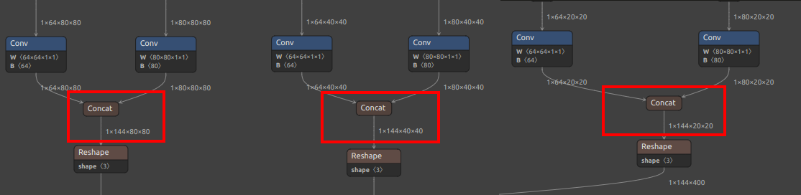
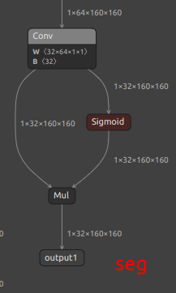
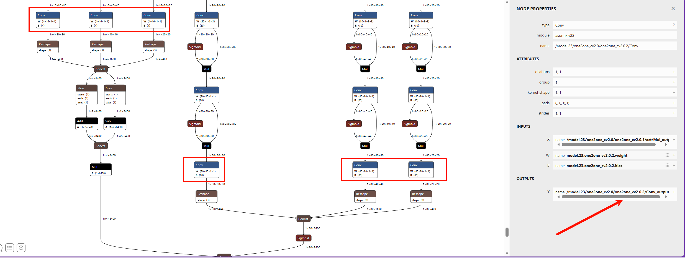

## Introduction
The official default model supports detection of 80 object classes. If this does not meet your requirements, you can train your own custom object detector by setting up a training environment on your local computer or server.

YOLOv8 / YOLO11 not only support object detection, but also `yolov8-pose` / `YOLO11-pose` for keypoint detection. In addition to the official human keypoints, you can create your own custom keypoint datasets to train detection for specific objects and keypoints.

Since YOLOv8 and YOLO11 mainly differ in their internal network architecture while sharing the same preprocessing and postprocessing steps, the training and conversion procedures are identical—only the output node names differ.

**Note:** This document covers custom training, but assumes you already possess some foundational knowledge. If not, please study independently:
* This document does not cover training environment setup. Please search for and install a PyTorch environment on your own.
* This document does not explain basic machine learning concepts or fundamental Linux usage.

If you find areas for improvement in this document, feel free to click `Edit this document` in the top-right corner to contribute and submit a documentation PR.

## Workflow & Document Objectives
To use your model with MaixPy (MaixCAM), follow this process:
* Set up a training environment (omitted in this document; search for PyTorch environment setup guides).
* Clone the [YOLO11/YOLOv8/YOLO26](https://github.com/ultralytics/ultralytics) source code locally.
* Prepare a dataset formatted for YOLO11 / YOLOv8 / YOLO26.
* Train the model and export an `onnx` model file (the final output of this document).
* Convert the `onnx` model to a MaixPy-compatible `MUD` file, as detailed in [MaixCAM Model Conversion](../ai_model_converter/maixcam.md).
* Load and run the model with MaixPy.

## Where to Find Datasets for Training
See [Where to Find Datasets](../pro/datasets.md).

## Reference Materials
Since these are general procedures, this document only provides a workflow overview. For specific details, refer to the **[YOLO26 / YOLO11 / YOLOv8 official code and documentation](https://github.com/ultralytics/ultralytics)** (**recommended**) and search for training tutorials. The final goal is to export an ONNX file.

If you find helpful articles, please modify this document and submit a PR.

## Exporting ONNX Models for YOLO26 / YOLO11 / YOLOv8
Create an `export_onnx.py` file in the `ultralytics` directory:
```python
from ultralytics import YOLO
import sys

print(sys.path)
net_name = sys.argv[1] # yolov8n.pt yolov8n-pose.pt # https://docs.ultralytics.com/models/yolov8/#supported-tasks-and-modes
input_width = int(sys.argv[2])
input_height = int(sys.argv[3])

# Load a model
model = YOLO(net_name)  # load an official model
# model = YOLO("path/to/best.pt")  # load a custom model

# Predict with the model
results = model("https://ultralytics.com/images/bus.jpg")  # predict on an image
path = model.export(format="onnx", imgsz=[input_height, input_width], dynamic=False, simplify=True, opset=17)   # export the model to ONNX format
print(path)
```

Run `python export_onnx.py yolov8n.pt 320 224` to export the ONNX model. Here we re-specify the input resolution—models are trained at `640x640`, and we redefine it to improve runtime speed. `320x224` is chosen for its aspect ratio similarity to MaixCAM's screen for easier display. For MaixCAM2, use `640x480` or `320x240`, or set as needed for your application.

## Converting to MaixCAM-Compatible Models & MUD Files
As of 2026.2.4, MaixPy/MaixCDK supports YOLO26 / YOLOv8 / YOLO11 detection, YOLOv8-pose / YOLO11-pose keypoint detection, YOLOv8-seg / YOLO11-seg segmentation, and YOLOv8-obb / YOLO11-obb oriented bounding box detection.

Convert models following [MaixCAM Model Conversion](../ai_model_converter/maixcam.md) and [MaixCAM2 Model Conversion](../ai_model_converter/maixcam2.md).

### Output Node Selection
Note the output node selection (**values may vary for your model; locate matching nodes in the diagrams below**):

For YOLO11 / YOLOv8, MaixPy supports two node selection schemes, chosen based on the hardware platform:

| Model & Features | Scheme 1 | Scheme 2 |
| -- | --- | --- |
| Target Devices | **MaixCAM2** (recommended)<br>MaixCAM (slightly slower than Scheme 2) | **MaixCAM** (recommended) |
| Features | Offloads more computation to CPU postprocessing; quantization is more stable, slightly slower than Scheme 2 | Offloads more computation to NPU and includes quantization |
| Notes | None | Quantization fails on MaixCAM2 in practice |
| YOLOv8 Detection |`/model.22/Concat_1_output_0`<br>`/model.22/Concat_2_output_0`<br>`/model.22/Concat_3_output_0`| `/model.22/dfl/conv/Conv_output_0`<br>`/model.22/Sigmoid_output_0` |
| YOLO11 Detection |`/model.23/Concat_output_0`<br>`/model.23/Concat_1_output_0`<br>`/model.23/Concat_2_output_0` | `/model.23/dfl/conv/Conv_output_0`<br>`/model.23/Sigmoid_output_0` |
| YOLOv8-pose Keypoint | `/model.22/Concat_1_output_0`<br>`/model.22/Concat_2_output_0`<br>`/model.22/Concat_3_output_0`<br>`/model.22/Concat_output_0`| `/model.22/dfl/conv/Conv_output_0`<br>`/model.22/Sigmoid_output_0`<br>`/model.22/Concat_output_0` |
| YOLO11-pose Keypoint | `/model.23/Concat_1_output_0`<br>`/model.23/Concat_2_output_0`<br>`/model.23/Concat_3_output_0`<br>`/model.23/Concat_output_0` | `/model.23/dfl/conv/Conv_output_0`<br>`/model.23/Sigmoid_output_0`<br>`/model.23/Concat_output_0`|
| YOLOv8-seg Segmentation |`/model.22/Concat_1_output_0`<br>`/model.22/Concat_2_output_0`<br>`/model.22/Concat_3_output_0`<br>`/model.22/Concat_output_0`<br>`output1`| `/model.22/dfl/conv/Conv_output_0`<br>`/model.22/Sigmoid_output_0`<br>`/model.22/Concat_output_0`<br>`output1`|
| YOLO11-seg Segmentation |`/model.23/Concat_1_output_0`<br>`/model.23/Concat_2_output_0`<br>`/model.23/Concat_3_output_0`<br>`/model.23/Concat_output_0`<br>`output1`|`/model.23/dfl/conv/Conv_output_0`<br>`/model.23/Sigmoid_output_0`<br>`/model.23/Concat_output_0`<br>`output1`|
| YOLOv8-obb Oriented BBox |`/model.22/Concat_1_output_0`<br>`/model.22/Concat_2_output_0`<br>`/model.22/Concat_3_output_0`<br>`/model.22/Concat_output_0`|`/model.22/dfl/conv/Conv_output_0`<br>`/model.22/Sigmoid_1_output_0`<br>`/model.22/Sigmoid_output_0`|
| YOLO11-obb Oriented BBox |`/model.23/Concat_1_output_0`<br>`/model.23/Concat_2_output_0`<br>`/model.23/Concat_3_output_0`<br>`/model.23/Concat_output_0`|`/model.23/dfl/conv/Conv_output_0`<br>`/model.23/Sigmoid_1_output_0`<br>`/model.23/Sigmoid_output_0`|
|YOLOv8/YOLO11 Detection Output Nodes|  | |
|YOLOv8/YOLO11 Pose Extra Output Node |  | See pose branch above |
|YOLOv8/YOLO11 Seg Extra Output Node |  | |
|YOLOv8/YOLO11 OBB Extra Output Node |  | |

| Model | Node Names | Node Diagram |
| -- | --- | --- |
| YOLO26 Detection | `/model.23/one2one_cv2.0/one2one_cv2.0.2/Conv_output_0 /model.23/one2one_cv2.1/one2one_cv2.1.2/Conv_output_0 /model.23/one2one_cv2.2/one2one_cv2.2.2/Conv_output_0 /model.23/one2one_cv3.0/one2one_cv3.0.2/Conv_output_0 /model.23/one2one_cv3.1/one2one_cv3.1.2/Conv_output_0 /model.23/one2one_cv3.2/one2one_cv3.2.2/Conv_output_0` | |

### Conversion Scripts
*One-click YOLO26 conversion script (run in container):*

`MaixCam/Pro:`
```bash
#!/bin/bash

set -e

net_name=yolo26n
input_w=320
input_h=224

# mean: 0, 0, 0
# std: 255, 255, 255

# mean
# 1/std

# mean: 0, 0, 0
# scale: 0.00392156862745098, 0.00392156862745098, 0.00392156862745098

# convert to mlir
model_transform.py \
--model_name ${net_name} \
--model_def ./${net_name}.onnx \
--input_shapes [[1,3,${input_h},${input_w}]] \
--mean "0,0,0" \
--scale "0.00392156862745098,0.00392156862745098,0.00392156862745098" \
--keep_aspect_ratio \
--pixel_format rgb \
--channel_format nchw \
--output_names "/model.23/one2one_cv2.0/one2one_cv2.0.2/Conv_output_0,/model.23/one2one_cv2.1/one2one_cv2.1.2/Conv_output_0,/model.23/one2one_cv2.2/one2one_cv2.2.2/Conv_output_0,/model.23/one2one_cv3.0/one2one_cv3.0.2/Conv_output_0,/model.23/one2one_cv3.1/one2one_cv3.1.2/Conv_output_0,/model.23/one2one_cv3.2/one2one_cv3.2.2/Conv_output_0" \
--test_input ./image.jpg \
--test_result ${net_name}_top_outputs.npz \
--tolerance 0.99,0.99 \
--mlir ${net_name}.mlir

echo "calibrate for int8 model"
# export int8 model
run_calibration.py ${net_name}.mlir \
--dataset ./coco \
--input_num 200 \
-o ${net_name}_cali_table

echo "convert to int8 model"
# export int8 model
#    add --quant_input, use int8 for faster processing in maix.nn.NN.forward_image
model_deploy.py \
--mlir ${net_name}.mlir \
--quantize INT8 \
--quant_input \
--calibration_table ${net_name}_cali_table \
--processor cv181x \
--test_input ${net_name}_in_f32.npz \
--test_reference ${net_name}_top_outputs.npz \
--tolerance 0.9,0.6 \
--model ${net_name}_int8.cvimodel
```

`MaixCam2:`
```bash
#!/bin/bash

set -e

############# Modify ####################
model_name=$1
model_path=./${model_name}.onnx
images_dir=./coco
images_num=100
input_names=images

config_path=yolo26_build_config.json

output_nodes=(
    "/model.23/one2one_cv2.0/one2one_cv2.0.2/Conv_output_0"   # bbox 80x80
    "/model.23/one2one_cv2.1/one2one_cv2.1.2/Conv_output_0"   # bbox 40x40
    "/model.23/one2one_cv2.2/one2one_cv2.2.2/Conv_output_0"   # bbox 20x20
    "/model.23/one2one_cv3.0/one2one_cv3.0.2/Conv_output_0"   # cls 80x80
    "/model.23/one2one_cv3.1/one2one_cv3.1.2/Conv_output_0"   # cls 40x40
    "/model.23/one2one_cv3.2/one2one_cv3.2.2/Conv_output_0"   # cls 20x20
)
#############################################
# Parse node configuration
onnx_output_names=""
json_outputs=""

for node in "${output_nodes[@]}"; do
    # Build output parameters for extract_onnx
    if [ -n "$onnx_output_names" ]; then
        onnx_output_names="${onnx_output_names},"
    fi
    onnx_output_names="${onnx_output_names}${node}"
    
    # Build JSON output_processors
    json_outputs="${json_outputs}
    {
      \"tensor_name\": \"${node}\",
      \"dst_perm\": [0, 2, 3, 1]
    },"
done

# Remove trailing comma
json_outputs="${json_outputs%,}"

# Generate JSON configuration file
cat > $config_path << EOF
{
  "model_type": "ONNX",
  "npu_mode": "NPU1",
  "quant": {
    "input_configs": [
      {
        "tensor_name": "${input_names}",
        "calibration_dataset": "tmp_images/images.tar",
        "calibration_size": ${images_num},
        "calibration_mean": [0, 0, 0],
        "calibration_std": [255, 255, 255]
      }
    ],
    "calibration_method": "MinMax",
    "precision_analysis": true
  },
  "input_processors": [
    {
      "tensor_name": "${input_names}",
      "tensor_format": "RGB",
      "tensor_layout": "NCHW",
      "src_format": "RGB",
      "src_dtype": "U8",
      "src_layout": "NHWC",
      "csc_mode": "NoCSC"
    }
  ],
  "output_processors": [${json_outputs}
  ],
  "compiler": {
    "check": 3,
    "check_mode": "CheckOutput",
    "check_cosine_simularity": 0.9
  }
}
EOF

echo -e "\e[32mConfiguration file generated: ${config_path}\e[0m"

# Create gen_cali_images_tar.py
cat > gen_cali_images_tar.py << 'PYTHON_SCRIPT'
import sys
import os
import random
import shutil

images_dir = sys.argv[1]
images_num = int(sys.argv[2])

print("images dir:", images_dir)
print("images num:", images_num)
print("current dir:", os.getcwd())
files = os.listdir(images_dir)
valid = []
for name in files:
    path = os.path.join(images_dir, name)
    ext = os.path.splitext(name)[1]
    if ext.lower() not in [".jpg", ".jpeg", ".png"]:
        continue
    valid.append(path)
print(f"images dir {images_dir} have {len(valid)} images")
if len(valid) < images_num:
    print(f"no enough images in {images_dir}, have: {len(valid)}, need {images_num}")
    sys.exit(1)

idxes = random.sample(range(len(valid)), images_num)
shutil.rmtree("tmp_images", ignore_errors=True)
os.makedirs("tmp_images/images")
for i in idxes:
    target = os.path.join("tmp_images", "images", os.path.basename(valid[i]))
    shutil.copyfile(valid[i], target)
os.chdir("tmp_images/images")
os.system("tar -cf ../images.tar *")
# shutil.rmtree("tmp_images/images")
PYTHON_SCRIPT

# Create extract_onnx.py
cat > extract_onnx.py << 'PYTHON_SCRIPT'
import onnx
import sys

input_path = sys.argv[1]
output_path = sys.argv[2]
input_names_str = sys.argv[3]
output_names_str = sys.argv[4]
input_names = []
for s in input_names_str.split(","):
    input_names.append(s.strip())
output_names = []
for s in output_names_str.split(","):
    output_names.append(s.strip())

onnx.utils.extract_model(input_path, output_path, input_names, output_names)
PYTHON_SCRIPT

# extract and onnxsim
mkdir -p tmp1
onnx_extracted=tmp1/${model_name}_extracted.onnx
onnxsim_path=tmp1/${model_name}.onnx

# Step 1: Extract specified output nodes
echo -e "\e[32mStep 1: Extract ONNX output nodes\e[0m"
python extract_onnx.py $model_path $onnx_extracted $input_names "$onnx_output_names"

# Step 2: Simplify model
echo -e "\e[32mStep 2: ONNX simplification\e[0m"
onnxsim $onnx_extracted $onnxsim_path

python gen_cali_images_tar.py $images_dir $images_num

mkdir -p out
tmp_config_path=tmp/$config_path

# vnpu
echo -e "\e[32mBuilding ${model_name}_vnpu.axmodel\e[0m"
rm -rf tmp
mkdir tmp
cp $config_path $tmp_config_path
sed -i '/npu_mode/c\"npu_mode": "NPU1",' $tmp_config_path
pulsar2 build --target_hardware AX620E --input $onnxsim_path --output_dir tmp --config $tmp_config_path
cp tmp/compiled.axmodel out/${model_name}_vnpu.axmodel

# npu all
echo -e "\e[32mBuilding ${model_name}_npu.axmodel\e[0m"
rm -rf tmp
mkdir tmp
cp $config_path $tmp_config_path
sed -i '/npu_mode/c\"npu_mode": "NPU2",' $tmp_config_path
pulsar2 build --target_hardware AX620E --input $onnxsim_path --output_dir tmp --config $tmp_config_path
cp tmp/compiled.axmodel out/${model_name}_npu.axmodel
rm -rf tmp

echo -e "\e[32mGenerate models done, in out dir\e[0m"
```

### Modifying the MUD File
For object detection, the MUD file is as follows (set `model_type` to `yolo11` for YOLO11, `yolo26` for YO26):

MaixCAM/MaixCAM-Pro:
```ini
[basic]
type = cvimodel
model = yolov8n.cvimodel

[extra]
model_type = yolov8
input_type = rgb
mean = 0, 0, 0
scale = 0.00392156862745098, 0.00392156862745098, 0.00392156862745098
labels = person, bicycle, car, motorcycle, airplane, bus, train, truck, boat, traffic light, fire hydrant, stop sign, parking meter, bench, bird, cat, dog, horse, sheep, cow, elephant, bear, zebra, giraffe, backpack, umbrella, handbag, tie, suitcase, frisbee, skis, snowboard, sports ball, kite, baseball bat, baseball glove, skateboard, surfboard, tennis racket, bottle, wine glass, cup, fork, knife, spoon, bowl, banana, apple, sandwich, orange, broccoli, carrot, hot dog, pizza, donut, cake, chair, couch, potted plant, bed, dining table, toilet, tv, laptop, mouse, remote, keyboard, cell phone, microwave, oven, toaster, sink, refrigerator, book, clock, vase, scissors, teddy bear, hair drier, toothbrush
```

MaixCAM2:
```ini
[basic]
type = axmodel
model_npu = yolo11n_640x480_npu.axmodel
model_vnpu = yolo11n_640x480_vnpu.axmodel

[extra]
model_type = yolo11
type=detector
input_type = rgb
labels = person, bicycle, car, motorcycle, airplane, bus, train, truck, boat, traffic light, fire hydrant, stop sign, parking meter, bench, bird, cat, dog, horse, sheep, cow, elephant, bear, zebra, giraffe, backpack, umbrella, handbag, tie, suitcase, frisbee, skis, snowboard, sports ball, kite, baseball bat, baseball glove, skateboard, surfboard, tennis racket, bottle, wine glass, cup, fork, knife, spoon, bowl, banana, apple, sandwich, orange, broccoli, carrot, hot dog, pizza, donut, cake, chair, couch, potted plant, bed, dining table, toilet, tv, laptop, mouse, remote, keyboard, cell phone, microwave, oven, toaster, sink, refrigerator, book, clock, vase, scissors, teddy bear, hair drier, toothbrush

input_cache = true
output_cache = true
input_cache_flush = false
output_cache_inval = true

mean = 0,0,0
scale = 0.00392156862745098, 0.00392156862745098, 0.00392156862745098
```

Replace `labels` with your custom trained object classes.

For keypoint detection (yolov8-pose), set `type=pose`.
For segmentation (yolov8-seg), set `type=seg`.
For oriented bounding box detection (yolov8-obb), set `type=obb`.

## Upload & Share to MaixHub
Upload and share your models at the [MaixHub Model Zoo](https://maixhub.com/model/zoo?platform=maixcam). Provide multiple resolutions for users to choose from.