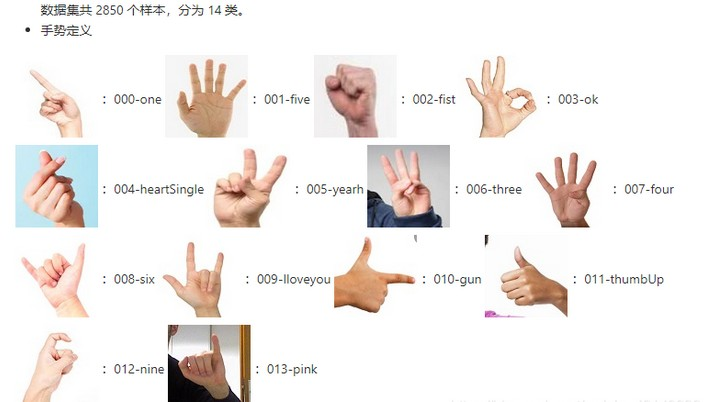

## Introduction

The `MaixCAM MaixPy Hand Gesture Classification Based on Hand Keypoint Detection` can classify various hand gestures.

The following describes how to preprocess features from [AI model estimated hand landmarks](./hand_landmarks.md), which are then classified using LinearSVC (Support Vector Machine). A detailed implementation is available in `MaixPy/projects/app_hand_gesture_classifier/LinearSVC.py`, and the usage example can be found in the app implementation in `MaixPy/projects/app_hand_gesture_classifier/main.py`.

**Users can add any distinguishable hand gestures for training.**

## Usage

### Preprocessing
Here’s the preprocessing for the raw output `hand_landmarks` from the AI model to derive usable features:

```python
def preprocess(hand_landmarks, is_left=False, boundary=(1,1,1)):
    hand_landmarks = np.array(hand_landmarks).reshape((21, -1))
    vector = hand_landmarks[:,:2]
    vector = vector[1:] - vector[0]
    vector = vector.astype('float64') / boundary[:vector.shape[1]]
    if not is_left: # mirror
        vector[:,0] *= -1
    return vector
```

### Import Modules
Alternatively, you can directly copy the `LinearSVC.py` implementation from the directory `target_dir`
```python
# To import LinearSVC
target_dir = '/maixapp/apps/hand_gesture_classifier/'
import sys
if target_dir not in sys.path:
    sys.path.insert(0, target_dir)

from LinearSVC import LinearSVC, LinearSVCManager
```

### Classifier (LinearSVC)

Introduction to the LinearSVC classifier's functions and usage.

#### Initialization, Loading, and Exporting
```python
# Initialize
clf = LinearSVC(C=1.0, learning_rate=0.01, max_iter=500)
# Load
clf = LinearSVC.load("/maixapp/apps/hand_gesture_classifier/clf_dump.npz")
# Export
clf.save("my_clf_dump.npz")
```
*Initialization Method Parameters*
1. C=1.0 (Regularization Parameter)
    - Controls the strength of the regularization in the SVM.
    - A larger C value punishes misclassifications more strictly, potentially leading to overfitting.
    - A smaller C value allows some misclassifications, improving generalization but potentially underfitting- 
    Default: 1.0, balanced regularization between accuracy and generalization.

2. learning_rate=0.01 (Learning Rate)
    - Controls the step size for weight updates during each gradient descent optimization.
    - Too large a learning rate may cause the optimization process to diverge
    - While too small a learning rate may lead to slow convergence.
    Default: 0.01, typically a moderate value to ensure gradual approach to the optimal solution.

3. max_iter=500 (Maximum Iterations)
    - Specifies the maximum number of optimization rounds during training.
    - More iterations allow the model more chances to converge, but too many may result in overfitting.
    - A smaller max_iter value may stop optimization prematurely, leading to underfitting.
    Default: 1000, sufficient iterations to ensure convergence.

*Loading and Exporting Method Parameters*
1. filename: str
    - The target file path, both relative and absolute paths are supported.
    - This is a required parameter.
    Default: None

*Training and Prediction (Classification)*
After initializing the classifier, it needs to be trained before it can be used for classification.

If you load a previously trained classifier, it can directly be used for classification.

**Note: Every training session is a full training process, meaning previous training results will be lost. It's recommended to export the classifier backup as needed.**

```python
npzfile = np.load("/maixapp/apps/hand_gesture_classifier/trainSets.npz") # Preload features and labels (name_classes index)
X_train = npzfile["X"] # Raw features
y_train = npzfile["y"] # Labels

clf.fit(clf.scaler.fit_transform(X_train), y_train)  # Train SVM after feature normalization

# Regression
y_pred = clf.predict(clf.scaler.transform(X_train))  # Predict labels after feature normalization
recall_count = len(y_train)
right_count = np.sum(y_pred == y_train)
print(f"right/recall= {right_count}/{recall_count}, acc: {right_count/recall_count}")

# Prediction
X_test = X_train[:5]
feature_test = clf.scaler.transform(X_test) # Feature normalization
# y_pred = clf.predict(feature_test)  # Predict labels
y_pred, y_conf = clf.predict_with_confidence(feature_test)  # Predict labels with confidence
print(f"pred: {y_pred}, conf: {y_conf}")
# Corresponding class names name_classes = ("one", "five", "fist", "ok", "heartSingle", "yearh", "three", "four", "six", "Iloveyou", "gun", "thumbUp", "nine", "pink")
```

Since every training is full, you need to manually maintain the storage of previously trained features and corresponding labels to allow dynamic addition/removal of classes.

To simplify usage and reduce extra workload, the `Classifier Manager (LinearSVCManager)` has been encapsulated, as described in the next section.


### Classifier Manager (LinearSVCManager)

Introduction to the LinearSVCManager's functions and usage.

#### Initialization, Loading, and Exporting

Both Initialization or Loading must provide valid X and Y (corresponding features and labels) inputs.

And their lengths must be equal and correspond to each other, or an error will occur.

```python
# Initialization, Loading
def __init__(self, clf: LinearSVC=LinearSVC(), X=None, Y=None, pretrained=False)

# Initialize with default LinearSVC parameters
clfm = LinearSVCManager(X=X_train, Y=y_train)
# Initialize with specific LinearSVC parameters
clfm = LinearSVCManager(LinearSVC(C=1.0, learning_rate=0.01, max_iter=100), X_train, y_train)

# Loading requires the loaded LinearSVC and setting pretrained=True to avoid unnecessary retraining
# Ensure X_train, y_train are the data previously used to train LinearSVC
clfm = LinearSVCManager(LinearSVC.load("/maixapp/apps/hand_gesture_classifier/clf_dump.npz"), X_train, y_train, pretrained=True)

# Export parameters using LinearSVC (clfm.clf)'s save
clfm.clf.save("my_clf_dump.npz")
# Export features and labels used for training
np.savez("trainSets.npz",
            X = X_train,
            y = y_train,
        )
```

#### Accessing Training Data Used

clfm.samples is a Python tuple:
1. clfm.samples[0] is `X`
2. clfm.samples[1] is `Y`

**Do not modify directly, for read-only access only. To make changes, call `clfm.train()` to retrain the model.**

#### Adding or Removing

**When adding, ensure X_new and y_new have the same length and match the shape of the previous X_train and y_train.**

All are numpy arrays, and you can check their shape with the shape attribute.

```python
# Add new data
clfm.add(X_new, y_new)

# Remove data
mask_ge_4 = clfm.samples[1] >= 4  # Mask for class labels >= 4
indices_ge_4 = np.where(mask_ge_4)[0]
clfm.rm(indices_ge_4)
```

These operations mainly modify clfm.samples, but will trigger a call to clfm.train() to retrain the model.

Depending on the size of the training data, wait a few moments before directly applying the updated model.


#### Prediction

```python
y_pred, y_conf = clfm.test(X_test)  # Predict labels
```

This is equivalent to:

```python
clf = clfm.clf
feature_test = clf.scaler.transform(X_test) # Feature normalization
y_pred, y_conf = clf.predict_with_confidence(feature_test)  # Predict labels with confidence
```

#### Example (Simplified Version of the Resulting Video)

Note:
- Missing preprocess implementation should be copied from the Preprocessing section.
- Missing LinearSVC module should be copied from the Import Modules section.

The classification and prediction part can be run as a single file:

```python
from maix import camera, display, image, nn, app
import numpy as np

# Add below me

name_classes = ("one", "five", "fist", "ok", "heartSingle", "yearh", "three", "four", "six", "Iloveyou", "gun", "thumbUp", "nine", "pink") # Easy-to-understand class names
npzfile = np.load("/maixapp/apps/hand_gesture_classifier/trainSets.npz") # Preload features and labels (name_classes index)
X_train = npzfile["X"]
y_train = npzfile["y"]
clfm = LinearSVCManager(LinearSVC.load("/maixapp/apps/hand_gesture_classifier/clf_dump.npz"), X_train, y_train, pretrained=True) # Initialize LinearSVCManager with preloaded classifier

detector = nn.HandLandmarks(model="/root/models/hand_landmarks.mud")
cam = camera.Camera(320, 224, detector.input_format())
disp = display.Display()

# Loading screen
img = cam.read()
img.draw_string(100, 112, "Loading...\nwait up to 10s", color = image.COLOR_GREEN)
disp.show(img)

while not app.need_exit():
    img = cam.read()
    objs = detector.detect(img, conf_th = 0.7, iou_th = 0.45, conf_th2 = 0.8)
    for obj in objs:
        hand_landmarks = preprocess(obj.points[8:8+21*3], obj.class_id == 0, (img.width(), img.height(), 1))  # Preprocessing
        features = np.array([hand_landmarks.flatten()])
        class_idx, pred_conf = clfm.test(features)  # Get predicted class
        class_idx, pred_conf = class_idx[0], pred_conf[0]  # Handle multiple inputs and outputs, take the first element
        msg = f'{detector.labels[obj.class_id]}: {obj.score:.2f}\n{name_classes[class_idx]}({class_idx})={pred_conf*100:.2f}%'
        img.draw_string(obj.points[0], obj.points[1], msg, color = image.COLOR_RED if obj.class_id == 0 else image.COLOR_GREEN, scale = 1.4, thickness = 2)
        detector.draw_hand(img, obj.class_id, obj.points, 4, 10, box=True)
    disp.show(img)
```

The current `X_train` is based on the "14-Class Static Hand Gesture Dataset," which consists of 2850 samples, divided into 14 classes. The dataset can be downloaded from the provided [Baidu Netdisk link (Password: 6urr)](https://pan.baidu.com/s/1Sd-Ad88Wzp0qjGH6Ngah0g).





## Demo Video

The implementation of this app is located at `MaixPy/projects/app_hand_gesture_classifier/main.py`, with the main logic as follows:

1. Load the `14-class static hand gesture dataset`, which consists of `20` coordinate offsets relative to the wrist after processing by `hand keypoint detection`.
2. Initially train `4` gesture classifications **or directly load pre-trained `14` classifier parameters (switchable in the source code)** to support gesture recognition.
3. Load the `hand keypoint detection` model to process the camera input and visualize the results on the screen using the classifier.
4. Click the upper right corner `class14` to add the remaining classification samples and retrain to achieve `14` gesture classifications.
5. Click the lower right corner `class4` to remove the additional classification samples from the previous step and retrain to revert to `4` gesture classifications.
6. Click the small area between the buttons to display the duration of the last classifier training at the top.
7. Click other large areas to display the currently supported classification categories on the left side—green indicates supported, yellow indicates not supported.

<video playsinline controls autoplay loop muted preload src="/static/video/hand_gesture_demo.mp4" type="video/mp4">
Classifier Result video
</video>

1. The demo video shows the execution of step `4` **or the bold part of step `2`**, demonstrating the `14-class` mode. It can recognize gestures `1-10` (with default corresponding English meanings), "OK", thumbs-up, heart shape (requires the back of the hand, difficult to demonstrate in the video but can be verified), and pinky stretch, making a total of `14` gestures.
2. Then, step `5` is executed to revert to the `4-class` mode, where only gestures `1`, `5`, `10` (fist), and "OK" can be recognized, while the remaining gestures do not produce correct results. Step `7` is also executed to show the current `4-class` mode, as only the first 4 gestures are displayed in green, and the remaining 10 are shown in yellow.
3. Step `4` is executed again to restore the `14-class` mode, and the gestures that could not be recognized in the `4-class` mode are now correctly identified.
4. Finally, the recognition of gestures with both hands is demonstrated, showing that the system can correctly identify gestures from both hands simultaneously.


## Others

**The demo video is captured from the preview window in the upper right corner of MaixVision, and it is consistent with the actual screen display.**

**For more detailed usage instructions or secondary development, please refer to the source code analysis mentioned above, which includes comments.**

If you still have questions or need assistance, you can post on `maixhub` or send an `e-mail` to the company at `support@sipeed.com`. **Please use the subject `[help][MaixPy] guesture classification: xxx`**.