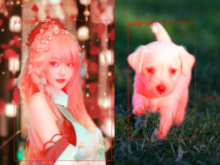

## Introduction

Image semantic segmentation refers to identifying specific objects in an image and recognizing the pixels that represent the parts of those objects. For example, in the image below, the human body and the dog are identified, and their body parts are segmented. This can be used for collision detection, autonomous vehicle navigation, area measurement, and more.



## Image Semantic Segmentation with MaixPy

MaixPy includes `YOLOv8-seg` and `YOLO11-seg` for object detection and image segmentation.

MaixPy provides a model for 80 object categories from the COCO dataset by default.

> To use YOLOv8, MaixPy version must be >= 4.4.0  
> To use YOLO11, MaixPy version must be >= 4.7.0

The following code demonstrates the usage, and you can also find it in [MaixPy examples](https://github.com/sipeed/maixpy/tree/main/examples/).

```python
from maix import camera, display, image, nn, app, time

detector = nn.YOLOv8(model="/root/models/yolov8n_seg.mud", dual_buff=True)
# detector = nn.YOLO11(model="/root/models/yolo11n_seg.mud", dual_buff=True)

cam = camera.Camera(detector.input_width(), detector.input_height(), detector.input_format())
disp = display.Display()

while not app.need_exit():
    img = cam.read()
    objs = detector.detect(img, conf_th=0.5, iou_th=0.45)
    for obj in objs:
        # img.draw_image(obj.x, obj.y, obj.seg_mask)
        detector.draw_seg_mask(img, obj.x, obj.y, obj.seg_mask, threshold=127)
        img.draw_rect(obj.x, obj.y, obj.w, obj.h, color=image.COLOR_RED)
        msg = f'{detector.labels[obj.class_id]}: {obj.score:.2f}'
        img.draw_string(obj.x, obj.y, msg, color=image.COLOR_RED)
    disp.show(img)
```

> To switch between YOLOv8 and YOLO11, just modify the commented part of the above code.

## Models with More Resolutions

The default model resolution is 320x224. For models with different resolutions, download them from the MaixHub model library:
* YOLOv8-seg: [[MaixHub Model Library](https://maixhub.com/model/zoo/413)](https://maixhub.com/model/zoo/413)
* YOLO11-seg: [[MaixHub Model Library](https://maixhub.com/model/zoo/455)](https://maixhub.com/model/zoo/455)

## dual_buff for Double Buffering Acceleration

You may notice that `dual_buff` is used for model initialization (default value is `True`). Enabling the `dual_buff` parameter can improve efficiency and increase the frame rate. For more details and considerations, refer to the [dual_buff Introduction](./dual_buff.md).

## Customizing Your Own Object Segmentation Model

The provided models are based on the 80 categories from the COCO dataset. If this does not meet your needs, you can train your own specific object detection and segmentation model. Follow the instructions in [Offline Training YOLOv8/YOLO11](./customize_model_yolov8.md) to use the official YOLOv8/YOLO11 model training method, and then convert it to a model format supported by MaixCAM.

