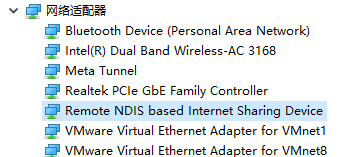
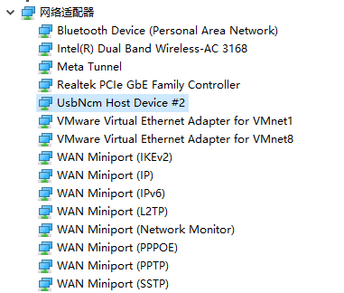

<style>
    #head_links table {
        width: 100%;
        display: table;
    }
    .biliiframe {
      width: 100%;
      min-height: 30em;
      border-radius: 0.5em;
      border: 1em solid white;
  }

    @media screen and (max-width: 900px){
      #head_links th, #head_links td {
          /* padding: 8px; */
          font-size: 0.9em;
          padding: 0.1em 0.05em;
      }
    }
</style>

## 从开机到运行第一个程序

>! MaixCAM2 有带 eMMC 和不带 eMMC 的版本。带 32GB eMMC 的版本正常情况下从 eMMC 启动，日常运行不需要插入 TF 卡；不带 eMMC 的版本需要插入已烧录系统的 TF 卡才能启动。TF 卡也可用于从 TF 卡启动系统，或用于向 eMMC 烧录、恢复系统。如需升级或烧录系统，请查看[升级和烧录系统](./basic/os.md)。

### 视频演示

<iframe src="//player.bilibili.com/player.html?isOutside=true&aid=115547387727388&bvid=BV1veCTBsEZa&cid=33995951833&p=1" scrolling="no" border="0" frameborder="no" framespacing="0" allowfullscreen="true" class="biliiframe"></iframe>

### 上电开机

使用 `Type-C` 数据线给 MaixCAM2 供电。等待设备开机并进入功能选择界面。


如果屏幕没有显示：

* 尝试[更新到最新系统](./basic/os.md)。
* 检查屏幕和摄像头排线是否松动。拆开外壳时，屏幕排线比较容易脱落。

### 联网

首次使用需要联网，以便激活设备、安装运行库并连接开发工具。没有路由器时，可以使用手机热点。

设备上点击 `设置`(`Settings`)，选择`WiFi`，有两种方法连接 `WiFi` 热点：
* 扫描 WiFi 分享码：
  * 使用手机分享`WiFi`热点二维码，或者到[maixhub.com/wifi](https://maixhub.com/wifi) 生成一个二维码。
  * 点击`扫描二维码`按钮，会出现摄像头的画面，扫描前面生成的二维码进行连接。
* 搜索热点：
  * 点击 `扫描` 按钮开始扫描周围 `WiFi`， 可以多次点击刷新列表。
  * 找到你的 WiFi 热点。
  * 输入密码点击`连接`按钮进行连接。
  然后等待获取到 `IP` 地址，这可能需要 `10` 到 `30` 秒，如果界面没有刷新可以退出`WiFi`功能重新进入查看，或者在`设置` -> `设备信息` 中也可以看到 `IP` 信息。


### 安装最新运行库

运行库提供应用需要的基础功能。没有安装最新版时，应用可能打不开或突然退出。

* 确认设备已经连接 WiFi、获得 IP 地址并且可以访问互联网。
* 设备上点击 `设置`(`Settings`)，选择`安装运行库`。
* 安装完成后可以看到更新到了最新版本，然后退出即可。

如果显示 `Request failed` 或“请求失败”，先检查设备能否访问互联网。确认网络正常后仍然失败，请拍下错误页面并联系客服。

### 使用内置应用

设备内置了找色块、AI 检测器和巡线等应用。下面是自学习检测的效果：

<video playsinline controls autoplay loop muted preload  class="pl-6 pb-4 self-end" src="/static/video/self_learn_tracker.mp4" type="video/mp4" style="width:95%">
Classifier Result video
</video>

可以从功能选择界面打开其他应用。应用说明和更新可以在 [MaixHub 应用商店](https://maixhub.com/app)查看。

**注意：应用只包含了 MaixPy 能实现的一部分功能，使用 MaixPy 能创造更多功能**。

### 登录终端

如果需要登录终端，MaixCAM2 的默认用户名是 `root`，密码是 `sipeed`。

## 作为串口模块使用

> 本节是可选功能。只有需要把检测结果通过 UART 发给 Arduino、STM32 等其他控制器时才需要阅读。

内置的各种应用可以直接当成串口模块使用，比如`找色块`、`找人脸`、`找二维码`等等，
注意这里串口仅能直接和其它单片机连接，**如果要和电脑串口通信请自备一个 USB 转串口模块**。

使用方法：
* 硬件连接： 翻阅[这里](https://wiki.sipeed.com/hardware/zh/maixcam/maixcam2.html)的引脚映射图, 找到需要的串口(UART)并将设备通连接到你的主控上了，比如`Arduino`、`树莓派`、`STM32`等等。注意:UART0一般用作系统打印串口, 如果需要上电就收发消息, 则建议不要使用该串口来通信
* 打开你想用的应用，比如二维码识别，当设备扫描到二维码就会通过串口把结果发送给你的主控了。
> 发送的串口波特率是 `115200`，数据格式是 `8N1`，协议遵循 [Maix 串口通信协议标准](https://github.com/sipeed/MaixCDK/blob/master/docs/doc/convention/protocol.md)，可以在[MaixHub APP](https://maixhub.com/app) 找到对应的应用介绍查看协议。
> 如果应用没有做串口输出结果，你也可以自己基于对应功能的例程，自行按照[串口使用文档](./peripheral/uart.md)添加串口输出结果。

## 准备连接电脑和设备

MaixVision 需要通过网络连接设备。可以选择 WiFi 或 USB，两种方式完成一种即可：
* **方法一 (强烈推荐)**：无线连接， 设备使用 WiFi 连接到电脑连接的同一个路由器或者 WiFi 热点下： 在设备的`设置 -> WiFi 设置`中连接到你的 WiFi 即可。（WiFi 如果出现**画面卡顿或者延迟**的问题可以尝试下面的方法二使用有线连接。）
* **方法二**：有线连接， 设备通过 USB 线连接到电脑，设备会虚拟成一个 USB 网卡，这样和电脑就通过 USB 在同一局域网了。推荐先用 WiFi 开始是因为有线虽然传输稳定但是可能会遇到线缆不良，接触不良，驱动等问题，遇到问题也可以在 [FAQ](./faq.md) 中找常见问题。
  .. details::方法二在不同电脑系统中驱动安装方法：
    :open: true
    默认会有两种 USB 虚拟网卡驱动（NCM 和 RNDIS驱动），以满足不同系统的需求，你也可以在设备端`设置`应用 -> `USB设置` 里面关掉不用的虚拟网卡：
    * **Windows**: windows 所有系统会自动安装 RNDIS 驱动， 仅 Win11 会自动安装 NCM 驱动，两种驱动**有一个能用就行**。如果 RNDIS 驱动没有自动安装，可以参考 [RNDIS 驱动安装教程](https://wiki.sipeed.com/hardware/zh/maixsense/maixsense-a075v/install_drivers.html)。
      * 打开任务管理器 -> 性能，可以看到一个虚拟的以太网，并且可以看到 ip 比如 `10.131.167.100` 是电脑的 ip, 设备的 ip 是最后一位改为`1` 即 `10.131.167.1`。如果是 Win11 则会看到两个虚拟网卡，随便选择一个 IP 使用即可。
      * 另外也可以打开电脑的 `设备管理器`（搜索栏搜索`设备管理器`）， RNDIS 和 NCM 驱动被正确安装的效果：
         
    * **Linux**: 无需额外设置，插上 USB 线即可。 使用 `ifconfig` 或者 `ip addr` 查看到 `usb0` 和 `usb1` 网卡，两个 IP 都可以使用，**注意** 这里看到的 ip 比如 `10.131.167.100` 是电脑的 ip, 设备的 ip 是最后一位改为`1` 即 `10.131.167.1`。
    * **MacOS**: 在`系统设置`->`网络`里面查看到 `usb` 网卡，**注意** 这里看到的 ip 比如 `10.131.167.100` 是电脑的 ip, 设备的 ip 是最后一位改为`1` 即 `10.131.167.1`。

## 开发环境准备

* 确认电脑和设备已经通过 WiFi 或 USB 连通。
* 下载 [MaixVision](https://wiki.sipeed.com/maixvision) 并安装。
* 打开 MaixVision，点击左下角的“连接”。找到设备后，点击设备右侧的连接按钮。

如果没有扫描到设备，可以在设备的 `设置 -> 设备信息` 中查看 IP 地址，然后在 MaixVision 中手动输入。仍然无法连接时，请查看 [FAQ](./faq.md)。

连接成功后，设备会退出功能选择界面并暂时黑屏，为 MaixVision 释放摄像头和屏幕。如果原来的界面仍然显示，请断开后重新连接。

这里有 MaixVision 的使用示例视频:

<video style="width:100%" controls muted preload src="/static/video/maixvision.mp4"></video>

## 运行例程

点击 MaixVision 左侧的`示例代码`，选择一个例程，点击左下角`运行`按钮将代码发送到设备上运行。

比如：
* `hello_maix.py`，点击`运行`按钮，就能看到 MaixVision 终端有来自设备打印的消息，以及右上角出现了图像。
* `camera_display.py`，这个例程会打开摄像头并在屏幕上显示摄像头的画面。
```python
from maix import camera, display, app

disp = display.Display()          # 构造一个显示对象，并初始化屏幕
cam = camera.Camera(640, 480)     # 构造一个摄像头对象，手动设置了分辨率为 640x480, 并初始化摄像头
while not app.need_exit():        # 一直循环，直到程序退出（可以通过按下设备的功能按键退出或者 MaixVision 点击停止按钮退出）
    img = cam.read()              # 读取摄像头画面保存到 img 变量，可以通过 print(img) 来打印 img 的详情
    disp.show(img)                # 将 img 显示到屏幕上
```
* `yolov5.py` 会检测摄像头画面中的物体框出来并显示到屏幕上，支持 80 种物体的检测，具体请看[YOLOv5/YOLOv8/YOLO11 物体检测](./vision/yolov5.md)。

跑通这两个例程后，可以按自己的目标尝试其他例程。

> 如果你使用相机例程遇到了图像显示卡顿，可能是网络不通畅，或者 USB 线质量或者主机 USB 质量太差造成，可以更换连接方式或者更换线缆、主机 USB 口或者电脑等。

## 安装应用到设备

上面是在设备中运行代码，`MaixVision` 断开后代码就会停止运行，如果想让代码出现在开机菜单中，可以打包成应用安装到设备上。

点击 `MaixVision` 左下侧的安装应用按钮，填写应用信息，会将应用安装到设备上，然后在设备上就能看到应用了。
也可以选择打包应用，将你的应用分享到[MaixHub 应用商店](https://maixhub.com/app)。

> 默认例程没有显式编写退出功能，进入应用后按下设备的功能按键即可退出应用。（对于 MaixCAM 是 user 键）

如果想让程序开机自启动，可以在 `设置 -> 开机启动` 中设置。


更多 MaixVision 使用请看 [MaixVision 文档](./basic/maixvision.md)。
