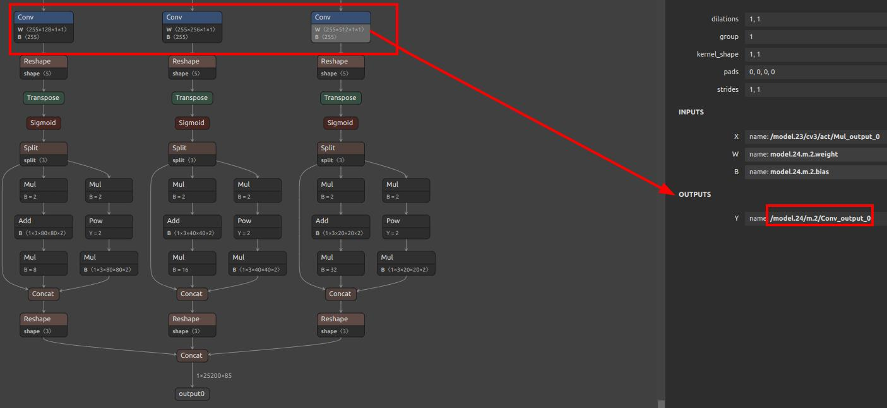
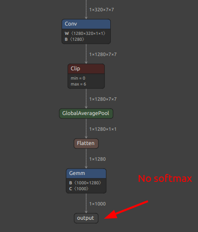

---
title: 裁剪 ONNX 模型节点教程
---

## 为什么需要裁剪节点

一般模型都有后处理节点，这部分是 CPU 进行运算的，我们将它们剥离出来，它们会影响到量化效果，可能会导致量化失败。


这里以`YOLOv5s 举例`，



可以看到这里有三个`conv`，后面的计算均由 CPU 进行，我们量化时就采取这几个`conv`的输出作为模型的最后输出，在这里输出名分别叫`/model.24/m.0/Conv_output_0,/model.24/m.1/Conv_output_0,/model.24/m.2/Conv_output_0`。

分类模型一般来说取最后一个输出名称就行，不过如果有`softmax`的话，建议不把`softmax`包含在模型里面，即取`softmax`前一层的输出名，下图是没有`softmax`层的所以直接取最后一层即可。



## ONNX裁剪节点脚本
这里核心就是 `onnx`模型文件了，可以用脚本`extract_onnx.py`提取：

```python
import onnx
import sys

input_path = sys.argv[1]
output_path = sys.argv[2]
input_names_str = sys.argv[3]
output_names_str = sys.argv[4]
input_names = []
for s in input_names_str.split(","):
    input_names.append(s.strip())
output_names = []
for s in output_names_str.split(","):
    output_names.append(s.strip())
onnx.utils.extract_model(input_path, output_path, input_names, output_names)
```

这里python脚本不做解释，只需要放在任意一个文件夹然后`python extract_onnx.py $model_path $onnx_extracted $input_names $output_names`即可
或者你不喜欢保存文件也可以直接运行如下：
```
python -c "import onnx,sys; onnx.utils.extract_model(sys.argv[1], sys.argv[2], [s.strip() for s in sys.argv[3].split(',')], [s.strip() for s in sys.argv[4].split(',')])" yolo11n.onnx export.onnx "images" "/model.23/Concat_output_0,/model.23/Concat_1_output_0,/model.23/Concat_2_output_0"
```
> 其中`yolo11n.onnx`, `export.onnx`, `"images"`, `"/model.23/Concat_output_0,/model.23/Concat_1_output_0,/model.23/Concat_2_output_0"`依次替换成你的`$model_path`, `$onnx_extracted`, `$input_names`, `$output_names`。

此时得到的`export.onnx`就是最后裁剪得到的新onnx文件了，下一步就可以继续你的部署了

> MaixCAM / MaixCAM-Pro 模型转换请看[MaixCAM 模型转换文档](./maixcam.md)
> MaixCAM2 模型转换请看[MaixCAM2 模型转换文档](./maixcam2.md)


