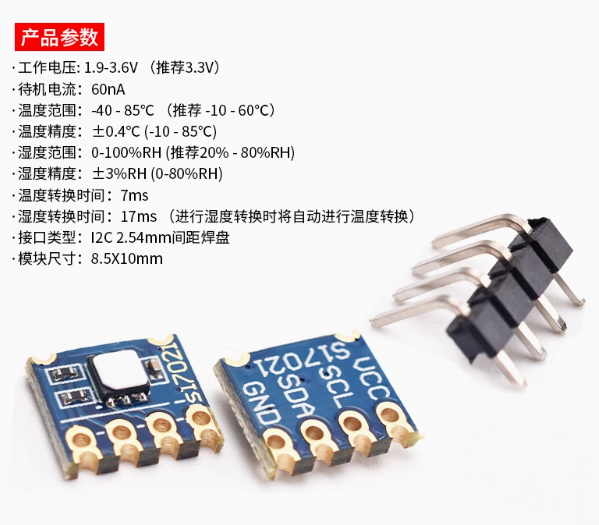

## 简介

通过给 MaixCAM 外挂一个温湿度传感器模块，可以轻松读取到环境温度和湿度，这里以 `Si7021` 这款传感器为例，通过 `I2C` 可以驱动它，其它的传感器你也可以找厂商要驱动然后使用 I2C / SPI 读取。

注意供电是 3.3v，不要接错到 5v 导致烧毁。

`SCL` / `SDA` 接到 MaixCAM 的 `SCL` / `SDA` 即可，比如 `I2C5` 对应的`A15(SCL)/ A27(SDA)`。

## 使用

完整的代码在 [MaixPy/examples/ext_dev/sensors](https://github.com/sipeed/MaixPy/blob/main/examples/ext_dev/sensors) 目录下， 找到`si7021` 的例程即可。

注意系统镜像需要 `>= 2024.6.3_maixpy_v4.2.1` 版本。

