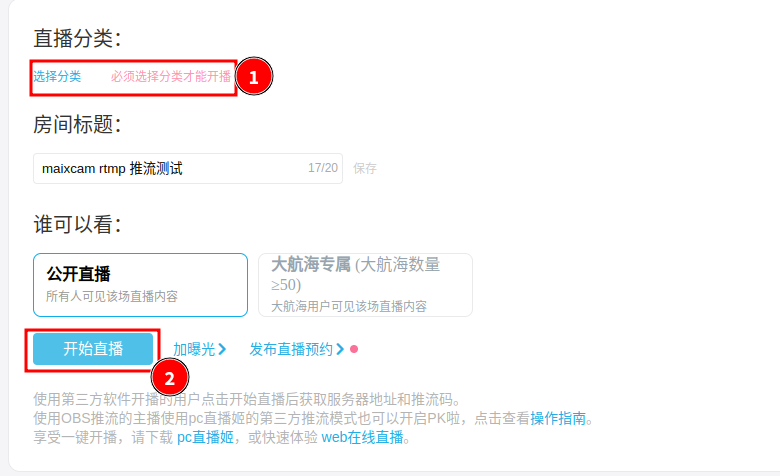

## 简介

本文档提供通过RTMP推送H264视频流的方法

## 使用方法

```python
from maix import camera, time, rtmp, image

cam = camera.Camera(640, 480, image.Format.FMT_YVU420SP)

# rtmp://192.168.0.30:1935/live/stream
host = '192.168.0.30'
port = 1935
app = 'live'
stream = 'stream'
bitrate = 1000_000
r = rtmp.Rtmp(host, port, app, stream, bitrate)
r.bind_camera(cam)
r.start()

while True:
    time.sleep(1)
```

步骤：

1. 导入camera, time, rtmp和image模块

   ```python
   from maix import camera, time, rtmp, image
   ```

2. 初始化摄像头

   ```python
   cam = camera.Camera(640, 480, image.Format.FMT_YVU420SP) # 初始化摄像头，输出分辨率640x480 NV21格式
   ```

   - 注意RTMP模块目前只支持NV21格式， 因此摄像头需要配置为NV21格式输出


3. 初始化并启动Rtmp对象

   ```python
   r = rtmp.Rtmp(host, port, app, stream, bitrate)
   r.bind_camera(cam)
   r.start()
   ```

   - `r = rtmp.Rtmp(host, port, app, stream, bitrate)`用来创建一个`Rtmp`对象，其中`host`指rtmp服务器的ip地址或者域名，`app`指rtmp服务器开放的应用名，`stream`指rtmp流的名称，也可以作为本次推流的密钥
   - `r.bind_camera(cam)`用来绑定一个`Camera`对象， 绑定后原`Camera`对象将不能再使用
   - `r.start()`用来启动`rtmp`推流

4. 完成

## 支持推流音频

MaixPy支持同时推送音视频流, 通过绑定一个`Recorder`对象后可以在推送视频流的同时附带音频数据

> 注:MaixPy v4.7.8之后的版本支持该方法（不包括v4.7.8）

参考代码如下:

```python
from maix import camera, time, app, rtmp, image, audio

cam = camera.Camera(640, 480, image.Format.FMT_YVU420SP)
audio_recorder = audio.Recorder()

host="192.168.0.63"
port=1935
app_name="live"
stream_name="stream"
client = rtmp.Rtmp(host, port, app_name, stream_name)
client.bind_camera(cam)
client.bind_audio_recorder(audio_recorder)
client.start()

print(f"rtmp://{host}:{port}/{app_name}/{stream_name}")
while not app.need_exit():
    time.sleep(1)
```

上文中通过`audio.Recorder()`创建一个`audio_recorder`对象,并使用`Rtmp`的`bind_audio_recorder()`方法绑定该对象, 推流的同时把音频数据也推送出去了.


## 向Bilibili推流测试

### 启动bilibili直播

1. 点击直播

   


2. 点击开播设置


3. 通过`我的直播间链接`找到直播地址


4. 往下翻，选择一个`分类`，再点击开始直播



5. 执行步骤4后，可以看到


- 直播服务器的地址为：`rtmp://live-push.bilivideo.com/live-bvc`
- 串流密钥为：`?streamname=live_xxxx&key=1fbfxxxxxxxxxxxxxffe0&schedule=rtmp&pflag=1`

组合起来的`rtmp`推流地址就是：`rtmp://live-push.bilivideo.com/live-bvc/?streamname=live_xxxx&key=1fbfxxxxxxxxxxxxxffe0&schedule=rtmp&pflag=1`


### 运行RTMP客户端

```python
from maix import camera, time, rtmp, image

cam = camera.Camera(640, 480, image.Format.FMT_YVU420SP)

# rtmp://live-push.bilivideo.com/live-bvc/?streamname=live_xxxx&key=1fbfxxxxxxxxxxxxxffe0&schedule=rtmp&pflag=1
host = 'live-push.bilivideo.com'
port = 1935
app = 'live-bvc'
stream = '?streamname=live_xxxx&key=1fbfxxxxxxxxxxxxxffe0&schedule=rtmp&pflag=1'
bitrate = 1000_000
r = rtmp.Rtmp(host, port, app, stream, bitrate)
r.bind_camera(cam)
r.start()

while True:
    time.sleep(1)
```

上面拿到bilibili的推流地址为`rtmp://live-push.bilivideo.com/live-bvc/?streamname=live_xxxx&key=1fbfxxxxxxxxxxxxxffe0&schedule=rtmp&pflag=1`

可以拆出

1. 服务器地址为`live-push.bilivideo.com`
2. 端口号为`1935`，即没有端口号则默认为`1935`
3. 应用名为`live-bvc`
4. 流名称为`?streamname=live_xxxx&key=1fbfxxxxxxxxxxxxxffe0&schedule=rtmp&pflag=1`

运行代码，就能在直播间看到`maixcam`的画面了，如果发现直播没有显示，可以尝试先关闭直播间，再重新打开直播间，再运行代码。

动手试试吧～ 