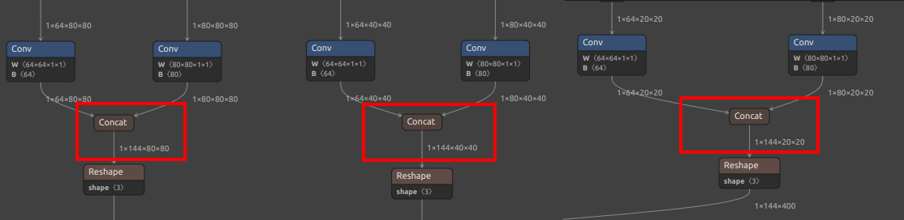
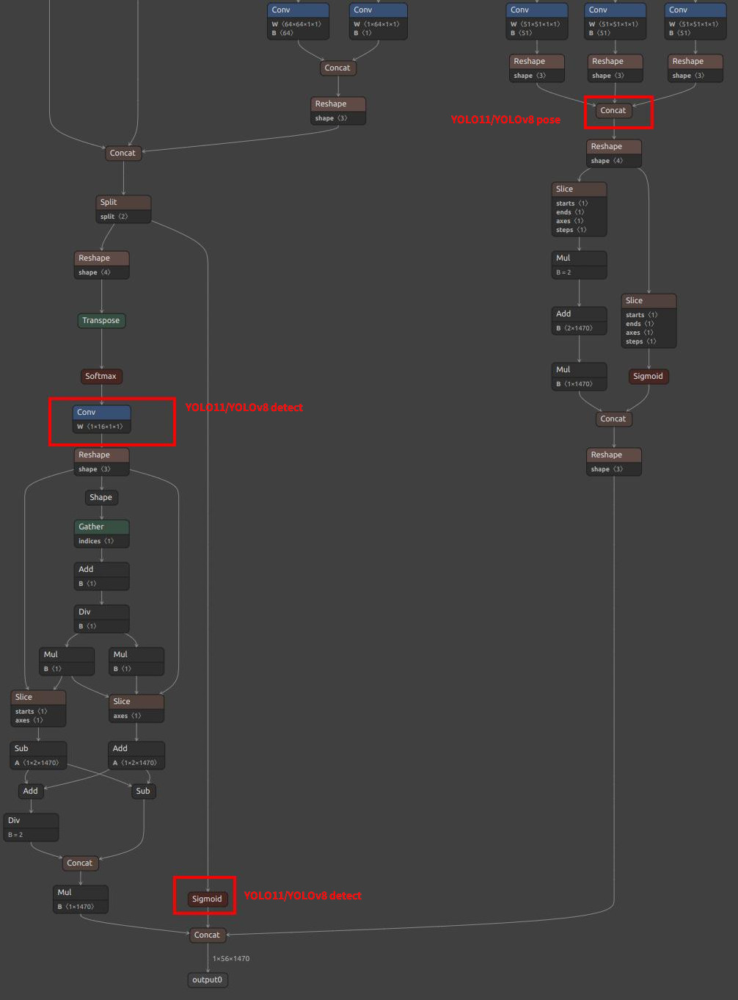
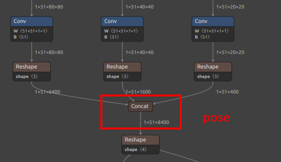
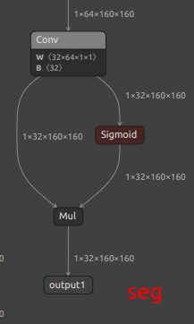
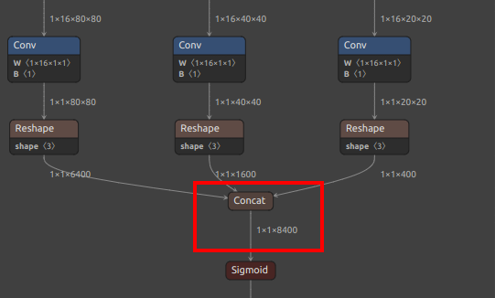
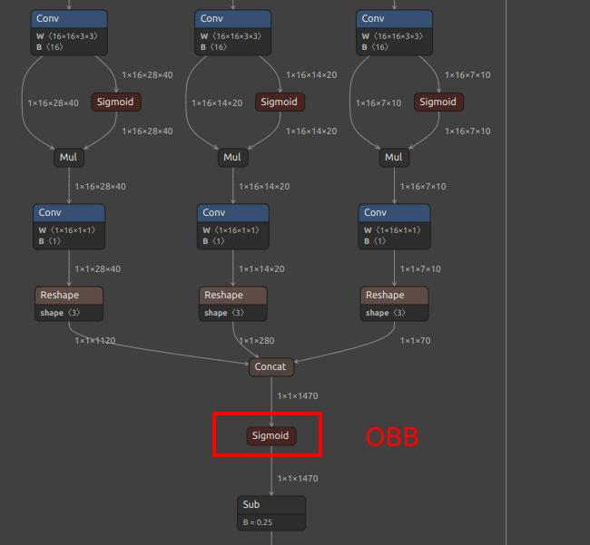
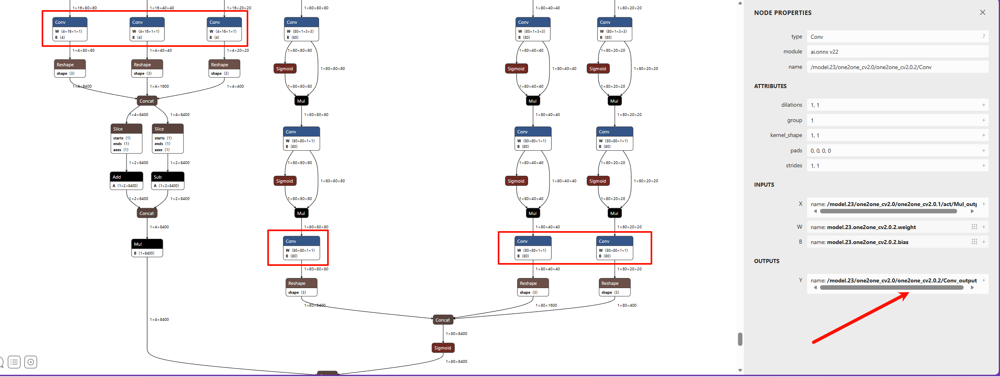

## 简介

默认官方提供了 80 种物体检测，如果不满足你的需求，可以自己训练检测的物体，可以在自己的电脑或者服务器搭建训练环境训练。

YOLOv8 / YOLO11 不光支持检测物体，还有 yolov8-pose / YOLO11-pose 支持关键点检测，出了官方的人体关键点，你还可以制作你自己的关键点数据集来训练检测指定的物体和关键点

因为 YOLOv8 和 YOLO11 主要是修改了内部网络，预处理和后处理都是一样的，所以 YOLOv8 和 YOLO11 的训练转换步骤相同，只是输出节点的名称不一样。


## 前置知识
本文讲了如何自定义训练，但是有一些基础知识默认你已经拥有，如果没有请自行学习：
* 本文不会讲解如何安装训练环境，请自行搜索安装（Pytorch 环境安装）测试。
* 本文不会讲解机器学习的基本概念、linux相关基础使用知识。
* 本文搭建的环境基于linux桌面环境，windows请使用wsl2环境使用，wsl2支持X11。相关信息请自行学习

## 流程和本文目标

这是一个零算法基础的流程，只要你会docker并且会标定数据，买到手就能在12小时内运行起你自定义的yolo模型在MaixCAM/MaixCAM2上完美运行。

要想我们的模型能在 MaixPy (MaixCAM)上使用，需要经历以下过程：
* 搭建训练环境，本文略过，请自行搜索 pytorch 训练环境搭建。
* 拉取 [YOLO11/YOLOv8/YOLO26](https://github.com/ultralytics/ultralytics) 源码到本地。
* 准备数据集，并做成 YOLO11 / YOLOv8 /YOLO26 项目需要的格式。
* 训练模型，得到一个 `onnx` 模型文件，也是本文的最终输出文件。
* 将`onnx`模型转换成 MaixPy 支持的 `MUD` 文件，这个过程在模型转换文章中有详细介绍：
  * [MaixCAM 模型转换](../ai_model_converter/maixcam.md)
  * [MaixCAM2 模型转换](../ai_model_converter/maixcam2.md)
* 使用 MaixPy 加载模型运行。


## 安装 docker

参考[docker 安装官方文档](https://docs.docker.com/engine/install/ubuntu/)安装即可。

比如：
```shell
# 安装docker依赖的基础软件
sudo apt-get update
sudo apt-get install apt-transport-https ca-certificates curl gnupg-agent software-properties-common
# 添加官方来源
curl -fsSL https://download.docker.com/linux/ubuntu/gpg | sudo apt-key add -
sudo add-apt-repository "deb [arch=amd64] https://download.docker.com/linux/ubuntu $(lsb_release -cs) stable"
# 安装 docker
sudo apt-get update
sudo apt-get install docker-ce docker-ce-cli containerd.io
```

接着安装导出onnx节点的环境。

## 哪里找数据集训练

请看[哪里找数据集](../pro/datasets.md)

## 准备模型转换环境

> 请预留100G的硬盘空间给docker，不然转换过程可能失败。
> 注：由于ultralytics不同版本从pt模型文件导出的节点不一致，随意更换版本会导致和后处理代码对不上进而无法使用，所以请严格按照Dockerfile指定版本导出。

### 创建onnx导出环境

```Dockerfile
# 基于Python3.10精简版镜像构建
# Build based on Python 3.10 slim image
FROM python:3.10-slim

# 设置系统与Python运行环境变量
# Set system and Python environment variables
ENV DEBIAN_FRONTEND=noninteractive \
    PIP_NO_CACHE_DIR=1 \
    PYTHONUNBUFFERED=1 \
    MPLCONFIGDIR=/tmp/matplotlib

# 设置容器工作目录为/app
# Set container working directory to /app
WORKDIR /app

# 更新软件源并安装系统依赖库，清理缓存减小镜像体积
# Update apt source, install system dependencies and clean cache to reduce image size
RUN apt-get update && apt-get install -y --no-install-recommends \
    git \
    wget \
    curl \
    libglib2.0-0 \
    libsm6 \
    libxrender1 \
    libxext6 \
    libgl1 \
    && rm -rf /var/lib/apt/lists/*

# 升级pip并安装CPU版本PyTorch相关库
# Upgrade pip and install CPU version of PyTorch related libraries
RUN pip install --upgrade pip && \
    pip install \
    torch torchvision torchaudio \
    --index-url https://download.pytorch.org/whl/cpu

# 安装指定版本的ultralytics框架及依赖
# Install specified version of ultralytics framework and dependencies
RUN pip install \
    ultralytics==8.3.240 \
    ultralytics-thop==2.0.18

# 拉取YOLOv5源码并安装项目依赖
# Clone YOLOv5 source code and install project requirements
RUN git clone https://github.com/ultralytics/yolov5.git &&  \
    pip install -r /app/yolov5/requirements.txt 

# 执行环境完整性检测
# Run environment inspection check
RUN yolo checks

# 切换工作目录至/workspace
# Switch working directory to /workspace
WORKDIR /workspace

# 容器默认启动命令为bash终端
# Default startup command for container is bash shell
CMD ["/bin/bash"]
```

> 在一个空文件夹下新建`Dockerfile`文件,使用`docker build -t onnx-export .`创造镜像
> 注：`Dockerfile`文件没有后缀名

## 参考文章

因为是比较通用的操作过程，本文只给一个流程介绍，具体细节可以自行看 **[YOLO26 / YOLO11 / YOLOv8 官方代码和文档](https://github.com/ultralytics/ultralytics)**(**推荐**)，以及搜索其训练教程，最终导出 onnx 文件即可。

如果你有觉得讲得不错的文章欢迎修改本文并提交 PR。

## 导出 onnx 模型
运行docker环境
```
docker run -it --rm  -v ./:/workspace   -w /workspace   --network=host   onnx-export:latest
```

> yolov8n/yolo11n/yolo26使用yolo命令行导出 。`yolo export model=./yolo11n.pt format=onnx`，请把`./yolo11n.pt`自行替换成你自己训练的pt文件
> yolov5s（Maixhub在线训练使用的模型）使用命令`python /app/yolov5/export.py --weights ./yolov5s.pt --include onnx --img 640 480`，请把`./yolov5s.pt`自行替换成你自己训练的pt文件


这里重新指定了输入分辨率，模型训练的时候用的`640x640`，我们重新指定了分辨率方便提升运行速度，这里使用`640x480`的原因是和 MaixCAM2 的屏幕比例比较相近方便显示，对于 MaixCAM 可以用 `320x224`，具体可以根据你的需求设置就好了。


## 转换为 MaixCAM 支持的模型以及 mud 文件

MaixPy/MaixCDK 目前支持了 YOLO26 / YOLOv8 / YOLO11 检测 以及 YOLOv8-pose / YOLO11-pose 关键点检测 以及 YOLOv8-seg / YOLO11-seg YOLOv8-obb / YOLOV11-obb 四种模型（2026.2.4）。


### 输出节点选择

注意模型输出节点的选择（**注意可能你的模型可能数值不完全一样，看下面的图找到相同的节点即可**）：
对于 YOLO11 / YOLOv8， MaixPy 支持了两种节点选择，可以根据硬件平台适当选择：
确定好输出节点之后需要进行onnx的裁剪，详细请看[裁剪 ONNX 模型节点教程]。

| 模型和特点 | 方案一 | 方案二 |
| -- | --- | --- |
| 适用设备 | **MaixCAM2**(推荐)<br>MaixCAM(速度比方案二慢一点点) | **MaixCAM**(推荐) |
| 特点    | 将更多的计算给 CPU 后处理，量化更不容易出问题，速度略微慢于方案二 | 将更多的计算给 NPU 并且参与量化 |
| 注意点 | 无 | MaixCAM2 实测量化失败 |
| 检测 YOLOv5s |`/model.24/m.0/Conv_output_0`<br>`/model.24/m.1/Conv_output_0`<br>`/model.24/m.2/Conv_output_0`|同MaixCAM2|
| 检测 YOLOv8 |`/model.22/Concat_1_output_0`<br>`/model.22/Concat_2_output_0`<br>`/model.22/Concat_3_output_0`| `/model.22/dfl/conv/Conv_output_0`<br>`/model.22/Sigmoid_output_0` |
| 检测 YOLO11 |`/model.23/Concat_output_0`<br>`/model.23/Concat_1_output_0`<br>`/model.23/Concat_2_output_0` | `/model.23/dfl/conv/Conv_output_0`<br>`/model.23/Sigmoid_output_0` |
| 关键点 YOLOv8-pose | `/model.22/Concat_1_output_0`<br>`/model.22/Concat_2_output_0`<br>`/model.22/Concat_3_output_0`<br>`/model.22/Concat_output_0`| `/model.22/dfl/conv/Conv_output_0`<br>`/model.22/Sigmoid_output_0`<br>`/model.22/Concat_output_0` |
| 关键点 YOLO11-pose | `/model.23/Concat_1_output_0`<br>`/model.23/Concat_2_output_0`<br>`/model.23/Concat_3_output_0`<br>`/model.23/Concat_output_0`| `/model.23/dfl/conv/Conv_output_0`<br>`/model.23/Sigmoid_output_0`<br>`/model.23/Concat_output_0`|
| 分割 YOLOv8-seg|`/model.22/Concat_1_output_0`<br>`/model.22/Concat_2_output_0`<br>`/model.22/Concat_3_output_0`<br>`/model.22/Concat_output_0`<br>`output1`| `/model.22/dfl/conv/Conv_output_0`<br>`/model.22/Sigmoid_output_0`<br>`/model.22/Concat_output_0`<br>`output1`|
| 分割 YOLO11-seg |`/model.23/Concat_1_output_0`<br>`/model.23/Concat_2_output_0`<br>`/model.23/Concat_3_output_0`<br>`/model.23/Concat_output_0`<br>`output1`|`/model.23/dfl/conv/Conv_output_0`<br>`/model.23/Sigmoid_output_0`<br>`/model.23/Concat_output_0`<br>`output1`|
| 旋转框 YOLOv8-obb |`/model.22/Concat_1_output_0`<br>`/model.22/Concat_2_output_0`<br>`/model.22/Concat_3_output_0`<br>`/model.22/Concat_output_0`|`/model.22/dfl/conv/Conv_output_0`<br>`/model.22/Sigmoid_1_output_0`<br>`/model.22/Sigmoid_output_0`|
| 旋转框 YOLO11-obb |`/model.23/Concat_1_output_0`<br>`/model.23/Concat_2_output_0`<br>`/model.23/Concat_3_output_0`<br>`/model.23/Concat_output_0`|`/model.23/dfl/conv/Conv_output_0`<br>`/model.23/Sigmoid_1_output_0`<br>`/model.23/Sigmoid_output_0`|
| 检测 YOLO26 |`/model.23/one2one_cv2.0/one2one_cv2.0.2/Conv_output_0 /model.23/one2one_cv2.1/one2one_cv2.1.2/Conv_output_0 /model.23/one2one_cv2.2/one2one_cv2.2.2/Conv_output_0 /model.23/one2one_cv3.0/one2one_cv3.0.2/Conv_output_0 /model.23/one2one_cv3.1/one2one_cv3.1.2/Conv_output_0 /model.23/one2one_cv3.2/one2one_cv3.2.2/Conv_output_0`|同MaixCAM2|
|YOLOv8/YOLO11 检测输出节点图|  | |
|YOLOv8/YOLO11 pose 额外输出节点 |  | 见上图 pose 分支|
|YOLOv8/YOLO11 seg 额外输出节点 |  | |
|YOLOv8/YOLO11 OBB 额外输出节点 |  | |
|检测 YOLO26 输出节点图 |  | 同MaixCAM2 |


### 转换成NPU指定模型文件教程
按照[MaixCAM 模型转换](../ai_model_converter/maixcam.md) 和 [MaixCAM2 模型转换](../ai_model_converter/maixcam2.md) 进行模型转换。


### 修改 mud 文件

对于物体检测，mud 文件为（YOLO11 model_type 改为 yolo11 YOLO26 model_type 改为 yolo26）
MaixCAM/MaixCAM-Pro:
```ini
[basic]
type = cvimodel
model = yolov8n.cvimodel

[extra]
model_type = yolov8
input_type = rgb
mean = 0, 0, 0
scale = 0.00392156862745098, 0.00392156862745098, 0.00392156862745098
labels = person, bicycle, car, motorcycle, airplane, bus, train, truck, boat, traffic light, fire hydrant, stop sign, parking meter, bench, bird, cat, dog, horse, sheep, cow, elephant, bear, zebra, giraffe, backpack, umbrella, handbag, tie, suitcase, frisbee, skis, snowboard, sports ball, kite, baseball bat, baseball glove, skateboard, surfboard, tennis racket, bottle, wine glass, cup, fork, knife, spoon, bowl, banana, apple, sandwich, orange, broccoli, carrot, hot dog, pizza, donut, cake, chair, couch, potted plant, bed, dining table, toilet, tv, laptop, mouse, remote, keyboard, cell phone, microwave, oven, toaster, sink, refrigerator, book, clock, vase, scissors, teddy bear, hair drier, toothbrush
```

MaixCAM2:
```ini
[basic]
type = axmodel
model_npu = yolo11n_640x480_npu.axmodel
model_vnpu = yolo11n_640x480_vnpu.axmodel

[extra]
model_type = yolo11
type=detector
input_type = rgb
labels = person, bicycle, car, motorcycle, airplane, bus, train, truck, boat, traffic light, fire hydrant, stop sign, parking meter, bench, bird, cat, dog, horse, sheep, cow, elephant, bear, zebra, giraffe, backpack, umbrella, handbag, tie, suitcase, frisbee, skis, snowboard, sports ball, kite, baseball bat, baseball glove, skateboard, surfboard, tennis racket, bottle, wine glass, cup, fork, knife, spoon, bowl, banana, apple, sandwich, orange, broccoli, carrot, hot dog, pizza, donut, cake, chair, couch, potted plant, bed, dining table, toilet, tv, laptop, mouse, remote, keyboard, cell phone, microwave, oven, toaster, sink, refrigerator, book, clock, vase, scissors, teddy bear, hair drier, toothbrush

input_cache = true
output_cache = true
input_cache_flush = false
output_cache_inval = true

mean = 0,0,0
scale = 0.00392156862745098, 0.00392156862745098, 0.00392156862745098
```

根据你训练的对象替换`labels`即可。

对于关键点检测(yolov8-pose)，修改 `type=pose`。
对于关键点检测(yolov8-seg)，修改 `type=seg`。
对于关键点检测(yolov8-obb)，修改 `type=obb`。


## 上传分享到 MaixHub

到 [MaixHub 模型库](https://maixhub.com/model/zoo?platform=maixcam) 上传并分享你的模型，可以多提供几个分辨率供大家选择。

