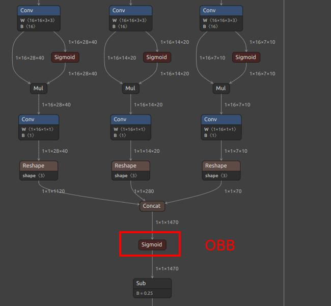

## 简介

默认官方提供了 80 种物体检测，如果不满足你的需求，可以自己训练检测的物体，可以在自己的电脑或者服务器搭建训练环境训练。

YOLOv8 / YOLO11 不光支持检测物体，还有 yolov8-pose / YOLO11-pose 支持关键点检测，出了官方的人体关键点，你还可以制作你自己的关键点数据集来训练检测指定的物体和关键点

因为 YOLOv8 和 YOLO11 主要是修改了内部网络，预处理和后处理都是一样的，所以 YOLOv8 和 YOLO11 的训练转换步骤相同，只是输出节点的名称不一样。


**注意：** 本文讲了如何自定义训练，但是有一些基础知识默认你已经拥有，如果没有请自行学习：
* 本文不会讲解如何安装训练环境，请自行搜索安装（Pytorch 环境安装）测试。
* 本文不会讲解机器学习的基本概念、linux相关基础使用知识。

如果你觉得本文哪里需要改进，欢迎点击右上角`编辑本文`贡献并提交 文档 PR。


## 流程和本文目标

要想我们的模型能在 MaixPy (MaixCAM)上使用，需要经历以下过程：
* 搭建训练环境，本文略过，请自行搜索 pytorch 训练环境搭建。
* 拉取 [YOLO11/YOLOv8](https://github.com/ultralytics/ultralytics) 源码到本地。
* 准备数据集，并做成 YOLO11 / YOLOv8 项目需要的格式。
* 训练模型，得到一个 `onnx` 模型文件，也是本文的最终输出文件。
* 将`onnx`模型转换成 MaixPy 支持的 `MUD` 文件，这个过程在[MaixCAM 模型转换](../ai_model_converter/maixcam.md) 一文种有详细介绍。
* 使用 MaixPy 加载模型运行。


## 哪里找数据集训练

请看[哪里找数据集](../pro/datasets.md)


## 参考文章

因为是比较通用的操作过程，本文只给一个流程介绍，具体细节可以自行看 **[YOLO11 / YOLOv8 官方代码和文档](https://github.com/ultralytics/ultralytics)**(**推荐**)，以及搜索其训练教程，最终导出 onnx 文件即可。

如果你有觉得讲得不错的文章欢迎修改本文并提交 PR。

## YOLO11 / YOLOv8 导出 onnx 模型

在 `ultralytics` 目录下创建一个`export_onnx.py` 文件
```python
from ultralytics import YOLO
import sys

print(sys.path)
net_name = sys.argv[1] # yolov8n.pt yolov8n-pose.pt # https://docs.ultralytics.com/models/yolov8/#supported-tasks-and-modes
input_width = int(sys.argv[2])
input_height = int(sys.argv[3])

# Load a model
model = YOLO(net_name)  # load an official model
# model = YOLO("path/to/best.pt")  # load a custom model

# Predict with the model
results = model("https://ultralytics.com/images/bus.jpg")  # predict on an image
path = model.export(format="onnx", imgsz=[input_height, input_width], dynamic=False, simplify=True, opset=17)   # export the model to ONNX format
print(path)

```

然后执行`python export_onnx.py yolov8n.pt 320 224` 就能导出 `onnx` 模型了，这里重新指定了输入分辨率，模型训练的时候用的`640x640`，我们重新指定了分辨率方便提升运行速度，这里使用`320x224`的原因是和 MaixCAM 的屏幕比例比较相近方便显示，具体可以根据你的需求设置就好了。


## 转换为 MaixCAM 支持的模型以及 mud 文件

MaixPy/MaixCDK 目前支持了 YOLOv8 / YOLO11 检测 以及 YOLOv8-pose / YOLO11-pose 关键点检测 以及 YOLOv8-seg / YOLO11-seg 三种模型（2024.10.10）。

按照[MaixCAM 模型转换](../ai_model_converter/maixcam.md) 进行模型转换。

注意模型输出节点的选择（**注意可能你的模型可能数值不完全一样，看下面的图找到相同的节点即可**）：
* 检测模型：
  * YOLOv8 提取 onnx 的 `/model.22/dfl/conv/Conv_output_0,/model.22/Sigmoid_output_0` 这两个输出。
  * YOLO11 提取`/model.23/dfl/conv/Conv_output_0,/model.23/Sigmoid_output_0`输出。
* 关键点检测：
  * YOLOv8-pose 提取`/model.22/dfl/conv/Conv_output_0,/model.22/Sigmoid_output_0,/model.22/Concat_output_0`这三个输出。
  * YOLO11-pose 提取`/model.23/dfl/conv/Conv_output_0,/model.23/Sigmoid_output_0,/model.23/Concat_output_0`这三个输出。
* 图像分割：
  * YOLOv8-seg 提取 `/model.22/dfl/conv/Conv_output_0,/model.22/Sigmoid_output_0,/model.22/Concat_output_0,output1`
  * YOLO11-seg 提取 `/model.23/dfl/conv/Conv_output_0,/model.23/Sigmoid_output_0,/model.23/Concat_output_0,output1`四个输出。
* OBB 检测：
  * YOLOv8 提取`/model.22/dfl/conv/Conv_output_0,/model.22/Sigmoid_1_output_0,/model.22/Sigmoid_output_0`这三个输出。
  * YOLO11 提取`/model.23/dfl/conv/Conv_output_0,/model.23/Sigmoid_1_output_0,/model.23/Sigmoid_output_0`这三个输出。

YOLOv8/YOLO11 输出节点:


YOLOv8/YOLO11 OBB 输出节点：


对于物体检测，mud 文件为（YOLO11 model_type 改为 yolo11）
```ini
[basic]
type = cvimodel
model = yolov8n.cvimodel

[extra]
model_type = yolov8
input_type = rgb
mean = 0, 0, 0
scale = 0.00392156862745098, 0.00392156862745098, 0.00392156862745098
labels = person, bicycle, car, motorcycle, airplane, bus, train, truck, boat, traffic light, fire hydrant, stop sign, parking meter, bench, bird, cat, dog, horse, sheep, cow, elephant, bear, zebra, giraffe, backpack, umbrella, handbag, tie, suitcase, frisbee, skis, snowboard, sports ball, kite, baseball bat, baseball glove, skateboard, surfboard, tennis racket, bottle, wine glass, cup, fork, knife, spoon, bowl, banana, apple, sandwich, orange, broccoli, carrot, hot dog, pizza, donut, cake, chair, couch, potted plant, bed, dining table, toilet, tv, laptop, mouse, remote, keyboard, cell phone, microwave, oven, toaster, sink, refrigerator, book, clock, vase, scissors, teddy bear, hair drier, toothbrush
```

根据你训练的对象替换`labels`即可。

对于关键点检测(yolov8-pose)， mud 文件为（YOLO11 model_type 改为 yolo11）：
```ini
[basic]
type = cvimodel
model = yolov8n_pose.cvimodel

[extra]
model_type = yolov8
type = pose
input_type = rgb
mean = 0, 0, 0
scale = 0.00392156862745098, 0.00392156862745098, 0.00392156862745098
labels = person
```

官方默认的时人体姿态关键点检测，所以`labels`只有一个 `person`，根据你检测的物体替换即可。

对于图像分割(yolov8-seg)， mud 文件（YOLO11 model_type 改为 yolo11）：
```ini
[basic]
type = cvimodel
model = yolo11n-seg_320x224_int8.cvimodel

[extra]
model_type = yolov8
input_type = rgb
type = seg
mean = 0, 0, 0
scale = 0.00392156862745098, 0.00392156862745098, 0.00392156862745098
labels = person, bicycle, car, motorcycle, airplane, bus, train, truck, boat, traffic light, fire hydrant, stop sign, parking meter, bench, bird, cat, dog, horse, sheep, cow, elephant, bear, zebra, giraffe, backpack, umbrella, handbag, tie, suitcase, frisbee, skis, snowboard, sports ball, kite, baseball bat, baseball glove, skateboard, surfboard, tennis racket, bottle, wine glass, cup, fork, knife, spoon, bowl, banana, apple, sandwich, orange, broccoli, carrot, hot dog, pizza, donut, cake, chair, couch, potted plant, bed, dining table, toilet, tv, laptop, mouse, remote, keyboard, cell phone, microwave, oven, toaster, sink, refrigerator, book, clock, vase, scissors, teddy bear, hair drier, toothbrush
```

## 上传分享到 MaixHub

到 [MaixHub 模型库](https://maixhub.com/model/zoo?platform=maixcam) 上传并分享你的模型，可以多提供几个分辨率供大家选择。


