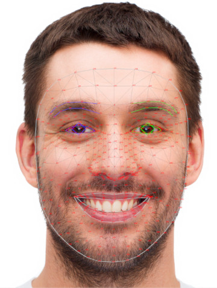

## 简介

前面的文章[人脸检测](./face_detection.md)中介绍了如何检测人脸，以及几个关键点（比如 5 个），本文介绍如何检测更多（478个）关键点。

更多的关键点有更多的用途，比如表情检测，人脸特征识别，换脸等等。



<a href="../../assets/maixcam_face_landmarks_full.jpg" target="_blank">高清大图， 478个点位置在图中可以看到</a>

## MaixPy 中使用人脸关键点检测

MaixPy 中移植了 MediePipe 的人脸 **478 关键点**检测，效果如下：


效果视频：
<video playsinline controls autoplay loop muted preload src="/static/video/maixcam_face_landmarks.mp4" type="video/mp4">
Classifier Result video
</video>


使用代码（MaixPy 版本必须 >= 4.10.0），最新代码以[MaixPy/examples](https://github.com/sipeed/MaixPy)为准：
```python
from maix import camera, display, image, nn, app

detect_conf_th = 0.5
detect_iou_th = 0.45
landmarks_conf_th = 0.5
landmarks_abs = True
landmarks_rel = False
max_face_num = 2
detector = nn.YOLOv8(model="/root/models/yolov8n_face.mud", dual_buff = False)
landmarks_detector = nn.FaceLandmarks(model="/root/models/face_landmarks.mud")

cam = camera.Camera(detector.input_width(), detector.input_height(), detector.input_format())
disp = display.Display()

while not app.need_exit():
    img = cam.read()
    results = []
    objs = detector.detect(img, conf_th = detect_conf_th, iou_th = detect_iou_th, sort = 1)
    count = 0
    for obj in objs:
        img_std = landmarks_detector.crop_image(img, obj.x, obj.y, obj.w, obj.h, obj.points)
        if img_std:
            res = landmarks_detector.detect(img_std, landmarks_conf_th, landmarks_abs, landmarks_rel)
            if res and res.valid:
                results.append(res)
        count += 1
        if count >= max_face_num:
            break
    for res in results:
        landmarks_detector.draw_face(img, res.points, len(res.points_z), res.points_z)
    disp.show(img)
```

这里有几个地方解释一下：
* `max_face_num` 可以限制最多检测的人脸数量，防止画面人脸过多变卡。
* `landmarks_abs` 指定检测到源图`img`中人脸关键点的坐标，在结果的`points`变量中有`478`个点，以`x0,y0,x1,y1,...,x477,y477`顺序排列。
* `landmarks_rel` 则输出`img_std`中的坐标，结果追加到`points`变量中。
* `points_z` 是关键点深度估计，值相对于面部重心，离镜头越近值越大，在面部重心之后则为负值，值与面部宽度成比例。


## 取部分关键点

478 个关键点有点多，如果你只需要其中几个，可以根据 <a href="../../assets/maixcam_face_landmarks_full.jpg" target="_blank">高清大图</a> 的下标取部分，常见的：
**注意只提供参考，以模型实际输出为准**
* 146 个点：
```python
sub_146_idxes = [0, 1, 4, 5, 6, 7, 8, 10, 13, 14, 17, 21, 33, 37, 39, 40, 46, 52, 53, 54, 55, 58, 61, 63, 65, 66, 67, 70, 78, 80,
            81, 82, 84, 87, 88, 91, 93, 95, 103, 105, 107, 109, 127, 132, 133, 136, 144, 145, 146, 148, 149, 150, 152, 153, 154, 155, 157,
            158, 159, 160, 161, 162, 163, 168, 172, 173, 176, 178, 181, 185, 191, 195, 197, 234, 246, 249, 251, 263, 267, 269, 270, 276, 282,
            283, 284, 285, 288, 291, 293, 295, 296, 297, 300, 308, 310, 311, 312, 314, 317, 318, 321, 323, 324, 332, 334, 336, 338, 356, 361,
            362, 365, 373, 374, 375, 377, 378, 379, 380, 381, 382, 384, 385, 386, 387, 388, 389, 390, 397, 398, 400, 402, 405,
            409, 415, 454, 466, 468, 469, 470, 471, 472, 473, 474, 475, 476, 477]
```
* 68 个点：
```python
sub_68_idxes = [162, 234, 93, 58, 172, 136, 149, 148, 152, 377, 378, 365, 397, 288, 323, 454, 389, 71, 63, 105, 66, 107, 336,
                296, 334, 293, 301, 168, 197, 5, 4, 75, 97, 2, 326, 305, 33, 160, 158, 133, 153, 144, 362, 385, 387, 263, 373,
                380, 61, 39, 37, 0, 267, 269, 291, 405, 314, 17, 84, 181, 78, 82, 13, 312, 308, 317, 14, 87]
```
* 5 个点
```python
sub_5_idxes = [468, 473, 4, 61, 291]
```

有了这些下标，我们用代码提取部分出来显示：
```python
def get_sub_landmarks(points, points_z, idxes):
    new_points = []
    new_points_z = []
    for i in idxes:
        new_points.append(points[i*2])
        new_points.append(points[i*2 + 1])
        new_points_z.append(points_z[i])
    return new_points, new_points_z

sub_xy, sub_z = get_sub_landmarks(res.points, res.points_z, sub_146_idxes)
landmarks_detector.draw_face(img, sub_xy, len(sub_z), sub_z)
```

