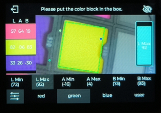

阅读本文前，确保已经知晓如何开发MaixCAM，详情请阅读[快速开始](../README.md)

## 简介

本文将介绍如何使用MaixPy来寻找色块，以及如何使用MaixCam的默认应用程序寻找色块。

在视觉应用中，寻找色块是一个非常常见的需求，比如机器人找色块，自动化生产线找色块等等，即需要识别画面中的特定的颜色区域，获取这个区域的位置和大小等信息。


## 使用 MaixPy 寻找色块

MaixPy的 `maix.image.Image`中提供了`find_blobs`方法，可以方便的找色块。

### 如何寻找色块

一个简单的示例，实现寻找色块并画框

```python
from maix import image, camera, display

cam = camera.Camera(320, 240)
disp = display.Display()

# 根据色块颜色选择对应配置
thresholds = [[0, 80, 40, 80, 10, 80]]      # red
# thresholds = [[0, 80, -120, -10, 0, 30]]    # green
# thresholds = [[0, 80, 30, 100, -120, -60]]  # blue

while 1:
    img = cam.read()
    blobs = img.find_blobs(thresholds, pixels_threshold=500)
    for blob in blobs:
        img.draw_rect(blob[0], blob[1], blob[2], blob[3], image.COLOR_GREEN)
    disp.show(img)
```

步骤：

1. 导入image、camera、display模块

   ```python
   from maix import image, camera, display
   ```

2. 初始化摄像头和显示

   ```python
   cam = camera.Camera(320, 240)	# 初始化摄像头，输出分辨率320x240 RGB格式
   disp = display.Display()
   ```

3. 从摄像头获取图片并显示

   ```python
   while 1:
       img = cam.read()
       disp.show(img)
   ```

4. 调用`find_blobs`方法寻找摄像头图片中的色块，并画到屏幕上

   ```python
   blobs = img.find_blobs(thresholds, pixels_threshold=500)
   for blob in blobs:
       img.draw_rect(blob[0], blob[1], blob[2], blob[3], image.COLOR_GREEN)
   ```

   - `img`是通过`cam.read()`读取到的摄像头图像，当初始化的方式为`cam = camera.Camera(320, 240)`时，`img`对象是一张分辨率为320x240的RGB图。
   - `img.find_blobs`用来寻找色块， `thresholds` 是一个颜色阈值列表，每个元素是一个颜色阈值，同时找到多个阈值就传入多个，每个颜色阈值的格式为 `[L_MIN, L_MAX, A_MIN, A_MAX, B_MIN, B_MAX]`，这里的 `L`、`A`、`B` 是`LAB`颜色空间的三个通道，`L` 通道是亮度，`A` 通道是红绿通道，`B` 通道是蓝黄通道。`pixels_threshold`是一个像素点数量的阈值，用来过滤一些不需要的小色块。
   - `img.draw_rect`用来画色块框，`blob[0]`、`blob[1]`、`blob[2]`、`blob[3]`分别代表色块左上角坐标x，色块左上角坐标y，色块宽度w和色块高度h

### 常用参数说明

列举常用参数说明，如果没有找到可以实现应用的参数，则需要考虑是否使用其他算法实现，或者基于目前算法的结果扩展所需的功能

| 参数             | 说明                                                         | 示例                                                         |
| ---------------- | ------------------------------------------------------------ | ------------------------------------------------------------ |
| thresholds       | 基于lab颜色空间的阈值，threshold=[[l_min, l_max, a_min, a_max, b_min, b_max]]，分别表示：<br />亮度范围为[l_min, l_max]\|<br />绿色到红色的分量范围为[a_min, a_max]<br />蓝色到黄色的分量范围为[b_min, b_max]<br />可同时设置多个阈值 | 设置两个阈值来检测红色和绿色<br />```img.find_blobs(threshold=[[0, 80, 40, 80, 10, 80], [0, 80, -120, -10, 0, 30]])```<br />红色阈值为[0, 80, 40, 80, 10, 80]<br />绿色阈值为[0, 80, -120, -10, 0, 30] |
| invert           | 使能阈值反转，使能后传入阈值与实际阈值相反，默认为False      | 使能阈值反转<br />```img.find_blobs(invert=True)```          |
| roi              | 设置算法计算的矩形区域，roi=[x, y, w, h]，x，y表示矩形区域左上角坐标，w，h表示矩形区域的宽度和高度，默认为整张图片 | 计算坐标为(50,50)，宽和高为100的区域<br />```img.find_blobs(roi=[50, 50, 100, 100])``` |
| area_threshold   | 过滤像素面积小于area_threshold的色块，单位为像素点，默认为10。该参数可用于过滤一些无用的小色块 | 过滤面积小于1000的色块<br />```img.find_blobs(area_threshold=1000)``` |
| pixels_threshold | 过滤有效像素点小于pixels_threshold的色块，默认为10。该参数可用于过滤一些无用的小色块 | 过滤有效像素点小于1000的色块<br />```img.find_blobs(pixels_threshold=1000)``` |

本文介绍常用方法，更多 API 请看 API 文档的 [image](../../../api/maix/image.md) 部分。

## 离线设置阈值

为了快速验证寻找色块的功能，可以先使用MaixCam提供的寻找色块应用程序来体验寻找色块的效果。

### 演示
打开设备，选择`找色块`应用，然后在下方选择要识别的颜色，或者自定义颜色，即可以识别到对应的颜色了，在下方`设置栏`会显示当前设置的`阈值范围`，同时串口也会输出识别到的坐标和颜色信息。

<video src="/static/video/find_blobs.mp4" controls="controls" width="100%" height="auto"></video>

[源码地址](https://github.com/sipeed/MaixCDK/tree/main/projects/app_find_blobs)

### 快速使用

#### 使用默认阈值

寻找色块APP提供了`red`、`green`、`blue`、`user`四种配置，其中`red`、`green`和`blue`用来寻找`红色`、`绿色`和`蓝色`的色块，`user`自定义的阈值在程序退出时会保存下来，下次打开应用时会加载上一次调试的阈值。快速体验时通过`点击`界面下方`按钮`即可切换到对应配置，APP界面参考如下：



#### 快速调试阈值

操作方法：

1. 将`摄像头对准`需要`寻找的物体`，`点击`屏幕上的`目标物体`，此时`左侧`会显示该物体对应颜色的`矩形框`，并显示该物体颜色的LAB值。
2. 点击出现的`矩形框`，系统将会`自动设置`LAB阈值，此时画面将会画出该物体边缘。

这个方法优点是方便，快捷，可以很快的设置阈值并找到对应的色块。缺点是还不够精确，可以在下一步中手动微调。

#### 手动微调阈值

操作方法：

1. `点击`左下角`选项图标`，进入配置模式

2. 将`摄像头对准`需要`寻找的物体`，`点击`屏幕上的`目标物体`，此时`左侧`会显示该物体对应颜色的`矩形框`，并显示该物体颜色的`LAB值`。

3. 点击下方选项`L Min，L Max，A Min，A Max，B Min，B Max`，点击后右侧会出现滑动条来设置该选项值。这些值分别对应LAB颜色格式的L通道、A通道和B通道的最小值和最大值

4. 参考步骤2计算的物体颜色的`LAB值`，将`L Min，L Max，A Min，A Max，B Min，B Max`调整到合适的值，即可识别到对应的色块。

   例如`LAB=(20, 50, 80)`，由于`L=20`，为了适配一定范围让`L Min=10`，`L Max=30`;同理，由于`A=50`，让`A Min=40`，`A Max=60`; 由于`B=80`，让`B Min=70`，`B Max=90`。

这个方法可以更精确的找到合适的阈值，搭配`快速调试阈值`的方法，轻松找到想要的阈值。

#### 通过串口协议获取识别结果

寻找色块APP支持通过串口（默认波特率为115200）上报检测到的色块信息。

由于上报信息只有一条，这里直接用示例来说明上报信息的内容。

例如上报信息为：

```shell
AA CA AC BB 14 00 00 00 E1 08 EE 00 37 00 15 01 F7 FF 4E 01 19 00 27 01 5A 00 A7 20
```

- `AA CA AC BB`：协议头部，内容固定
- `14 00 00 00`：数据长度，除了协议头部和数据长度外的总长度
- `E1`：标志位，用来标识串口消息标志
- `08`：命令类型，对于寻找色块APP应用该值固定为0x08
- `EE 00 37 00 15 01 F7 FF 4E 01 19 00 27 01 5A 00`：已找到色块的四个顶点坐标，每个值用小端格式的2字节表示。`EE 00`和`37 00`表示第一个顶点坐标为(238, 55)，`15 01`和`F7 FF`表示第二个顶点坐标为(277, -9)，`4E 01`和`19 00`表示第三个顶点坐标为(334, 25)，`27 01`和`5A 00`表示第四个顶点坐标为(295, 90)。

- `A7 20`：CRC 校验值，用以校验帧数据在传输过程中是否出错

## 关于LAB颜色空间

LAB颜色空间和RGB颜色空间一样是一种表示颜色的方法，LAB可以表示人眼能看到的所有颜色。如果需要了解LAB可以去网络上搜索相关文章，那样更详细，而对于你应该只需要了解为什么选用LAB对于MaixPy的优势。

LAB对于MaixPy的优势：

1. LAB颜色空间的色域比RGB都要大，因此完全可以替换RGB。
2. LAB颜色空间下，由于L通道是亮度通道，我们常常设置到较大的范围即可（常用[0,80]），而编写代码时主要关注是A通道和B通道，这样可以减少大量的时间在纠结颜色阈值如何选择的问题上。
3. LAB颜色空间的颜色感知更均匀，更容易用代码调试。例如，对于只需要寻找红色色块，可以固定L通道和B通道值，只需要调整A通道的值即可（这是在颜色精度要求不高的情况下）;如果是RGB通道则基本需要R、G、B三个通道同时变动才能找到合适的阈值。


