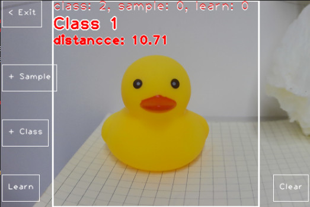

## MaixPy 自学习分类器介绍

一般情况下我们要识别新的类别，需要在电脑端重新采集数据集并训练，步骤很麻烦，难度较高，这里提供一种不需要电脑端训练，而是直接在设备端就能秒学习新的物体，适合场景不太复杂的使用场景。

比如眼前有饮料瓶和手机，使用设备分别拍一张它们的照片作为两个分类的依据，然后再采集几张他们各个角度的照片，提取它们的特征保存，然后识别时根据图像的特征值分别和保存的特征值进行对比，和保存的哪个更相近就认为是对应的分类。


## MaixPy 中使用自学习分类器

默认镜像自带了 [自学习分类 APP](https://maixhub.com/app/30)，可以直接尝试使用熟悉使用流程。



步骤：
* 点击`+ Class` 按钮， 采集 n 张分类(class)图，采集图时物体需要在屏幕的白色框中。
* 点击`+ Sample`按钮，采集 m 张样本图，每个分类都采集一些，顺序无所谓，张数也比较随意，最好是在各个角度拍一点，不要差距过大。
* 点击`Learn`按钮，启动学习，会自动根据采集的分类图和样本图进行分类学习，得到分类的特征。
* 屏幕中央对准物体，识别图像输出结果，可以看到屏幕显示了所属的分类，以及和这个分类的相似距离，相似距离越近则越相似。
* 此 APP 学习后的特征值会存到`/root/my_classes.bin`，所以退出应用或者重启了仍然会自动加载上一次的。

简洁版本代码，完整版本请看[例程](https://github.com/sipeed/maixpy/tree/main/examples/vision/ai_vision)里面的完整代码。

```python
from maix import nn, image

classifier = nn.SelfLearnClassifier(model="/root/models/mobilenet_v2_no_top.mud", dual_buff = True)

img1 = image.load("/root/1.jpg")
img2 = image.load("/root/2.jpg")
img3 = image.load("/root/3.jpg")
sample_1 = image.load("/root/sample_1.jpg")
sample_2 = image.load("/root/sample_2.jpg")
sample_3 = image.load("/root/sample_3.jpg")
sample_4 = image.load("/root/sample_4.jpg")
sample_5 = image.load("/root/sample_5.jpg")
sample_6 = image.load("/root/sample_6.jpg")


classifier.add_class(img1)
classifier.add_class(img2)
classifier.add_class(img3)
classifier.add_sample(sample_1)
classifier.add_sample(sample_2)
classifier.add_sample(sample_3)
classifier.add_sample(sample_4)
classifier.add_sample(sample_5)
classifier.add_sample(sample_6)

classifier.learn()

img = image.load("/root/test.jpg")
max_idx, max_score = classifier.classify(img)
print(maix_idx, max_score)
```

## 储存和加载学习到的特征值

使用 `save` 函数进行储存，会得到一个二进制文件，里面存了物体的特征值。
再使用时用`load`函数进行加载即可。

```python
classifier.save("/root/my_classes.bin")
classifier.load("/root/my_classes.bin")
```

如果你给每一个分类命名了，比如存到了`labels`变量，也可以使用：
```python
classifier.save("/root/my_classes.bin", labels = labels)
labels = classifier.load("/root/my_classes.bin")
```


## dual_buff 双缓冲区加速

你可能注意到这里模型初始化使用了`dual_buff`（默认值就是 `True`），使能 `dual_buff` 参数可以加快运行效率，提高帧率，具体原理和使用注意点见 [dual_buff 介绍](./dual_buff.md)。

