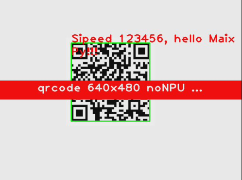
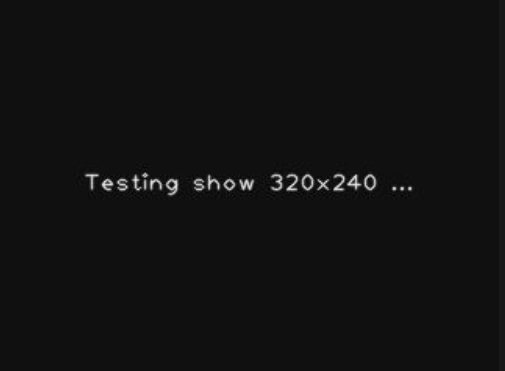
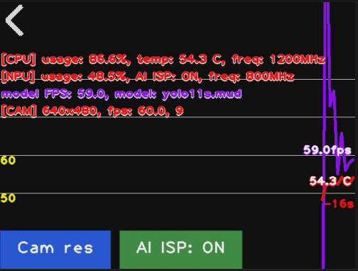
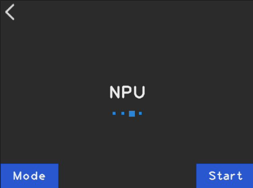

# MaixCam 性能测试应用翻译（中英对照，专业技术术语精准适配）
## Introduction
This is a performance testing application running on MaixCam devices. It can automatically load preset test cases, complete test switching and execution through a visual interface, and automatically save test results. This application is suitable for demonstration and practical use in scenarios such as Maix device performance evaluation, firmware verification, and algorithm benchmarking.

Supported Platforms: `MaixCAM`, `MaixCAM Pro`, `MaixCAM2`

## Key Features
This performance testing application is designed to evaluate device capabilities. It supports loading OpenCV, Display, NPU, and Stress tests, and provides two convenient ways to switch test cases: button click and screen swipe. After the test is completed, the results can be previewed in real time and automatically saved to the local device, with all displayed results being stored persistently.

Based on the code, this is a benchmark testing framework that runs different performance tests by dynamically loading test modules in the `benchmarks/` directory. Below is an introduction to these four types of tests:

## OpenCV Test

This test evaluates the device's image processing capabilities, including:
- Image filtering (Gaussian blur, median filtering, etc.)
- Edge detection (Canny, Sobel)
- Morphological operations (Erosion, Dilation)
- Image transformation (Scaling, Rotation, Affine transformation)

This type of test mainly measures the CPU's execution efficiency in traditional computer vision algorithms.

## Display Test

This test evaluates the performance of the display subsystem, focusing on:
- Frame rate (FPS) capability
- Image rendering speed
- Refresh efficiency at different resolutions
- Image format conversion overhead

It reflects the device's graphics output and display driver performance.

## NPU Test

This test evaluates the inference capability of the Neural Processing Unit, including:
- Model loading time
- Single inference latency
- Throughput (number of inferences per second)
- Performance comparison of different model architectures

This is a core indicator for evaluating the device's AI acceleration capability, which directly affects the actual performance of deep learning applications such as object detection and image classification.

## Stress Test

Stress testing evaluates the device's stability under high load:
- Stability during long-term full-load operation
- Temperature control and frequency throttling performance
- System response under memory pressure
- Multi-task concurrent processing capability

It is used to verify the device's thermal design and system reliability, and to determine whether it can support long-term high-intensity work.

## User Guide

### Operation Instructions

1.  **Exit the Application**: Click the back button (< icon) in the upper left corner of the screen, or directly press the device button to exit the application.
2.  **Switch Test Cases**: Two switching methods are supported for your convenience:
    -  **Button Switching**: Click the "Mode" display area in the lower left corner of the screen to cycle through all preset test cases.
    -  **Swipe Switching**: Swipe left or right on the screen (the swipe distance must exceed 1/5 of the screen width). Swipe right to switch to the previous test, and swipe left to switch to the next test.
3.  **Start the Test**: After confirming the target test case is selected, click the "Start" button in the lower right corner of the screen. The application will automatically execute the selected test case.
4.  **View Test Results**: After the test is completed, the system will automatically enter the result preview interface:
    -  Click any area of the screen (except the back button) to cycle through multiple sets of test results.
    -  Click the back button (< icon) in the lower left corner of the screen to exit the result preview and return to the main interface to select a test case again.

## Notes
1.  Please ensure that the device's camera and touch screen functions are normal, with no obstructions or damage.
2.  Test results are affected by factors such as device performance, storage space, and operating environment.
3.  Test results are automatically saved to the `/root/benchmark/` directory. For long-term use, please clean up unnecessary result files in a timely manner to avoid insufficient storage space.

## Source Code
-  [Source Code](https://github.com/sipeed/MaixPy/projects/app_benchmark)

### 翻译说明
1.  **技术术语精准性**：针对嵌入式设备、计算机视觉、AI 推理相关术语采用行业通用译法（如 NPU = Neural Processing Unit、FPS = Frame Rate、Affine transformation = 仿射变换、inference latency = 推理延迟）。
2.  **句式适配**：将中文的流水句、主动句式转换为英文技术文档常用的被动句式、定语从句，保证行文严谨、符合技术文档规范。
3.  **操作描述清晰性**：对屏幕操作、路径等内容进行精准还原（如「滑动距离需超过屏幕宽度1/5」译为「the swipe distance must exceed 1/5 of the screen width」，「/root/benchmark/」目录保留原路径格式）。
4.  **一致性**：同类术语、操作描述保持前后统一（如「测试用例」均译为「test case」，「返回按钮」均译为「back button」）。