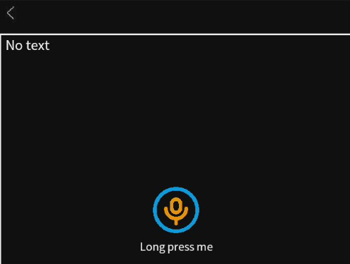

## Introduction
This is an **all-offline voice interaction application** running on MaixCam2 devices. It completes the full process of "Voice Input → Transcription → Intelligent Response" without requiring an internet connection. The application features simple operation and an intuitive interface, making it suitable for scenarios such as quick on-site queries and offline voice assistants. It is user-friendly and requires no specialized technical background.

## Main Features
1.  **Offline Voice Recording**: Capture voice information directly on the device without needing an external recording device; the recording process is simple and convenient.
2.  **Speech-to-Text**: Automatically converts recorded speech into clear, readable text, eliminating the need for manual input.
3.  **Intelligent Text Responses**: Automatically generates contextually appropriate natural language replies based on the transcribed text, suitable for daily inquiries and information organization.
4.  **Visual Interaction**: Intuitively view recording status, transcription results, and intelligent responses via the device screen, providing clear operational feedback.
5.  **Safe and Convenient Exit**: Supports one-click exit, which automatically cleans up device resources to prevent memory bloat.

## User Guide

### Recording Voice
*   The recording button is located at the bottom of the main interface, with the prompt text "Long press me".
*   **Long press the recording button** (press and hold for approximately 1 second to trigger). The screen will display "Recording..." to indicate that recording has started.
*   To finish recording, simply release your finger. The screen will then switch to display "Transcribing ...".

### Viewing Results
*   After stopping the recording, the application automatically completes the "Speech-to-Text" and "Intelligent Response" steps; no additional action is required.
*   The text area in the middle of the screen will sequentially display your transcribed text followed by the application's generated intelligent response.

### Exiting the Application
*   There is an exit button (small icon) in the top-left corner of the main interface.
*   Tap this exit button with your finger. The application will automatically clean up resources and exit normally, returning you to the device's home screen.

## Notes
1.  **Device Requirements**: Only supports Maix devices with **4GB of RAM**. The application cannot run normally on low-memory devices.
2.  **Prerequisite Configuration**: You **must disable** the "AI ISP" function before use (Path: Device [Settings] App → Find [AI ISP] option → Select [Off]). The application will fail to launch if this is not disabled.
3.  **Recording Environment**: Try to record in a quiet environment. Background noise can affect transcription accuracy.
4.  **Operation Norms**: You must long press the button to record; a short press will not trigger the function. Do not power off or force close the application during loading to avoid device exceptions.

## More Information
APP Source Code: [Source Code](https://github.com/sipeed/MaixPy/tree/main/projects/app_chat)
Documentation: [Running Qwen LLM on MaixPy MaixCAM](https://wiki.sipeed.com/maixpy/doc/en/mllm/llm_qwen.html)