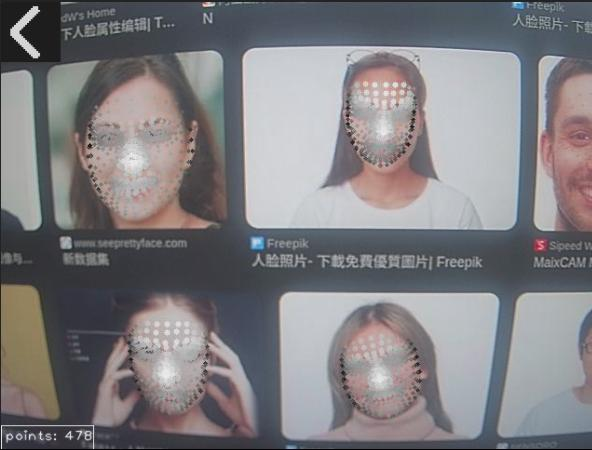

Here is the translation of the introduction into English:

## Introduction

This is a facial landmark detection application capable of real-time detection of human faces in the camera feed and marking them with varying numbers of key points. It is suitable for technical demonstrations and testing in scenarios such as facial analysis, expression recognition, and virtual makeup.

**Supported Platforms:** `MaixCAM`, `MaixCAM Pro`, `MaixCAM2`

## Main Features
**Face Detection**: Automatically detects multiple faces in the frame (up to 4).

**Landmark Marking**: Marks key feature points on detected faces.

**Landmark Mode Switching**: Supports 4 different density modes for landmarks.

**Real-time Display**: Displays the camera feed with real-time facial landmark overlays on the screen.

## User Guide

### Operation Instructions
1. **Exit Application**: Click the back button (← icon) in the top-left corner of the screen.
2. **Switch Landmark Modes**: Click the mode display area in the bottom-left corner to cycle through 4 modes:
   - **478-point Mode**: Complete facial landmarks (478 points). The densest distribution, covering all facial details.
   - **146-point Mode**: Selected landmarks (146 points). Medium density, suitable for most application scenarios.
   - **68-point Mode**: Commonly used facial landmarks (68 points). A standard number often used for facial feature analysis.
   - **5-point Mode**: Basic landmarks (5 points). The most fundamental points (e.g., eyes, nose, mouth corners).

## Notes
1. Please ensure the camera lens is clean and unobstructed.
2. Detection effectiveness is influenced by lighting, face angle, and obstructions.
3. When multiple faces appear in the frame, a maximum of 4 will be detected simultaneously.
4. Mode changes take effect immediately; there is no need to restart the application.
5. Different landmark modes are suitable for different scenarios; please choose according to your requirements.

## More Information

APP Source Code: [Source Code](https://github.com/sipeed/MaixPy/tree/main/projects/app_face_landmarks)
Facial Landmark Detection Documentation: [MaixCAM MaixPy Face 478-Point Landmark Detection](https://wiki.sipeed.com/maixpy/doc/en/vision/face_landmarks.html)