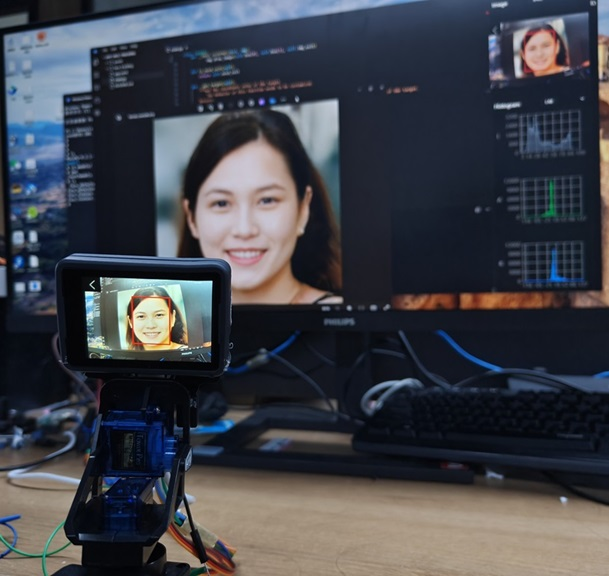

# Face Tracking

## Description

Face recognition and tracking is accomplished using a gimbal consisting of two servos and MaixCAM.

See [Wiki](../../docs/doc/en/projects/face_tracking.md) for more details.
