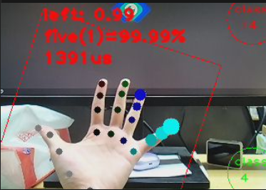

Here is the English translation of the user manual for your hand gesture recognition system.

***

## 1. Introduction
You are using a **Real-time Hand Gesture Recognition and Classification System** developed for embedded devices. The system captures hand images via a camera, extracts 21 core hand key points using a pre-trained hand detection model, and classifies different hand gestures using a Linear Support Vector Machine (LinearSVC). It can quickly distinguish between various common gestures (such as numbers and command gestures). The entire process runs locally on the device without relying on cloud computing, offering low latency and high real-time performance.

## 2. Main Features
1.  **Real-time Hand Detection & Keypoint Extraction**: Automatically identifies hand regions in the camera feed, accurately extracts 21 core hand key points, and visualizes the hand bone structure with lines for an intuitive representation of hand posture.
2.  **Multi-gesture Classification**: Supports recognition of 14 common gestures, including number gestures (1, 3, 4, 5, 6, 9, etc.) and command gestures (Thumbs Up, OK, Heart, I Love You, etc.). Recognition results include confidence scores (accuracy) and processing time.
3.  **Toggle Between Two Classification Modes**: Offers **"Lite Mode (4 classes)"** and **"Full Mode (14 classes)"**. You can quickly switch via the touchscreen to meet different needs (Lite Mode is faster, while Full Mode offers broader coverage).
4.  **Visual Information Display**: Real-time overlay on the screen shows hand information (Left/Right Hand, Detection Confidence), gesture classification results (Class Name, Class ID, Confidence Percentage), and recognition time (in microseconds). Different colors distinguish the Left Hand (Red) from the Right Hand (Green).
5.  **Training Time Recording**: Automatically records the time taken for model loading, gesture classification, and training/updating during mode switches, making it easy to monitor system performance.

## 3. User Guide
### 3.1 System Startup

1.  After running the program, the system will display a loading screen saying *"Loading... wait up to 10s"* while initializing the model, dataset, and related components.
2.  Once initialization is complete, the camera starts automatically to capture the feed in real-time, and you will enter the main working interface.

### 3.2 Basic Operation (Gesture Recognition)
1.  Place your hand within the camera's visible range. Keep the hand clear and unobstructed, and maintain an appropriate distance from the camera (recommended 30-50cm).
2.  The system will automatically detect the hand, draw the red/green bone structure, and display relevant information near the hand:
    *   **Line 1**: Left/Right Hand + Hand Detection Confidence (0.00-1.00)
    *   **Line 2**: Recognized Gesture Name + Class ID + Recognition Confidence Percentage (higher is more accurate)
    *   **Line 3**: Time taken for the current gesture recognition (in microseconds, reflecting system real-time performance)
3.  No extra action is needed; the system continuously refreshes the frame for dynamic gesture recognition.

### 3.3 Switching Classification Modes (Touchscreen Operation)
The interface provides two circular toggle buttons to switch between 4-class and 14-class gesture modes:
1.  **Top-right Button (class 14)**:
    *   **Green** indicates the current mode is **"14-class Full Mode"**; **Red** indicates it is not.
    *   **Switching**: Long-press the circular button. The screen will display the prompt *"Release to upgrade to class 14 and please wait for Training be done."* After releasing your finger, the system will automatically complete the model training update. Once finished, it will prompt *"success changed to 14"*, the button will turn green, and the system enters 14-class recognition mode.
2.  **Bottom-right Button (class 4)**:
    *   **Green** indicates the current mode is **"4-class Lite Mode"**; **Red** indicates it is not.
    *   **Switching**: Long-press the circular button. The screen will display the prompt *"Release to retrain to class 4 and please wait for Training be done."* After releasing your finger, the system will automatically complete the model update. Once finished, it will prompt *"success changed to 4"*, the button will turn green, and the system enters 4-class recognition mode.
3.  Please keep the device stable during mode switching and wait for the training update to complete (refer to the "last_train_time" displayed on the interface). Do not force quit the program.

### 3.4 System Exit
Simply press the exit button to quit. The program will automatically terminate the loop and release related resources.

## 4. Notes
1.  **Environmental Requirements**:
    *   It is recommended to use the system in a well-lit environment without glare or strong backlighting. Avoid dark environments as they affect detection accuracy.
    *   Keep the background as simple as possible. Avoid objects with colors similar to skin tones in the background to reduce false detections.
2.  **Hand Requirements**:
    *   Keep the hand fully visible and unobstructed. Avoid excessive finger bending, overlapping hands, or occlusion by other objects, as this will cause keypoint extraction failure or reduced accuracy.
    *   Avoid shaking the hand rapidly; hold the gesture steady for a moment to facilitate accurate recognition.
    *   Both left and right hands are supported. The system automatically distinguishes them and labels them with colors (Red for Left, Green for Right).
3.  **Performance Tips**:
    *   The recognition time in 14-class Full Mode is slightly longer than in 4-class Lite Mode, which is normal.
    *   The training update time during mode switching is related to device performance; please wait patiently and do not interrupt the process.
5.  **Touchscreen Operation**:
    *   Ensure accurate positioning when tapping the toggle buttons (within the circular area) to avoid ineffective touches.
    *   Long-pressing is only effective when the button is red (inactive mode). Long-pressing a green button (active mode) has no additional effect.

## 5. More Information
[Source Code](https://github.com/sipeed/MaixPy/tree/main/projects/app_hand_gesture_classifier)

[MaixCAM MaixPy: Hand Gesture Classification based on Keypoint Detection](https://wiki.sipeed.com/maixpy/doc/eh/vision/hand_gesture_classification.html)