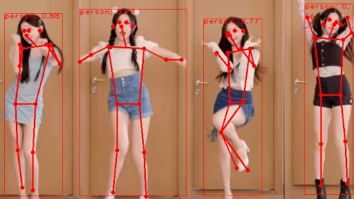

## 1. 简介

这是一个基于YOLO视觉的实时人体姿态检测与分类系统,能够通过摄像头识别人体关键点,自动分析并分类当前姿态类型。系统采用YOLO11姿态检测模型,可以实时显示检测结果、姿态分类和评分信息。

## 2. 主要功能

- **实时姿态检测**:通过摄像头实时捕捉画面并识别人体姿态
- **关键点标注**:在检测到的人体上标记关键点(如头部、肩膀、肘部、手腕、臀部、膝盖、脚踝等)
- **智能姿态分类**:自动识别并分类当前姿态(如站立、坐姿、蹲姿、躺卧等)
- **姿态评估**:对检测到的姿态进行质量评分和规范性分析
- **检测框显示**:用红色方框标记检测到的人体区域
- **置信度显示**:实时显示检测结果的准确度
- **触摸返回**:支持触摸屏操作,点击返回按钮可退出程序

## 3. 使用说明

### 3.1 启动程序
- 运行程序后,系统会自动启动摄像头
- 屏幕将实时显示摄像头画面

### 3.2 进行姿态检测与分类
- 将身体完整置于摄像头视野范围内
- 保持适当距离,确保全身能被摄像头捕捉
- 系统会自动检测并在画面上显示:
  - **红色矩形框**:标记检测到的人体位置
  - **关键点连线**:显示人体骨架结构
  - **置信度分数**:显示检测准确度(0-1之间的数值)
  - **姿态分类结果**:显示当前姿态的类型(如"站立"、"坐姿"、"深蹲"等)

## 4. 注意事项

- **光线条件**:请在光线充足的环境下使用,以获得更好的检测和分类效果
- **拍摄距离**:建议距离摄像头1.5-3米,确保全身在画面中
- **背景环境**:尽量选择简洁的背景,避免复杂背景干扰检测
- **衣着建议**:穿着贴身或对比度较高的衣物有助于提升检测准确度
- **遮挡问题**:避免身体关键部位被遮挡,以免影响检测和分类效果
- **姿态保持**:保持姿态稳定1-2秒,有助于系统准确分类
- **多人检测**:系统可同时检测多个人体并分别分类,但建议单人使用以获得最佳体验

## 5. 更多介绍
[源码](https://github.com/sipeed/MaixPy/tree/main/projects/app_human_pose_classifier)

[MaixCAM MaixPy 检测人体关键点姿态检测](https://wiki.sipeed.com/maixpy/doc/zh/vision/body_key_points.html)