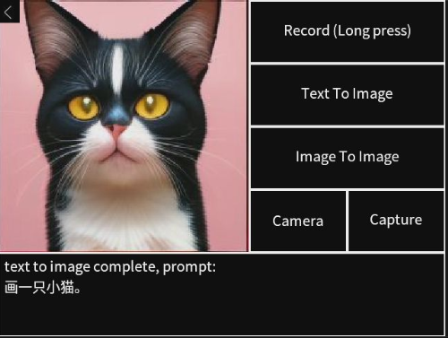

## 1. Introduction
This APP is an intelligent application running on the **MaixCam2** device. By combining **Automatic Speech Recognition (ASR)** with **Text-to-Image / Image-to-Image** technologies, it enables convenient image generation triggered by voice input. It also supports real-time camera preview and image capture, allowing users to create creative images without manual text input. The operation is intuitive, making it suitable for quickly realizing visual creative ideas.

## 2. Main Features
1.  **Voice Transcription (Long Press to Record)**: Supports voice input and automatically transcribes it into text prompts, serving as the basis for image generation.
2.  **Text-to-Image (Txt2Img)**: Based on the transcribed voice prompts, the LCM-LoRA SDV1.5 model is called to generate corresponding creative images.
3.  **Image-to-Image (Img2Img)**: Based on the already generated text image, combined with voice prompts, the image undergoes secondary optimization and reconstruction to generate images that better fit the requirements.
4.  **Camera Real-time Preview & Capture**: Supports turning on the device camera for real-time preview and capturing the current frame as base material for Img2Img.
5.  **Convenient Exit**: Quickly terminate the application through a dedicated exit area on the screen to ensure proper resource recovery.

## 3. User Guide
### 3.1 Preparation
1.  Ensure the device is the **4GB version of MaixCam2** with the corresponding firmware correctly flashed.
2.  If the model file is not included in the default system, it needs to be downloaded in advance to the `/root/models` directory.
3.  Run the application and wait for the startup loading to complete (the screen will display a progress prompt during loading, please wait patiently).

### 3.2 Operation Steps

1.  **Startup Complete**: After the application loads, you will enter the main interface, which includes a record button, function buttons, a camera preview area, and a text prompt area.
2.  **Recording Voice Prompts**:
    *   Long press the `Record (Long press)` button on the interface to start recording (the screen prompts `Recording..`).
    *   Speak your image generation requirements into the device microphone (e.g., "A small house by a lake full of cherry blossoms, cartoon style").
    *   Release the button to stop recording. The application will automatically transcribe the voice to text (the screen prompts `Transcribing ...`). Once complete, the corresponding content will be displayed in the text prompt area.
3.  **Text-to-Image Generation**:
    *   After transcription is complete, click the `Text To Image` button.
    *   Wait for the model to run (keep the device stable and avoid frequent operations during this period). Once completed, the generated image will be displayed in the preview area, and completion information will appear in the text prompt area.
    *   The generated image is automatically saved to the device path `/tmp/text2img.jpg`.
4.  **Image-to-Image Generation**:
    *   Ensure Txt2Img generation has been completed (a valid base image exists).
    *   If secondary optimization is needed, you can record a new voice prompt (or use the existing one).
    *   Click the `Image To Image` button. Wait for the model to complete secondary generation based on the base image and prompt. The result is saved to `/tmp/img2img.jpg`.
5.  **Camera Operations**:
    *   Click the `Camera` button to turn on the real-time camera preview (click again to close the preview and return to the original image).
    *   Once the preview is active, click the `Capture` button to snap the current camera frame as base material for Img2Img (automatically overwrites `/tmp/text2img.jpg`).
6.  **Exiting the Application**:
    *   Click the exit image area in the upper left corner of the screen (where `exit.jpg` is displayed).
    *   Wait for the application to display the `Exit..` prompt. It will automatically exit after resource recovery; there is no need to force close it manually.

## 4. Notes
1.  **Hardware Requirements**: Only supports the 4GB version of the MaixCam2 device. The 2GB version cannot run due to insufficient memory and will automatically detect this and prompt an exit on startup.
2.  **Model Loading**: Model loading and initialization may take a long time when starting the application for the first time (the screen prompts `It may wait for a long time`). Please be patient and do not power off or force quit.
3.  **Recording Operation**: Recording requires a **long press** of the `Record` button (short press is ineffective). It is recommended to record in a quiet environment to improve speech transcription accuracy.
4.  **Device Stability**: The image generation process (Txt2Img/Img2Img) occupies significant computing resources. Do not run other applications simultaneously to avoid device lag or crashes.
5.  **Storage Path**: Generated images are automatically saved in the `/tmp` directory.
6.  **Disclaimer**: The model has inherent limitations and may produce incorrect, harmful, offensive, or other undesirable outputs. This is unrelated to *Sipeed*.

## 5. More Information
[Source Code](https://github.com/sipeed/MaixPy/tree/dev/projects/demo_generate_image_and_print)

[Running the LCM-LoRA-SDv1-5 Model on MaixPy MaixCAM](https://wiki.sipeed.com/maixpy/doc/en/mllm/dlm_lora_sdv1_5.html)