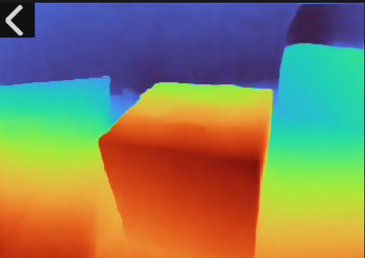

## 1. 简介
本工具是一款基于Maix硬件平台开发的实时深度图像检测应用，能够通过设备摄像头采集实时画面，并借助`DepthAnything`模型快速处理生成对应的深度可视化图像，将场景中的远近信息以色彩编码的形式直观呈现，操作简洁且运行高效，适用于各类需要快速获取场景深度信息的场景。

## 2. 主要功能
1.  实时摄像头采集：自动调用设备摄像头，获取高清实时场景画面，无需手动配置摄像头参数。
2.  深度图像生成：依托`DepthAnything v2`模型对采集画面进行实时处理，生成以TURBO色彩映射的深度可视化图像，色彩差异对应场景中物体的远近差异。
3.  便捷退出功能：提供可视化返回按钮，支持触摸操作快速退出应用，无需复杂的指令输入。
4.  异常容错处理：应用内置异常捕获与展示机制，运行过程中出现问题会自动打印错误信息并在设备屏幕上显示，便于排查问题。

## 3. 使用说明
1.  应用启动：将预配置好的设备上电后，应用会自动加载运行，无需手动启动额外程序。
2.  查看深度图像：应用运行后，设备屏幕会实时显示场景对应的深度可视化图像，通过图像色彩可直观区分场景中物体的远近。
3.  退出应用：设备屏幕左上角会显示返回按钮图标，触摸该图标区域，即可快速退出本应用，回到设备初始界面。

## 4. 注意事项
1.  硬件环境：本工具仅适用于支持`maix`系列库的专用硬件设备，不支持普通电脑或其他非兼容嵌入式设备运行。
2.  模型文件：设备`/root/models/`目录下必须存在`depth_anything_v2_vits.mud`模型文件，缺少该文件可以自行下载。
3.  运行环境：应用运行过程中请避免断电或强行重启设备，以免损坏相关配置文件或模型文件。

## 5. 更多介绍
[源码](https://github.com/sipeed/MaixPy/tree/main/projects/app_mono_depth_estimation)

[MaixCAM2 MaixPy 使用 Depth-Anything 单目估计深度距离](https://wiki.sipeed.com/maixpy/doc/zh/vision/depth_anything.html)