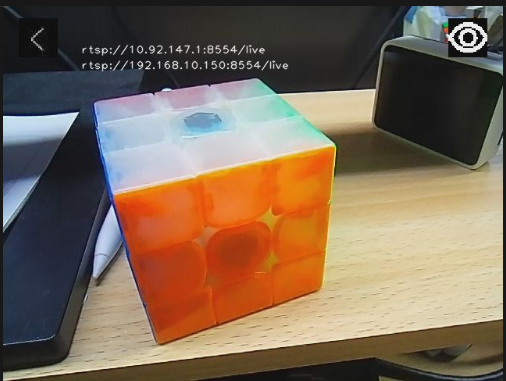

## 1. Introduction
This tool is a simple RTSP audio and video streaming application designed to run on Maix devices. It requires no complex configuration; once launched, it enables video capture from the device camera and audio recording, pushing the streams via the RTSP protocol. It features a local visual interface for easy deployment and operation.

## 2. Key Features
1.  **RTSP Audio/Video Streaming**: Binds the device camera and audio recording module to start a built-in RTSP server, providing accessible stream URLs.
2.  **Local Visual Display**: Real-time display of the camera feed with an intuitive interactive user interface.
3.  **RTSP URL Toggle**: Supports manual switching to show or hide the streaming URL on the local interface for easy access and recording.
4.  **Quick Exit**: Provides a visual shortcut button to terminate the application without needing command-line interaction.

## 3. User Guide
**Launching the Application**:
*   Upon startup, the application automatically initializes the camera, audio, and RTSP server.
*   The terminal will automatically print the list of RTSP stream URLs.
*   You can also click the eye icon at the top right of the local display (switching it to the "open" state) to view all available streaming URLs directly on the screen.

**Using the Stream URL**:
*   Enter the obtained RTSP URL into an RTSP-compatible media player (such as VLC Media Player) to view the device's video feed remotely.

**Hiding the Stream URL**:
*   Click the eye icon at the top right again (switching it to the "closed" state) to hide the URL from the interface.

**Exiting the Application**:
*   Click the exit icon at the top left of the interface. The application will terminate automatically and release resources for the RTSP server and audio module; no additional cleanup is required.

## 4. Notes
1.  **Network Requirements**: For remote playback, the Maix device and the viewing device must be on the same local network with a stable connection to avoid lag or stream interruptions.
2.  **Operation Delay**: There is a 200ms delay for toggling the eye icon. Avoid rapid consecutive clicks to prevent functional anomalies; wait briefly after a single click for the state to switch.
3.  **Resource Release**: The application includes built-in logic for automatic resource release upon exit. Do not force-terminate the program via the terminal (e.g., using `Ctrl+C`) while it is running, as this may leave the camera or audio module occupied, affecting future use.
4.  **URL Validity**: The RTSP URL may change after the application restarts. If you need to use it again, please obtain the latest address.

## 5. More Information
[Source Code](https://github.com/sipeed/MaixPy/tree/main/projects/app_rtsp)

[MaixCAM MaixPy Video Stream RTSP Streaming](https://wiki.sipeed.com/maixpy/doc/en/video/rtsp_streaming.html)