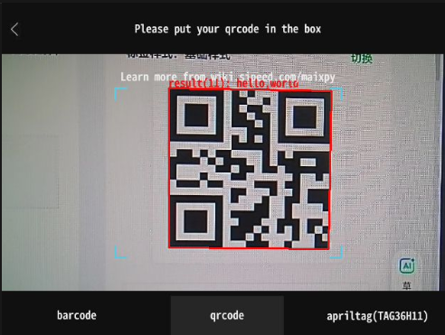

## 1. 简介
本工具是一款运行在MaixCam设备上的视觉识别应用，能够实现条形码、二维码（QR Code）以及AprilTag（TAG36H11）的实时识别与数据上报。应用具备直观的触控操作界面，识别结果会通过设备默认通信模块（默认为UART）进行发送，方便后续数据对接与处理。

## 2. 主要功能
1.  多类型视觉码识别：支持条形码、二维码（QR Code）、AprilTag（TAG36H11）三种格式的目标识别；
2.  实时视觉反馈：识别过程中会在设备屏幕上标注目标位置、显示识别结果详情，同时提供识别区域的动态提示；
3.  触控切换识别模式：通过屏幕下方触控按钮，可快速切换三种识别模式，操作简洁直观；
4.  数据通信上报：识别到有效目标后，会自动将结果通过通信模块（默认UART）上报，支持后续数据解析与应用；
5.  快捷退出功能：提供屏幕上方快捷退出入口，方便终止应用运行。

## 3. 使用说明
### 3.1 运行程序
打开程序即可自动运行扫码


### 3.2 切换识别模式
程序启动后默认进入二维码（QR Code）识别模式，可通过屏幕下方三个触控按钮进行模式切换：
1.  左侧按钮：切换至条形码识别模式；
2.  中间按钮：切换至二维码（QR Code）识别模式；
3.  右侧按钮：切换至AprilTag（TAG36H11）识别模式；
4.  按钮被选中时会呈现深色高亮状态，同时屏幕上方会显示对应识别模式的提示文字。

### 3.3 进行目标识别
1.  切换至所需识别模式后，将待识别的条形码/二维码/AprilTag放置在屏幕中间的蓝色框选识别区域内；
2.  设备会实时采集图像并进行识别，识别成功后，目标会被红色矩形（或角点连线）标注，同时屏幕上会显示识别结果详情（二维码/条形码显示内容、AprilTag显示ID、家族、坐标等）；
3.  以二维码识别为例：Put the qrcode in the camera, and you will see the qrcode is marked by a rectangle.

### 3.4 查看上报数据
1.  识别成功后，设备会自动将识别结果通过通信模块发送，默认通信协议为UART，波特率115200；
2.  可通过`app.get_sys_config_kv("comm", "method")`获取当前设备使用的通信协议；
3.  查看UART上报数据示例：
```
# uart data
AA CA AC BB 0D 00 00 00 E1 05 31 32 33 34 35 36 37 38 39 1A 15
# 31 32 33 34 35 36 37 38 39： means the qrcode is "123456789"
```
4.  条形码数据上报格式与二维码类似，AprilTag会上报家族、ID、坐标等结构化打包数据。

### 3.5 退出程序
1.  点击屏幕上方的退出图标，图标会呈现高亮状态，此时开始计数；
2.  短暂等待后（计数超过2帧），程序会自动终止，设备屏幕清空并退出应用。

## 4. 注意事项
1.  识别过程中请保持设备稳定，待识别目标与设备保持合适距离，避免过近、过远或角度倾斜过大，影响识别成功率；
2.  条形码识别有专属优化识别区域，切换至条形码模式后，请将条形码放置在对应优化区域内，以获得更好识别效果；
3.  避免在强光直射或光线过暗的环境下使用，光线条件不佳会严重影响视觉识别的准确性和实时性。
4.  AprilTag识别功能默认支持TAG36H11家族，如需支持其他AprilTag家族，可修改代码中`image.ApriltagFamilies`对应的参数并重新部署应用。

## 5. 更多介绍
[源码](https://github.com/sipeed/MaixPy/tree/dev/projects/app_scan_qrcode)

[MaixCAM MaixPy 二维码识别](https://wiki.sipeed.com/maixpy/doc/zh/vision/qrcode.html)
