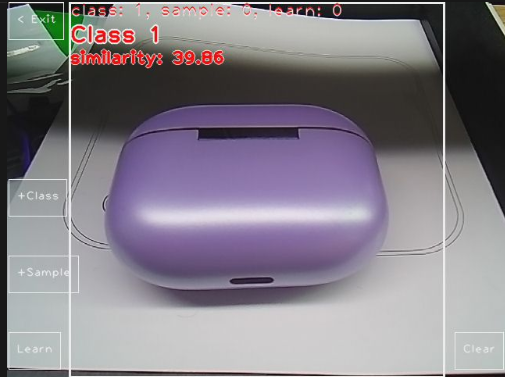

## 1. Introduction
This tool is a visual self-learning classification application running on the MaixCam device. Based on the MobileNet V2 model, it enables the collection, training, and real-time recognition of custom categories and samples. Without the need to write complex model training code in advance, you can complete category creation, sample addition, model learning, and result verification through touch operations. Recognition results are displayed intuitively on the device screen, making it suitable for quickly implementing simple custom visual classification needs.

## 2. Main Features
1.  **Custom Category Management:** Supports creating new visual classification categories. Categories are automatically named and persistently saved, and you can view the number of currently created categories.
2.  **Sample Collection and Addition:** Add visual samples to created categories. Sample data is saved along with category information, and you can view the total number of current samples.
3.  **One-Click Model Learning:** Automatically trains the model on collected categories and samples without manual configuration of training parameters. The model is automatically saved upon completion of training.
4.  **Real-Time Visual Recognition:** After training, the device captures images in real-time for classification and displays the current recognition results along with similarity scores.
5.  **Data Clear Function:** Supports one-click clearing of all created categories, samples, and saved model data, making it easy to restart classification learning.
6.  **Quick Exit:** Provides an intuitive exit button to quickly terminate the application and return to the device's main environment.

## 3. User Guide

### 3.1 Launching the Application
Simply run the program to start. Upon startup, the device automatically initializes the camera, display, and touch functions, entering the main application interface where operation buttons and the real-time camera feed are displayed.

### 3.2 Core Operation Workflow (Key Steps)
1.  **Creating Classification Categories (+Class Button)**
    *   Click the 「+Class」 button on the screen. The application automatically captures the central area of the current camera frame as the initial sample for the category and creates a new classification category (named in the format 「Class X」, where X is the category index).
    *   You can click this button multiple times to create several different classification categories. The screen displays the number of currently created 「class」 in real-time.

2.  **Adding Sample Data (+Sample Button)**
    *   First, ensure at least one classification category has been created (clicking without creating a category will prompt 「+Class first please」).
    *   Place the object to be used as a sample for the current category within the white box in the center of the camera frame. Keep the frame stable and click the 「+Sample」 button to add a new visual sample for the current category.
    *   It is recommended to add multiple samples from different angles and lighting conditions for each category to improve subsequent recognition accuracy. The screen displays the total number of current 「sample」 in real-time.

3.  **Model Self-Learning (Learn Button)**
    *   After adding categories and samples, click the 「Learn」 button. The application enters training mode, displaying 「Learning ...」 on the screen.
    *   Upon completion, it prompts 「Learn complete」 and updates the 「learn」 count on the screen. The trained model is automatically saved persistently, so data is not lost even if the application is closed and restarted.
    *   If training has already been completed and no new categories/samples have been added, clicking will prompt 「Already learned」.

4.  **Viewing Recognition Results in Real-Time**
    *   After model training is complete, the application automatically enters real-time recognition mode, capturing and classifying images live.
    *   The screen displays the name of the currently recognized category (「Class X」) and the corresponding similarity score. A score closer to 1.0 indicates a higher recognition match.

5.  **Clearing All Data (Clear Button)**
    *   Clicking the 「Clear」 button deletes all created categories, samples, and the 「my_classes.bin」 model file saved on the device. The category and sample counts on the screen reset to 0, and recognition results are cleared.

6.  **Exiting the Application (< Exit Button)**
    *   Click the 「< Exit」 button to quickly terminate the application and exit to the Maix device's main environment.

## 4. Notes
1.  **Operation Sequence:** You must first click 「+Class」 to create a category before clicking 「+Sample」 to add samples or 「Learn」 to train. Otherwise, a corresponding prompt will appear.
2.  **Sample Collection:** When adding samples, try to keep the target object within the white box in the center of the camera view. Avoid direct strong light or excessively dark environments. Collecting from different angles improves the robustness of model recognition.
3.  **Data Saving:** Categories, samples, and the trained model are automatically saved as the 「my_classes.bin」 file. Deleting this file (or clicking the 「Clear」 button) results in the loss of all learning data, which cannot be recovered. Please proceed with caution.
4.  **Device Stability:** Please keep the device stable during training (while 「Learning ...」 is displayed) to avoid training interruptions or data anomalies.
5.  **Recognition Limitations:** This tool is based on the lightweight MobileNet V2 model, making it suitable for simple visual classification scenarios. Complex scenarios (such as overlapping targets or cluttered backgrounds) may affect recognition accuracy.

## 5. More Information
[Source Code](https://github.com/sipeed/MaixPy/tree/dev/projects/app_self_learn_classifier)

[Using AI Models for Object Classification in MaixCAM MaixPy](https://wiki.sipeed.com/maixpy/doc/en/vision/classify.html)