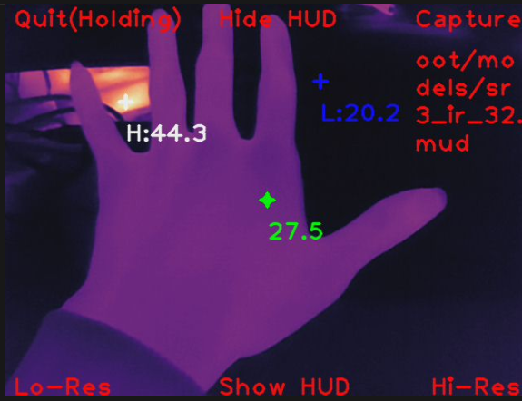

## 1. 简介
本APP是专为 **MaixCAM2 设备**开发的热成像数据处理应用，能够实现热成像画面的实时预览、高清增强、温度数据提取与可视化，同时支持热成像画面和原始数据的本地保存，方便后续分析与使用。工具内置多种图像增强模型，可切换不同分辨率模式，满足不同场景下的热成像观测需求。

## 2. 主要功能
1.  **实时热成像预览**：以热力图形式呈现热成像画面，清晰展示被测物体的温度分布，支持 COLORMAP_MAGMA 伪彩色映射，提升温度差异辨识度。
2.  **温度数据自动提取**：自动识别并标注热成像画面中的中心温度、最高温度（H）、最低温度（L），温度值精确到小数点后1位。
3.  **图像分辨率增强**：支持切换 Lo-Res（原始分辨率）和 Hi-Res（高清增强分辨率）模式，高清模式下调用预训练图像增强模型，提升画面细节清晰度。
4.  **多格式数据保存**：支持捕获并保存热成像画面（JPG格式）、原始灰度数据、增强后灰度数据（NPY格式），方便后续数据复盘与专业分析。
5.  **HUD 界面切换**：支持显示/隐藏操作提示界面（HUD），既可以获取完整热成像画面，也可以通过提示快速上手操作。
6.  **便捷退出机制**：提供安全退出流程，退出时自动恢复设备原始 NPU 配置，避免影响设备后续使用。

## 3. 使用说明
### 3.1 前期准备
确保设备为 **MaixCAM2**，且已完成相关硬件接线（热成像模块与 MaixCAM2 的 I2C/SPI 引脚对应正确），工具已成功部署到设备中并正常启动。

### 3.2 启动与初始界面
1.  工具启动后会自动完成初始化（包括引脚配置、I2C/SPI 初始化、热成像模块启动、模型加载等），初始界面会显示热力图预览及完整 HUD 操作提示。
2.  初始化过程中若出现报错，需检查硬件接线和设备型号是否符合要求。

### 3.3 核心操作（触摸屏操作）
本工具所有操作均通过设备触摸屏完成，核心操作如下：
1.  **退出工具**：长按左上角（0≤x≤80，0≤y≤40）区域约1-2秒，待提示文字变色后，即可触发退出流程，工具会自动恢复设备配置并关闭。
2.  **捕获保存数据**：点击右上角（屏幕宽度-120≤x≤屏幕宽度，0≤y≤40）区域，即可捕获当前热成像画面及相关数据。
    - 保存路径：`/maixapp/share/picture/thermal/`
    - 保存文件：包含 JPG 格式热力图、NPY 格式原始灰度数据、NPY 格式增强后灰度数据（高清模式下），文件名包含时间戳和帧编号，方便区分。
3.  **切换分辨率模式**
    - 切换 Lo-Res（原始分辨率）：点击左下角（0≤x≤120，屏幕高度-40≤y≤屏幕高度）区域。
    - 切换 Hi-Res（高清增强）：点击右下角（屏幕宽度-120≤x≤屏幕宽度，屏幕高度-40≤y≤屏幕高度）区域，切换后会自动加载对应增强模型并更新画面。
4.  **HUD 界面切换**
    - 隐藏 HUD：点击顶部中间（屏幕宽度//2-60≤x≤屏幕宽度//2+60，0≤y≤40）区域，隐藏所有操作提示，仅保留热成像画面。
    - 显示 HUD：点击底部中间（屏幕宽度//2-60≤x≤屏幕宽度//2+60，屏幕高度-40≤y≤屏幕高度）区域，恢复所有操作提示界面。

### 3.4 画面查看
1.  热力图中绿色十字+圆圈为**中心温度**标注，白色十字为**最高温度**标注，蓝色十字为**最低温度**标注，对应温度值会显示在十字下方。
2.  高清模式下画面细节更清晰，适合观测微小温度差异；原始分辨率模式下运行更流畅，适合快速实时观测。

## 4. 注意事项
1.  **设备兼容性**：本工具仅支持 **MaixCAM2 设备**，其他型号设备运行会直接报错，请勿在非目标设备上部署使用。
2.  **硬件接线**：使用前需确保热成像模块与 MaixCAM2 的引脚对应正确（A8/I2C7_SCL、A9/I2C7_SDA、B21/SPI2_CS1 等），接线错误会导致初始化失败或数据采集异常。
3.  **模型文件**：高清增强模式依赖预训练模型文件（`espcn_x3.mud`、`sr3_ir_32.mud` 等），需确保模型文件已放置在 `/root/models/` 目录下，缺失模型会导致高清模式无法正常工作。
4.  **存储空间**：捕获的数据文件会占用一定存储空间，长期使用需定期清理 `/maixapp/share/picture/thermal/` 目录下的旧文件，避免存储空间不足。
5.  **退出规范**：请务必通过长按左上角区域的正规流程退出工具，切勿强制断电或强制终止进程，否则可能无法恢复设备原始 NPU 配置，影响后续其他应用的使用。
6.  **运行耗时**：高清增强模式下因涉及模型推理，画面更新耗时会略高于原始分辨率模式，属于正常现象。
7.  **温度换算**：工具显示的温度为经过校准后的实际温度（基于热成像模块原始数据换算：原始值/64 - 273.15），若需更高精度温度测量，需对热成像模块进行单独校准。

## 5. 更多介绍
[源码](https://github.com/sipeed/MaixPy/tree/main/projects/app_thermal256_camera)
