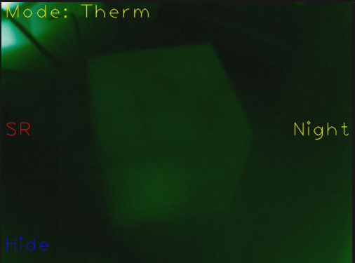

## 1. 简介
本系统是一款运行在 **MaixCAM2 设备**上的热成像与可见光图像融合应用，能够实现热成像数据采集、温度可视化、图像超分增强以及多种模式下的图像融合展示，支持触屏交互配置参数，可广泛用于设备测温、场景巡检、异常热源排查等场景。

## 2. 主要功能
1.  **四种工作模式切换**：支持可见光模式（Vis）、纯热成像模式（Therm）、自适应混合融合模式（Mix）、边缘增强融合模式（Edge），满足不同场景下的观测需求。
2.  **热成像增强**：内置超分模型（SR），可对热成像图像进行清晰度提升，支持手动开启/关闭该功能。
3.  **热成像伪彩切换**：提供Hot、Cool、Magma、Turbo、Night五种伪彩色映射方案，方便用户更清晰地分辨温度差异。
4.  **参数灵活配置**：支持触屏调节图像缩放比例、偏移量（X/Y轴），配置参数自动保存，下次启动无需重新调整。
5.  **温度差异可视化**：实时计算并显示热成像图像的温度差值，边缘增强功能会根据温度差值自动触发，突出高温/低温异常区域。
6.  **HUD界面隐藏/显示**：支持隐藏操作界面，获得纯净的观测画面，再次唤起即可恢复操作功能。

## 3. 使用说明
### 3.1 系统启动
1.  确保设备为 MaixCAM2，已完成相关驱动和依赖环境部署。
2.  将热成像模块正确连接至 MaixCAM2 对应的 I2C/SPI 引脚（代码已预设引脚配置，无需额外修改）。
3.  上传应用程序及相关文件（超分模型 `sr2.5_ir32_npu1.mud`、字体文件、配置文件）至设备指定路径。
4.  运行应用程序，系统将自动完成初始化（摄像头、热成像模块、模型加载），初始化过程约8秒，屏幕显示"Initializing (Wait 8s)..."提示。
5.  初始化完成后，默认进入纯热成像模式（Therm），即可开始使用。

### 3.2 触屏操作指南
#### 3.2.1 基础操作
- **模式切换**：点击屏幕左上角（0,0 至 150,80 区域），循环切换 Vis/Therm/Mix/Edge 四种工作模式。
- **HUD界面切换**：点击屏幕左下角（0, h-80 至 120, h 区域，h 为屏幕高度），隐藏/显示操作界面（隐藏后仅保留绿色小圆点提示，再次点击该区域恢复）。

#### 3.2.2 纯热成像模式（Therm）专属操作
- **超分（SR）开关**：点击屏幕左侧中间（0, h/2-40 至 100, h/2+40 区域），开启/关闭热成像图像超分增强功能（开启后图像更清晰，绿色显示表示开启，红色表示关闭）。
- **伪彩切换**：点击屏幕右侧中间（w-120, h/2-40 至 w, h/2+40 区域，w 为屏幕宽度），循环切换五种伪彩色映射方案，当前伪彩名称显示在屏幕右侧中间。

#### 3.2.3 混合/边缘融合模式（Mix/Edge）专属操作
- 继承纯热成像模式的 **超分开关**、**伪彩切换** 功能（Mix模式超分独立配置，与Therm模式互不影响）。
- **缩放比例调节**：点击屏幕上方右侧（w-180, 50 至 w-80, 130 区域）减少缩放比例（最小0.1），点击（w-80, 50 至 w, 130 区域）增加缩放比例，当前缩放比例显示在屏幕右上角。
- **图像偏移调节**：点击屏幕右下角（w-160, h-160 至 w, h 区域），通过滑动调整图像X/Y轴偏移量：
  - 左右滑动：调整X轴偏移量（< 向左偏移，> 向右偏移）
  - 上下滑动：调整Y轴偏移量（^ 向上偏移，v 向下偏移）
  - 偏移量实时显示在屏幕右下角。

#### 3.2.4 可见光模式（Vis）专属操作
仅支持 **模式切换** 和 **HUD界面切换**，无额外参数配置功能。

### 3.3 数据保存说明
应用运行过程中，所有配置参数（缩放比例、X/Y偏移量、伪彩索引、超分开关状态等）会在程序正常退出时自动保存至 `/root/fusion.json` 文件，下次启动应用将自动加载上次的配置，无需重复调整。

## 4. 注意事项
1.  **设备兼容性**：本应用仅支持 **MaixCAM2 设备**，运行在其他设备上会直接抛出异常，请勿在非目标设备上部署。
2.  **初始化要求**：
    - 初始化过程中请勿断电或操作设备，否则可能导致热成像模块配置失败。
    - 热成像模块初始化需约8秒（包含预览停止、启动、温度预览启动等步骤），耐心等待屏幕切换至工作界面即可。
3.  **硬件连接**：确保热成像模块与 MaixCAM2 的 I2C7（A8/A9）、SPI2（B18/B19/B20/B21）引脚连接牢固，接触不良会导致数据采集失败（屏幕无热成像画面）。
4.  **文件依赖**：
    - 超分模型文件 `sr2.5_ir32_npu1.mud` 需放置在 `/root/models/` 目录下，缺失将导致超分功能无法使用。
    - 字体文件 `SourceHanSansCN-Regular.otf` 需放置在 `/maixapp/share/font/` 目录下，缺失将导致界面文字无法正常显示。
5.  **性能说明**：开启超分功能后，系统处理帧率会有所下降，属于正常现象，优先保证图像清晰度。
6.  **温度阈值**：边缘增强功能默认触发阈值为5.0，当热成像图像温度差值小于该阈值时，边缘增强不生效，仅显示融合图像。
7.  **正常退出**：请通过设备正常流程退出应用，避免强制断电，否则配置参数无法自动保存。

## 5. 更多介绍
### 5.1 各工作模式详细说明
1.  **可见光模式（Vis）**：仅显示摄像头采集的可见光画面，无热成像相关信息，适用于正常光线环境下的常规观测。
2.  **纯热成像模式（Therm）**：仅显示热成像模块采集的温度图像，通过伪彩区分温度高低，适用于黑暗、烟雾等可见光无法穿透的环境，或需要快速排查热源的场景。
3.  **自适应混合融合模式（Mix）**：将可见光图像与热成像图像进行自适应融合，根据热成像图像的温度差异自动调整融合权重，既保留场景细节，又突出异常热源，适用于需要同时观察场景环境和温度信息的场景。
4.  **边缘增强融合模式（Edge）**：提取热成像图像的边缘信息并叠加到可见光图像上，突出高温/低温区域的轮廓，适用于需要精准定位异常热源边界的场景。

### 5.2 配置文件说明
配置文件 `/root/fusion.json` 为JSON格式，包含以下核心字段：
- `scale`：图像缩放比例（默认1.0）
- `x`/`y`：图像X/Y轴偏移量（默认0）
- `cmap_idx`：伪彩索引（默认0，对应Hot伪彩）
- `sr_therm`/`sr_mix`/`sr_edge`：各模式超分功能开关状态（默认True/False/True）

若配置文件损坏或丢失，应用将自动加载默认配置，不影响正常运行。

### 5.3 扩展说明
1.  可修改代码中的 `EDGE_TEMP_THRESHOLD` 变量调整边缘增强触发阈值，适应不同场景的温度检测需求。
2.  可新增伪彩色映射方案至 `CMAP_LIST` 列表，扩展热成像图像的显示效果。
3.  支持更换超分模型，只需替换 `/root/models/` 目录下的模型文件，并修改代码中的模型名称和输出层名称即可。

[源码](https://github.com/sipeed/MaixPy/tree/main/projects/app_thermal256_nightvision)