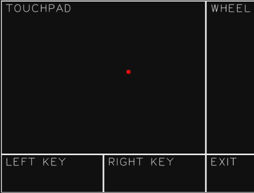

## 1.  简介
本工具通过设备的触摸屏来模拟电脑鼠标的各项操作，无需额外连接物理鼠标，即可实现对电脑等支持HID鼠标协议设备的远程控制，适用于无物理鼠标场景下的简易操作、嵌入式设备配套控制等场景。

## 2.  主要功能
1.  **触摸板移动**：通过核心触摸区域实现鼠标指针的精准移动，适配屏幕比例优化移动灵敏度。
2.  **鼠标按键模拟**：支持鼠标左键、右键的按压与释放操作，实现文件选择、菜单调出等基础鼠标功能。
3.  **滚轮模拟**：专属滚轮区域支持上下滑动，对应电脑鼠标滚轮的滚动效果，可用于翻页、缩放等操作。
4.  **快速退出**：设置专属退出区域，一键终止应用运行，操作便捷。
5.  **可视化交互**：操作过程中实时显示触摸点位、按键状态，直观反馈当前操作效果。

## 3.  使用说明

1.  **前期准备**
    - 确保设备已开启HID Mouse功能（路径：设置 -> USB设置 -> HID Mouse，勾选后确认并重启设备）。
    - 将Maix设备通过USB线与电脑（或其他支持HID协议的设备）连接，确保设备被正常识别。
2.  **界面区域识别**
    - **触摸板区域（TOUCHPAD）**：占据屏幕大部分区域的白色边框矩形，标注有"TOUCHPAD"，是鼠标指针移动的核心操作区。
    - **滚轮区域（WHEEL）**：位于触摸板右侧的白色边框矩形，标注有"WHEEL"，用于模拟鼠标滚轮。
    - **退出区域（EXIT）**：位于界面右下角的白色边框矩形，标注有"EXIT"，用于退出应用。
    - **左键区域（LEFT KEY）**：位于屏幕底部左侧的白色边框矩形，标注有"LEFT KEY"，对应鼠标左键。
    - **右键区域（RIGHT KEY）**：位于屏幕底部右侧的白色边框矩形，标注有"RIGHT KEY"，对应鼠标右键。
3.  **具体操作步骤**
    - **移动鼠标指针**：在触摸板区域（TOUCHPAD）内轻触并滑动手指，屏幕上的红色圆点会跟随手指移动，同时电脑端的鼠标指针也会同步移动，滑动幅度决定指针移动距离。
    - **鼠标左键操作**：触摸底部左侧的左键区域（LEFT KEY），区域会变为白色填充状态，对应鼠标左键按压；松开手指后，区域恢复边框状态，对应鼠标左键释放；在触摸板区域快速点击（轻触后立即松开，无明显滑动），可模拟鼠标左键单击。
    - **鼠标右键操作**：触摸底部右侧的右键区域（RIGHT KEY），区域会变为白色填充状态，对应鼠标右键按压；松开手指后，区域恢复边框状态，对应鼠标右键释放。
    - **滚轮操作**：在滚轮区域（WHEEL）内上下滑动手指，即可模拟鼠标滚轮的上下滚动，实现电脑端页面的翻页或内容缩放。
    - **退出应用**：触摸右下角的退出区域（EXIT），即可立即终止本工具运行，退出应用界面。

## 4.  注意事项
1.  **HID功能必开启**：使用前必须在设备中开启HID Mouse功能并重启，否则应用无法正常工作，会提示功能未启用的相关信息。
2.  **USB连接稳定性**：确保USB连接线接触良好，避免连接松动导致鼠标控制中断、操作无响应等问题。
3.  **操作区域区分**：各功能区域有明确划分，操作时尽量在对应区域内进行，避免跨区域误触导致操作不符合预期（如误触退出区域导致应用关闭）。
4.  **触摸灵敏度说明**：鼠标指针移动、滚轮滚动的灵敏度已做优化适配，若需调整可通过设备相关设置修改，操作时避免过度滑动导致指针偏移过大。
5.  **设备兼容性**：本工具主要适配支持HID鼠标协议的设备（如Windows、Linux系统电脑），部分特殊设备可能存在兼容性问题，无法正常识别或响应操作。

## 5.  更多介绍
[源码](https://github.com/sipeed/MaixPy/tree/main/projects/app_usb_hand_touch)

[MaixCAM MaixPy 使用 USB HID(作为设备)](https://wiki.sipeed.com/maixpy/doc/zh/peripheral/hid.html)