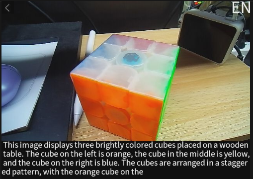

## 1. Introduction
This tool is a multimodal application running on the **MaixCam** device. It supports loading several mainstream lightweight Vision Language Models (VLMs) such as **Qwen3-VL**, **InternVL**, and **SmolVLM**. The application captures images via the device camera, intelligently describes them using the selected model, and displays the results on the screen, realizing the core capability of "describing what it sees." The operation is concise and does not require complex command-line configurations; all interactions can be completed via the touchscreen.

## 2. Main Features
1.  **Model Selection**: Freely choose between three pre-trained VLMs (Qwen3-VL, InternVL, SmolVLM) to adapt to different recognition needs and device performance levels.
2.  **Image Capture & Analysis**: Real-time image capture through the built-in camera, with rapid analysis and natural language description performed by the selected model.
3.  **Bilingual Support**: Supports switching between Chinese (ZH) and English (EN) output languages to accommodate different user habits (Note: The SmolVLM model only supports English).
4.  **Convenient Exit**: Provides a quick exit entry on the screen to terminate the application with one click and restore the device to its initial state.
5.  **Runtime Environment Check**: Automatically verifies device memory configuration to ensure stable operation, and provides user-friendly prompts for missing models or environment exceptions.

## 3. User Guide
### 3.1 Prerequisites
1.  Ensure the MaixCam device has completed basic system deployment and has sufficient storage space (at least **2GB of free space** is recommended for storing model files).
2.  The **SmolVLM** model is included by default; other models need to be downloaded and uploaded manually to the `/root/models/` directory on the device.

### 3.2 Starting the Application
1.  Upload the files containing the tool's code to the MaixCam device.
2.  Run the code via the device terminal or supporting tools to start the application.
3.  Upon startup, loading prompts such as "loading touchscreen" and "loading [model name]" will appear sequentially. Wait for the loading to complete to enter the interactive interface.

### 3.3 Core Operations
1.  **Model Selection**:
    *   After loading, you will first enter the model selection interface. The center of the screen displays the three available models, each within a white bordered selection box.
    *   Tap the selection box corresponding to a model to select it; the application will automatically proceed to load that specific model.
2.  **Viewing Image Descriptions**:
    *   Once the model is loaded, the application automatically starts the camera to capture images—no manual operation is required.
    *   The model analyzes the captured images, and the results are displayed in the black area below the camera feed, with automatic line wrapping.
    *   The application continuously captures and analyzes images, updating the displayed results in real-time.
3.  **Language Switching**:
    *   The current language (ZH/EN) is displayed in the top-right corner. If the selected model supports Chinese (Qwen3-VL, InternVL), tap the language area to switch between Chinese and English output.
    *   If the SmolVLM model is selected, the top-right corner will be fixed on "EN," and Chinese switching is not supported.
4.  **Exiting the Application**:
    *   An exit icon is displayed in the top-left corner. Tapping this icon area (or the expanded recognition area around it) allows for a quick exit.
    *   If an error prompt appears (e.g., missing model), tapping anywhere on the screen will exit the application.

## 4. Notes
1.  **Hardware Requirements**: Certain large models only support the **4GB RAM version** of the MaixCam2 device. The 2GB RAM version cannot run these models and will automatically detect this and prompt an exit upon startup.
2.  **Model Related**:
    *   Model files must be completely uploaded to the specified directory; otherwise, the application will prompt that the model is missing and terminate.
    *   Different models have different performance requirements. The **Qwen3-VL** model occupies more resources and has a relatively slower analysis speed, while the **SmolVLM** model is lighter and faster.
3.  **AI ISP Settings**: The application automatically disables the AI ISP feature on startup and restores the original settings upon exit. No manual adjustment is needed, preventing interference with other applications.
4.  **Operating Environment**:
    *   It is recommended to use the device in a well-lit environment to ensure clear image capture and improve analysis accuracy.
    *   Avoid plugging or unplugging peripherals while the device is running to prevent application crashes.
5.  **Troubleshooting**:
    *   If the application freezes, wait a moment; it should automatically recover after the model analysis is complete. If the freeze persists, force quit and restart.
    *   If nothing is displayed on the screen, check if the display is connected properly and if the code is running correctly.
6.  **Storage Space**: Storing multiple models simultaneously consumes significant storage space. It is recommended to download and keep only the models you need; delete unused models to free up space.

## 5. More Information
[Source Code](https://github.com/sipeed/MaixPy/tree/main/projects/app_vlm)

[MaixPy MaixCAM Running VLM InternVL Vision Language Model](https://wiki.sipeed.com/maixpy/doc/en/mllm/vlm_internvl.html)