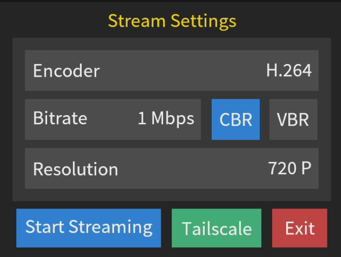
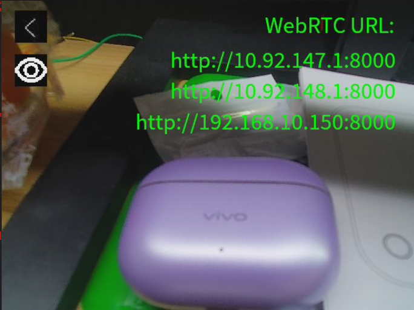

## 1.  简介
本工具是一款运行在MaixCam设备上的可视化流媒体配置与推流应用，提供了简洁的触控操作界面，无需命令行输入即可完成WebRTC流媒体参数配置、推流启动，同时集成了Tailscale网络工具的快速管理功能，方便用户实现跨网络的流媒体访问，操作门槛低。

## 2.  主要功能
1.  **流媒体参数可视化配置**：支持对推流核心参数进行触控切换选择，无需手动修改配置文件。
2.  **Tailscale网络管理**：可快速启动、停止Tailscale服务，查看设备在线状态与IP地址，完成登录授权操作，实现跨网络设备互通。
3.  **WebRTC流媒体推流**：根据配置的参数启动推流服务，生成可访问的播放URL，支持实时预览推流画面。
4.  **推流URL查看**：推流过程中可切换显示/隐藏播放URL，方便用户获取并在其他设备上访问流媒体。

## 3.  使用说明

### 3.1 配置页面与功能操作

设备启动本工具后，直接进入**Stream Settings**（流媒体配置）主页面。该页面包含四大核心配置项（编码器、码率、码控模式、分辨率）以及底部的功能操作区。

**1. 参数配置（点击对应区域循环切换）**
*   **编码器 (Encoder)**：点击区域可在 **H.264** 和 **H.265** 两种编码格式间循环切换。
*   **码率 (Bitrate)**：点击区域可在 **1 Mbps ~ 64 Mbps** 之间循环切换。数值越大画质越清晰，但对网络带宽要求越高。
*   **码控模式 (RC Type)**：点击区域可在 **CBR（恒定码率）** 和 **VBR（可变码率）** 之间切换。
*   **分辨率 (Resolution)**：点击区域可根据设备摄像头传感器能力，在 **720 P ~ 4 K** 之间循环切换。

**2. 底部功能按钮操作**
*   **Start Streaming（启动推流）**：点击蓝色按钮，工具将根据当前选中的参数启动WebRTC推流服务，并自动进入推流预览页面。
*   **Tailscale（网络管理，可选）**：若设备已安装Tailscale，将显示绿色按钮。点击进入管理页面，可查看设备状态（ONLINE/OFFLINE）与IP地址，进行 **Start**（启动服务/登录）、**Stop**（停止服务）、**Logout**（退出登录）操作，点击左上角图标可返回配置页面。
*   **Exit（退出工具）**：点击红色按钮，直接退出本工具，返回设备桌面。

**3. 推流预览与操作**
1.  进入推流页面后，将实时显示摄像头采集的画面，即当前推流的内容。
2.  左上角退出图标：点击该图标，停止当前推流服务，返回流媒体配置主页面。
3.  眼睛图标（URL显示/隐藏）：点击该图标，切换显示/隐藏推流播放URL，显示状态下将在画面右侧展示可访问的WebRTC播放地址，可复制该地址在其他设备的浏览器或兼容WebRTC的播放器中打开，观看流媒体内容。
4.  推流过程中保持设备网络通畅，如需停止推流，点击左上角退出图标即可。

## 4.  注意事项
1.  网络要求：推流过程需要稳定的网络环境，选择高码率、高分辨率推流时，需确保设备网络上行带宽满足要求，否则可能出现卡顿、花屏现象。

3.  硬件适配：4K分辨率仅对搭载4K摄像头传感器的MaixCam生效。

## 5.  更多介绍
[MaixCAM MaixPy 视频流 JPEG 推流 / 发送图片到服务器](https://wiki.sipeed.com/maixpy/doc/zh/video/jpeg_streaming.html)

[源码](https://github.com/sipeed/MaixPy/tree/main/projects/app_webrtc_stream)