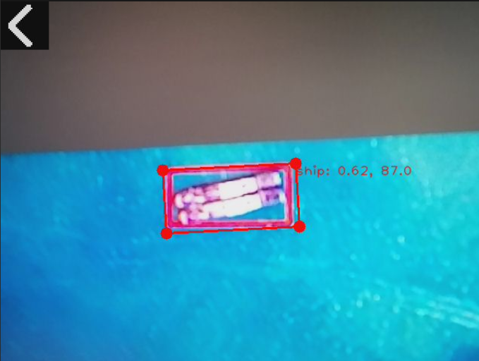

## 1.  简介
本工具采用YOLO11 OBB（定向边界框）算法模型，能够对拍摄场景中的目标进行精准识别、置信度评估及角度检测，同时提供简洁的操作交互界面，无需复杂配置即可快速启动使用。

## 2.  主要功能

1.  实时图像采集：通过设备摄像头自动获取实时场景画面，无需手动触发拍摄。
2.  定向目标检测：采用YOLO11n_obb模型，可检测目标并输出带角度的定向边界框，相比普通矩形框更贴合不规则或旋转目标。
3.  检测信息可视化：实时显示目标类别、置信度（保留2位小数）及目标旋转角度（保留1位小数），并以红色线条绘制目标定向边界框。
4.  一键退出功能：提供可视化返回按钮，支持触摸操作快速退出应用，提升使用便捷性。
5.  异常处理机制：应用运行过程中若出现异常，会自动捕获并显示详细错误信息，便于问题排查。

## 3.  使用说明
1.  启动应用：直接运行本应用程序，无需额外输入参数，应用会自动初始化摄像头、显示屏、YOLO11检测器及触摸屏。
2.  查看检测结果：应用启动后，摄像头会自动采集画面，显示屏实时展示原始画面及目标检测结果，包括定向边界框和对应的类别、置信度、角度信息。
3.  退出应用：在显示屏左上角找到返回图标，点击该图标区域，即可快速退出应用，结束运行。

## 4.  注意事项

 检测参数说明：应用默认置信度阈值为0.5、IOU阈值为0.45、关键点阈值为0.5，低于该阈值的目标将不会被检测和显示，若需调整需修改应用内部参数。

## 5.  更多介绍
[源码](https://github.com/sipeed/MaixPy/tree/main/projects/app_yolo_obb)

[带旋转角度的检测(OBB)](https://wiki.sipeed.com/maixpy/doc/zh/vision/detect_obb.html)