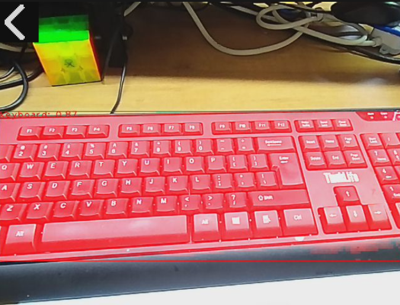

## 1.  简介
本工具是一款基于YOLO11n_seg模型实现高效的视觉检测，能够在设备端直接完成目标的识别、评分以及分割掩码绘制，无需依赖外部服务器，具备操作简洁、运行流畅、实时性强的特点，适用于各类现场视觉检测、简易物体识别场景。

## 2.  主要功能
1.  实时图像采集：通过设备摄像头自动采集实时画面，无需手动触发拍摄。
2.  目标识别与评分：精准识别画面中的目标物体，标注物体类别，并输出0-1区间的识别置信度（保留2位小数）。
3.  图像分割掩码绘制：对识别到的目标进行分割处理，绘制专属分割掩码，清晰区分目标与背景。
4.  目标框标注：用红色矩形框标注识别到的目标位置，直观易懂。
5.  快捷退出功能：提供专用返回按钮，支持触摸触发快速退出应用，操作便捷。

## 3.  使用说明

1.  启动应用：将设备部署完成后，运行本应用，应用将自动初始化摄像头、显示模块、YOLO11识别模型及触摸屏。
2.  实时查看结果：应用启动后，摄像头将自动采集画面，设备显示屏将实时展示：
    -  原始采集画面
    -  红色矩形框标注的识别目标
    -  目标上方的“类别：置信度”文字说明
    -  目标区域对应的分割掩码
    -  屏幕左上角的返回按钮图标
3.  退出应用：直接用手指触摸设备显示屏左上角的返回按钮图标，应用将接收到退出指令并自动关闭，返回至设备主界面或初始状态。
4.  异常查看：若应用运行过程中出现故障，将自动切换至黑色背景界面，显示白色异常详情日志，便于了解故障原因。

## 4.  注意事项
1.  拍摄环境要求：
    -  尽量在光线充足、环境明亮的场景下使用，避免逆光、暗光环境，否则会降低目标识别准确率及分割效果。
    -  保持摄像头与目标物体的适当距离，避免目标过近或过远导致无法识别。
    -  减少画面中无关干扰物体，避免多个目标重叠，提升识别效率。

## 5.  更多介绍
[源码](https://github.com/sipeed/MaixPy/tree/main/projects/app_yolo_obb)

[MaixCAM MaixPy 图像语义分割](https://wiki.sipeed.com/maixpy/doc/zh/vision/segmentation.html)