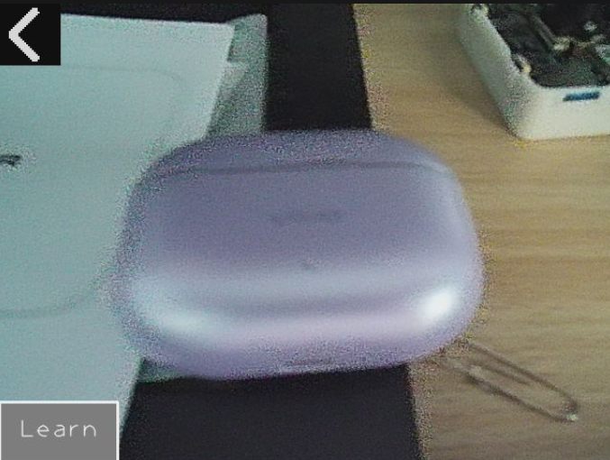

## 1.  简介
本应用是一款运行在MaixCam2设备上的YOLO-World目标检测演示程序，支持通过语音录入目标类别并自动完成模型特征生成，实现对指定目标的实时视觉检测，无需手动修改配置或编写额外代码，操作简洁高效，适用于快速实现自定义目标的现场检测需求。

## 2.  主要功能
1.  **实时目标检测**：加载预配置模型后，可对指定目标（默认为人脸）进行实时画面检测，标注目标位置并显示检测置信度。
2.  **语音录入自定义类别**：支持通过3秒语音录入自定义检测目标类别（英文），自动完成语音转文字识别。
3.  **自动生成模型特征**：确认自定义类别后，应用将自动运行脚本生成对应类别的标签文件和文本特征文件，无需手动处理模型相关配置。
4.  **一键切换检测模型**：特征文件生成完成后，将自动加载对应规模的YOLO-World模型，切换为新目标的实时检测模式。
5.  **简易交互操作**：提供返回退出、类别确认/取消、学习新目标等可视化按钮，支持触屏点击操作，界面友好。

# 3. 使用说明

1.  **启动与基础检测**：确保设备摄像头、麦克风正常且已预装相关模型文件，直接运行应用即可；程序会自动完成初始化（包括加载模型和语音识别工具），随后进入实时预览界面，摄像头将自动对默认目标进行检测，并用红色矩形框标注目标位置及置信度。
2.  **自定义目标学习**：在预览界面点击下方的「Learn」按钮，界面提示后在3秒内清晰说出目标的**英文名称**（如「car」）；录音结束后，应用会自动转写语音并显示识别结果，点击「Yes」确认即可自动生成特征文件并切换为该目标的实时检测模式，点击「No」则放弃。
3.  **退出应用**：在非学习/转写的任意界面，点击屏幕左上角的返回图标，即可正常关闭应用并恢复设备配置。

## 4.  注意事项
1.  **设备硬件要求**：本应用要求设备为MaixCam的4GB内存版本，低于4GB内存的设备无法正常运行，启动时将提示硬件不满足并退出。
2.  **语音录入限制**：仅支持英文目标类别录入，不支持中文及其他语言，且录音时需保持环境安静，避免杂音影响转写准确率，同时需在3秒内完成语音录入。
3.  **操作交互说明**：本应用仅支持触屏点击操作，所有按钮需点击确认生效，长按无额外功能；学习过程中（生成特征文件）请勿关闭应用或重启设备，避免文件损坏。
4.  **资源占用说明**：应用运行过程中占用摄像头、麦克风、NPU等硬件资源，运行期间建议关闭其他无关应用，避免影响检测效果和运行流畅度。
5.  **异常处理**：若运行过程中出现报错，界面将显示错误信息，点击屏幕任意位置即可退出应用，可查看设备日志排查具体问题。
6.  **文件存储路径**：自定义目标的标签文件（`.txt`）和特征文件（`.bin`）将自动保存至`/root/models/my_yolo_world/`目录下，可通过设备文件管理工具查看和备份。
7.  **检测参数说明**：应用默认检测置信度阈值为0.5，IOU阈值为0.45，若需调整检测灵敏度，可修改代码中对应参数（`detector.detect(img, conf_th=0.5, iou_th=0.45)`）后重新运行。
8.  **扩展功能**：若需支持多类别同时检测，可修改语音录入和特征生成相关逻辑，生成包含多个类别的标签文件和特征文件，同时加载对应多类别YOLO-World模型。

## 5.  更多介绍
[源码](https://github.com/sipeed/MaixPy/tree/main/projects/app_yoloworld)

[MaixPy MaixCAM2 使用 YOLO World 模型实现无需训练检测任意目标](https://wiki.sipeed.com/maixpy/doc/zh/vision/yolo_world.html)