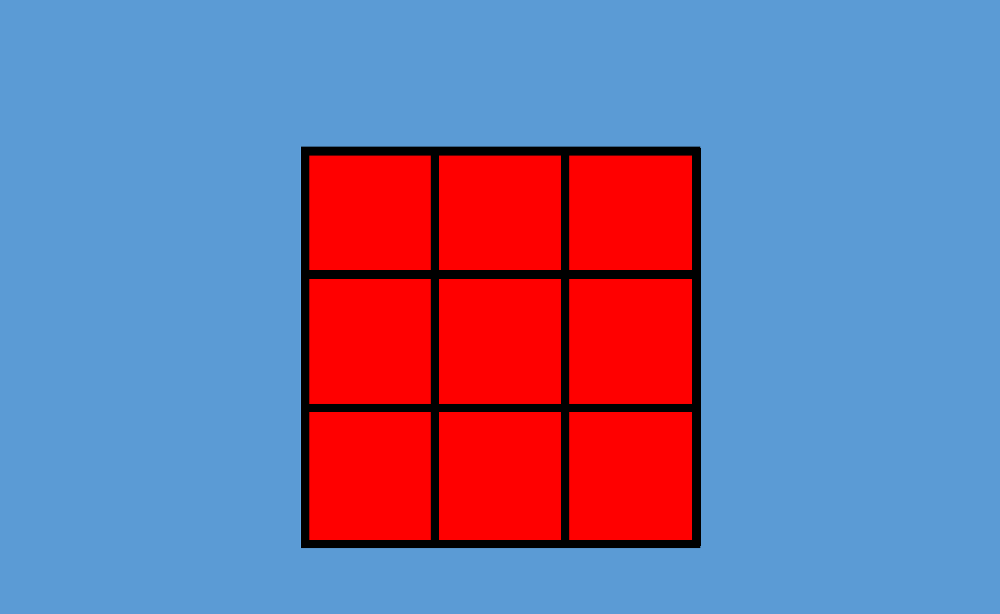
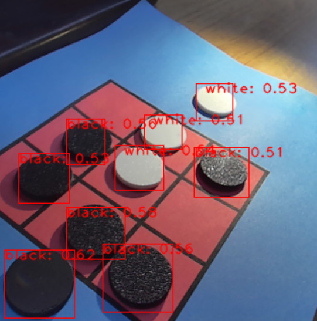

2024 电赛三子棋 棋盘识别和棋子识别程序
====

视频演示：
* **[检测棋盘和传统算法检测棋子](https://www.bilibili.com/video/BV1q2vKebEUd/?vd_source=6c974e13f53439d17d6a092a499df304#reply234394879360)**
* **[AI检测棋子](https://www.bilibili.com/video/BV11pvseZEZw/?vd_source=6c974e13f53439d17d6a092a499df304)**

检测棋盘和传统算法检测棋子的代码在本目录，
AI 检测棋子在[MaixHub 模型库](https://maixhub.com/model/zoo/428) 下载模型，按照其使用说明使用即可。

本例程 识别棋子 和 识别棋盘 是分开识别的，可以根据你的情况修改，点击按钮可以切换识别棋子和棋盘模式。

**使用了无畸变镜头**，MaixCAM 可以找 Sipeed 官方购买。

**注意：本程序只是一个效果演示，以及提供一个思路，程序写得粗糙，实际应用请自己阅读源码后根据你的情况进行优化修改，不要一味照搬！**

摄像头默认是 80FPS， 如果出现画屏现象，请设置为 60FPS 模式。

测试棋盘（非标准，随便画的）：

效果：

